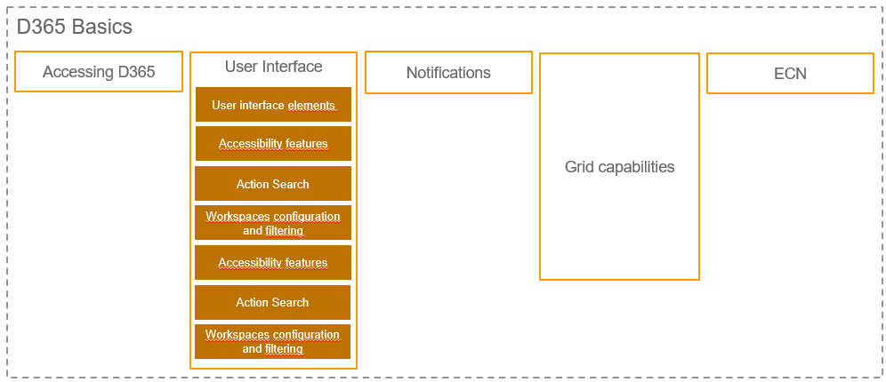

# Basics

> [!NOTE]
> The more effective communication of users in ERP systems (AX System) is a sub-topic of SML3. The goal is to avoid unnecessary media breaks(sending mails with Outlook) and to convey an existing communication tool (notifications) to the users of AX in a new way.

> [!Tip]
> The more effective communication of users in ERP systems (AX System) is a sub-topic of SML3. The goal is to avoid unnecessary media breaks(sending mails with Outlook) and to convey an existing communication tool (notifications) to the users of AX in a new way.

> [!IMPORTANT]
> The more effective communication of users in ERP systems (AX System) is a sub-topic of SML3. The goal is to avoid unnecessary media breaks(sending mails with Outlook) and to convey an existing communication tool (notifications) to the users of AX in a new way.

> [!WARNING]
> The more effective communication of users in ERP systems (AX System) is a sub-topic of SML3. The goal is to avoid unnecessary media breaks(sending mails with Outlook) and to convey an existing communication tool (notifications) to the users of AX in a new way.

# Navigation

[Login to D365](Login.md)

[Overview](Grundlagen_Overview.md)

[Notifications](Notifications.md)

