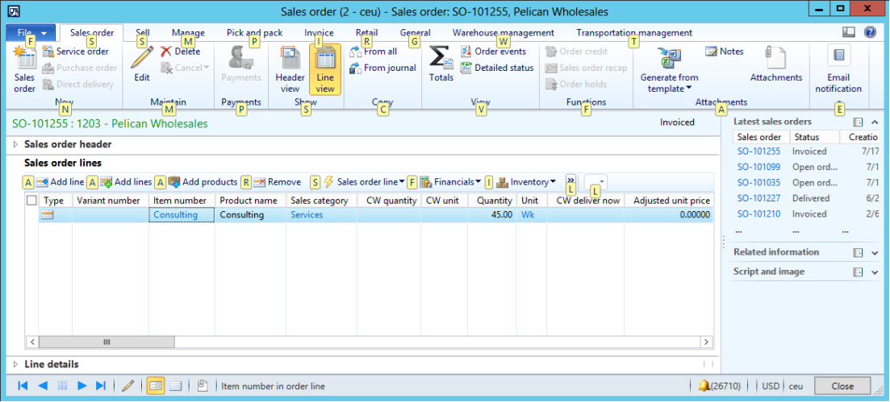
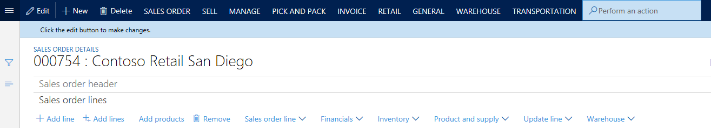
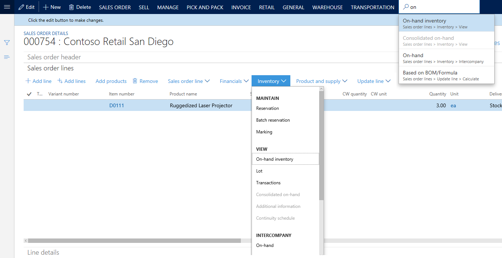

---
# required metadata

title: Action search
description: This article describes the action search functionality. Action search will help you find and run actions on a page.
author: jasongre
ms.date: 03/09/2020
ms.topic: article
ms.prod: 
ms.technology: 

# optional metadata

# ms.search.form: 
# ROBOTS: 
audience: Application User
# ms.devlang: 
ms.reviewer: sericks
# ms.tgt_pltfrm: 
ms.custom: 62303
ms.assetid: 62c70de0-fdde-4417-8e08-0583fb095a40
ms.search.region: Global
# ms.search.industry: 
ms.author: jasongre
ms.search.validFrom: 2016-02-28
ms.dyn365.ops.version: AX 7.0.0

---

# Action search

[!include [banner](../includes/banner.md)]

This article describes the action search functionality. Action search will help you find and run actions on a page.

## Introduction

Pages primarily expose commands on Action Panes, both the standard Action Pane that appears at the top of a page and the toolbars that appear in various sections of the page. In previous versions, a Key Tips feature let you quickly access any button on an Action Pane by pressing the Alt key and then a series of letters.

The action search feature replaces Key Tips, which are no longer available. This new feature lets you quickly search for and run a button from any visible Action Pane.

## Using action search

To use the action search feature, follow these steps.

1. On the Action Pane, click in the **action search** field. (The **action search** field contains a magnifying glass icon.)
2. Type all or part of the name of the button that you want to run. You can also search by using words from the button's "path." (For more information, see the next section of this article.) Typically, a button will appear near the top of the results list after you've typed two to four characters.
3. Find and run the button in the results list (by using your mouse or keyboard).

After the button is run, the focus is returned to your last position on the page, so that you can continue to work.

You can also start action search by pressing Ctrl+/ or Alt+Q. Press the keyboard shortcut again to return the focus to your last position on the page.

## Understanding the results list

Often, you must know both the location and the context of a button to fully understand the purpose of that button. Therefore, the results list shows additional information to help you understand exactly which buttons appear in the list. In particular, the "path" of the button is shown. This path might include the labels of the following UI elements, as relevant:

- Action Pane tab
- Button group
- Menu button (if the button is inside a menu button)
- Menu separator (if the button is inside a named group inside a menu button)
- Group or tab on the page (for example, the name of a FastTab)

For example, you typed **tot** in the **action search** field and are now examining the results list. The first entry, for a button that is named **Totals**, is highlighted. A button path of **Sales order** &gt; **View** is also shown. The **Sales order** part of the path corresponds to the **Sales order** tab on the Action Pane, and the **View** part of the path corresponds to the **View** group on that tab. Similarly, the path of the **Total discount** button (**Sell** &gt; **Calculate**) informs you that this button is located in the **Calculate** group on the **Sell** tab of the Action Pane. Therefore, this information helps you understand exactly which button will be triggered by action search (if you select that button in the results list).

In the previous example, action search showed results from the standard Action Pane at the top of a page. However, action search also shows results from visible toolbars that are in other places on the page. For example, you're searching for the **On-hand inventory** button that is on the **Sales order lines** FastTab. In this case, the button path in the results list (**Sales order lines** &gt; **Inventory** &gt; **View**) informs you that this button is under the **View** heading on the **Inventory** menu button on the **Sales order lines** FastTab.

> [!NOTE]
> There are some buttons that do not show up in Action search. These include drop dialog buttons and buttons from subforms. 

## Action search vs. Navigation search

Whereas action search is intended to find and run actions on a page, there is a separate search mechanism for finding and navigating to pages. For more information about that feature, see the [Navigation search](navigation-search.md) article.

<!--

---
title: Aktivitätssuche
description: Dieser Artikel beschreibt die Aktivitätssuchfunktion. Mit der Aktivitätssuche finden Sie Aktivitäten auf einer Seite und können diese ausführen.
author: jasongre
manager: AnnBe
ms.date: 03/09/2020
ms.topic: article
ms.prod: ''
ms.service: dynamics-ax-applications
ms.technology: ''
audience: Application User
ms.reviewer: sericks
ms.custom: 62303
ms.assetid: 62c70de0-fdde-4417-8e08-0583fb095a40
ms.search.region: Global
ms.author: jasongre
ms.search.validFrom: 2016-02-28
ms.dyn365.ops.version: AX 7.0.0
ms.openlocfilehash: 8b5d2e678b01f052db29d5a1c47eae27d27cd04f
ms.sourcegitcommit: f5e31c34640add6d40308ac1365cc0ee60e60e24
ms.translationtype: HT
ms.contentlocale: 
ms.lasthandoff: 12/08/2020
ms.locfileid: "4694187"
---
# Aktivitätssuche

[!include [banner](../includes/banner.md)]

Dieser Artikel beschreibt die Aktivitätssuchfunktion. Mit der Aktivitätssuche finden Sie Aktivitäten auf einer Seite und können diese ausführen.

## Einführung

Seiten enthalten hauptsächlich Befehle in Aktivitätsbereichen, sowohl im Standardaktivitätsbereich am Anfang einer Seite als auch auf den Symbolleisten, die in verschiedenen Bereichen der Seite angezeigt werden. In den Vorgängerversionen konnte mit einer Tippfunktion schnell auf jede Schaltfläche im Aktivitätsbereich zugegriffen werden, indem Sie die Taste ALT und eine Reihe von Buchstaben drückten.

Entscheidende Tipps sind nicht mehr verfügbar, werden jedoch durch die Aktivitätssuchfunktion ersetzt. Mit dieser neuen Funktion können Sie schnell nach einer Schaltfläche suchen und sie von jedem sichtbaren Aktivitätsbereich ausführen.

## Verwenden der Aktivitätssuche

Um die Funktion „Aktivitätssuche“ zu verwenden, führen Sie die folgenden Schritte aus:

1. Klicken Sie im Aktivitätsbereich auf das Feld **Aktivitätssuche**. (Das Feld **Aktivitätssuche** enthält ein Lupensymbol.)
2. Geben Sie den vollständigen Namen oder einen Teil des Namens der Schaltfläche ein, die Sie ausführen möchten. Sie können auch suchen, indem Sie Wörter von der Schaltfläche "Pfad" verwenden. (Weitere Informationen, finden Sie im nächsten Abschnitt dieses Artikels). Normalerweise wird die Schaltfläche in der Nähe der Ergebnisliste angezeigt, nachdem Sie zwei bis zu vier Zeichen eingegeben haben.
3. Suchen Sie die Schaltfläche in der Ergebnisliste, und führen Sie sie aus (mithilfe der Maus oder Tastatur).

Nachdem die Schaltfläche ausgeführt wird, kehrt der Fokus auf Ihre letzte Position auf der Seite zurück, sodass Sie mit der Arbeit fortfahren können.

Sie können die Aktivitätssuche auch starten, indem Sie Strg+/ oder ALT+Q drücken. Drücken Sie die Tastenkombination erneut, um den Fokus zu Ihrer letzten Position auf der Seite zurückzukehren.

## Verstehen der Ergebnisliste

Oft müssen Sie die Position und den Kontext einer Schaltfläche kennen, um den Zweck dieser Schaltfläche vollständig zu verstehen. Daher werden zusätzliche Information für jeden Artikel der Ergebnisliste angezeigt, um Sie zu unterstützen, genau zu veranschaulichen, welche Schaltflächen in der Liste angezeigt werden. Insbesondere wird der „Pfad“ der Schaltfläche angezeigt. Dieser Pfad kann möglicherweise die Beschriftungen der folgenden Benutzeroberflächenelemente enthalten, wie relevant:

- Registerkarte (Aktivitätsbereich)
- Schaltflächengruppe
- Menüschaltfläche (wenn die Schaltfläche innerhalb einer Menüschaltfläche ist)
- Menütrennzeichen (wenn die Schaltfläche innerhalb einer benannten Gruppe innerhalb einer Menüschaltfläche ist)
- Gruppe oder Registerkarte auf der Seite (beispielsweise der Name eines Inforegisters)

Beispielsweise haben Sie **tot** in das Feld **Aktivitätssuche** eingegeben und überprüfen nun die Ergebnisliste. Der erste Eintrag, für eine Schaltfläche mit der Bezeichnung **Summen** wird markiert. Ein Schaltflächenpfad der **Ansicht** &gt; **Auftrag** wird auch angezeigt. Der Teil **Auftrag** des Pfades entspricht der Registerkarte **Auftrag** im Aktivitätsbereich **Ansicht**, und der Teil des Pfades entspricht der Gruppe **Ansicht** auf dieser Registerkarte. Ebenso informiert Sie der Pfad der Schaltfläche **Rechnungsrabatt** (**Verkaufen** &gt; **Berechnen**), dass die Schaltfläche in der Gruppe **Berechnen** auf der Registerkarte **Verkaufen** im Aktivitätsbereich ist. Daher können diese Informationen Ihnen genau veranschaulichen, welche Schaltfläche nach Aktivitätssuche ausgelöst wird (falls diese Schaltfläche in der Ergebnisliste ausgewählt ist).

Im vorherigen Beispiel ergibt sich die angezeigte Aktivitätssuche vom Standardaktivitätsbereich oben einer Seite. Allerdings zeigt die Aktivitätssuche auch Ergebnisse aus sichtbaren Symbolleisten an, die sich an anderen Stellen auf der Seite befinden. So finden Sie die Schaltfläche für **Verfügbarer Lagerbestand**, die auf dem Inforegister **Auftragspositionen** ist. In diesem Fall wird im Schaltflächenpfad in der Ergebnisliste (**Auftragspositionen** &gt; **Lager** &gt; **Ansicht**) Sie informieren, dass die Schaltfläche unter Überschrift **Ansicht** in der Menüschaltfläche **Bestand** im Inforegister **Auftragsposition** ist.

> [!NOTE]
> Es gibt einige Schaltflächen, die in der Aktionssuche nicht angezeigt werden. Dazu gehören Schaltflächen für den Drop-Dialog und Schaltflächen aus Unterformularen. 

## Aktivitätssuche im Vergleich zur Navigationssuche

Während die Aktivitätssuche vorgesehen ist, um Aktivitäten auf einer Seite zu suchen und auszuführen, gibt es einen separaten Suchenmechanismus für die Suche und zum Navigieren zu Seiten. Weitere Informationen zu dieser Funktion finden Sie im Artikel [Navigationssuche](navigation-search.md)
--->