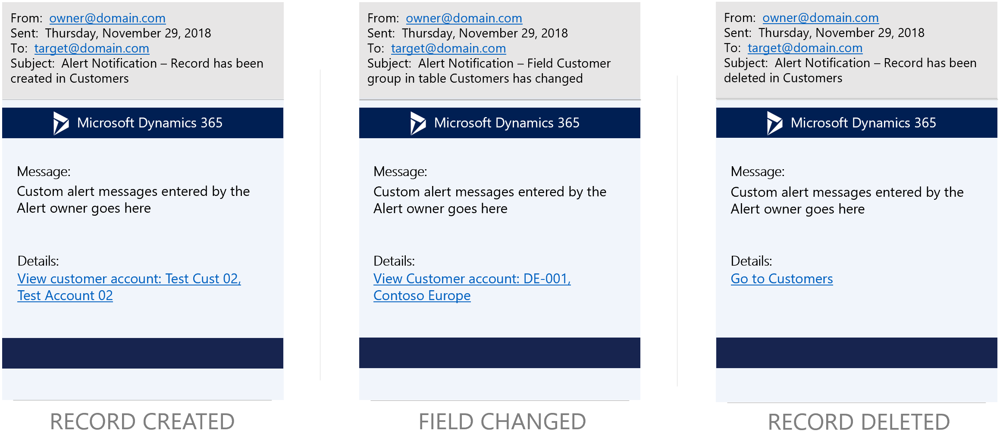

---
# required metadata

title: Client alert notifications by email
description: This topic provides information about how to set up rules that send email notifications predefined events occur.
author: RichdiMSFT
ms.date: 09/20/2019
ms.topic: article
ms.prod: 
ms.technology: 

# optional metadata

ms.search.form: EventCreateRule
# ROBOTS:
audience: Application user
# ms.devlang: 
ms.reviewer: sericks
# ms.tgt_pltfrm: 
# ms.custom:
ms.search.region: Global
# ms.search.industry:
ms.author: richdi
ms.search.validFrom: 2019-1-29
ms.dyn365.ops.version: Platform update 24
---

# Client alert notifications by email

[!include [banner](../includes/banner.md)]

You can define custom alert rules that monitor filtered views of data and automatically send email notifications when predefined events occur. The option to send email notifications is available for all supported alert types and you can also turn them on for existing alert rules.

You can use built-in controls to create alert rules that monitor the filtered views of system batch jobs. By monitoring the value of the **Status** field, you can also configure alert rules that send email when a batch job fails. After you create these alert rules, you no longer have to check reports for changes to business data. Instead, you can let the intelligent change detection service do the monitoring for you.

Client alerts depend on the email subsystem that is provided through integration with Microsoft Office. We recommend that you use the Simple Mail Transfer Protocol (SMTP) provider, so that email distribution doesn't have to rely on a local mail client.

To send notifications by email, customers must configure integrated email services. Email notifications are sent to recipients on behalf of alert owners.

For more information about how to configure email, see [Configure and send email](../organization-administration/configure-email.md).

The following image shows the **Create alert rule** dialog box, which now includes a **Send email** option.

> [!NOTE]
> When the **Send email** option is set to **Yes**, alert notifications will continue to be delivered from the Action Center.

## Alert notification email templates

The service sends email notifications by using predefined email templates that deliver the basic details of the alert notification.

The following image shows the structure of the alert notifications when they are received by email.

<!---

---
title: Clientwarnbenachrichtigungen per E-Mail
description: Dieses Thema enthält Informationen zur Einrichtung von Regeln, die bei vordefinierten Ereignisse E-Mail-Benachrichtigungen senden.
author: tjvass
manager: AnnBe
ms.date: 09/20/2019
ms.topic: article
ms.prod: ''
ms.service: dynamics-ax-applications
ms.technology: ''
ms.search.form: EventCreateRule
audience: Application user
ms.reviewer: sericks
ms.search.region: Global
ms.author: tjvass
ms.search.validFrom: 2019-1-29
ms.dyn365.ops.version: Platform update 24
ms.openlocfilehash: bf485b407d56b21621617682bab3492925f7f9a4
ms.sourcegitcommit: f5e31c34640add6d40308ac1365cc0ee60e60e24
ms.translationtype: HT
ms.contentlocale: 
ms.lasthandoff: 12/08/2020
ms.locfileid: "4693821"
---
# Client-Warnungsbenachrichtigungen per E-Mail

[!include [banner](../includes/banner.md)]

Sie können benutzerdefinierte Warnregeln definieren, die gefilterte Datenansichten überwachen und automatisch E-Mail-Benachrichtigungen senden, wenn vordefinierte Ereignisse auftreten. Die Option zum Senden von Benachrichtigungen steht für alle unterstützten Warntypen zur Verfügung und kann auch für vorhandene Warnregeln aktiviert werden.

Sie können integrierte Kontrollen verwenden, um Warnregeln zu erstellen, die die gefilterten Ansichten von Systembatchaufträgen überwachen. Durch die Überwachung des Werts des Felds **Status** können Sie auch Warnregeln konfigurieren, die E-Mails senden, wenn ein Batchauftrag fehlschlägt. Nachdem diese Warnregeln erstellt wurden, müssen Sie die Berichte nicht mehr auf Änderungen an Geschäftsdaten überprüfen. Stattdessen kann der intelligente Änderungserkennungsdienst die Überwachung für Sie übernehmen.

Clientwarnungen hängen vom E-Mail-Subsystem ab, das durch die Integration in Microsoft Office bereitgestellt wird. Es wird empfohlen, den Simple Mail Transfer Protocol (SMTP)-Anbieter zu verwenden, sodass die E-Mail-Verteilung nicht von einem lokalen Mailclient abhängt.

Um Benachrichtigungen per E-Mail zu senden, müssen Kunden integrierte E-Mail-Services konfigurieren. E-Mail-Benachrichtigungen werden an Empfänger im Auftrag der Warnungseigentümer gesendet.

Weitere Informationen über die Konfiguration von E-Mails finden Sie unter [E-Mail konfigurieren und senden (This is an external link)](https://docs.microsoft.com/de-de/dynamics365/supply-chain/fin-ops-core/fin-ops/organization-administration/configure-email).

Das folgende Bild zeigt das Dialogfeld **Warnregel erstellen**, das jetzt die Option **E-Mail senden** enthält.

> [!NOTE]
> Wenn die Option **E-Mail senden** auf **Ja** festgelegt wurde, werden weiter Warnbenachrichtigungen vom Aktivitätszentrum übermittelt.

## E-Mail-Vorlagen für Warnbenachrichtigungen

Der Dienst sendet E-Mail-Benachrichtigungen, indem er vordefinierte E-Mail-Vorlagen verwendet, die die grundlegenden Details der Warnbenachrichtigung enthalten.

Das folgende Bild zeigt die Warnbenachrichtigungen, wenn sie per E-Mail eingehen.

--->