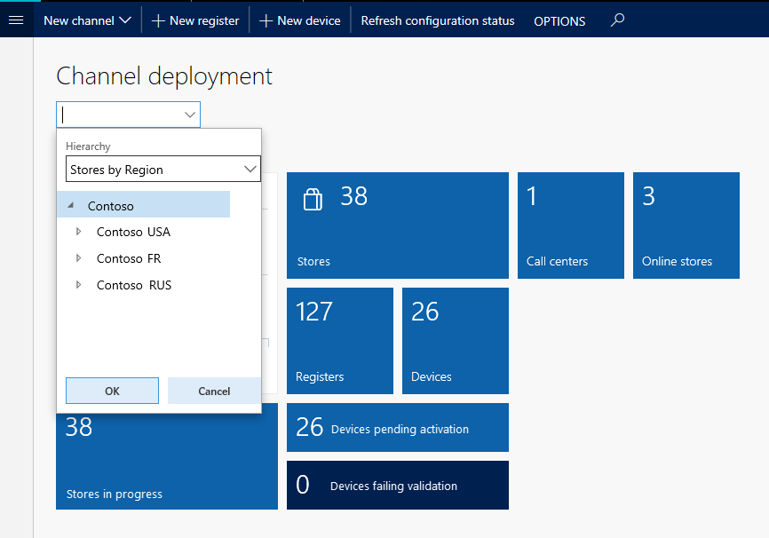
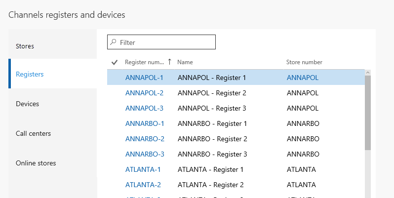

---
# required metadata

title: Configure and filter workspaces
description: This article provides an overview about how to configure and filter workspaces.
author: jasongre
ms.date: 06/20/2017
ms.topic: article
ms.prod: 
ms.technology: 

# optional metadata

ms.search.form: BankTreasurerWorkspace, HcmBenefitWorkspace, BudgetPlanningWorkspace, BusinessProcessGenericWorkspace, RetailCatalogManagementWorkspace, RetailCategoryAndProductWorkspace, RetailChannelManagementWorkspace, HcmCompensationWorkspace, CAMCostAccountingLedgerAdminWorkspace, CostAdminWorkspace, CostAnalysisWorkspace, CAMCostControlWorkspace, CustomerCollectionManagerWorkspace, CustomerInvoiceWorkspace, CustPaymentWorkspace, DataManagementWorkspace, DataValidationWorkspace, ERWorkspace, LedgerPeriodCloseProjectWorkspace, AssetWorkspace, GeneralJournalEntryWorkspace, VendVendorPortalInvoiceWorkspace, BudgetTrackingWorkspace, ReqCreatePlanWorkspace, BusinessProcessGenericOwnerWorkspace, SelfHealingWorkspace, WHSOutboundWorkMonitoringWorkspace, WHSWavePlanningWorkspace, PayrollWorkspace, HcmWorkforceWorkspace, RetailDiscountPricingWorkspace, EcoResProductDiscreteManufacturingWorkspace, KanbanPrepareProductForLeanWorkspace, EcoResProductProcessManufacturingWorkspace, EcoResProductVariantMaintainWorkspace, JmgShopSupervisorWorkspace, ProjProjectManagementWorkspace, VendVendorPortalWorkspace, PurchOrderMaintainWorkspace, PurchOrderProcessReceiptsWorkspace, HcmRecruitmentWorkspace, EcoResProductMaintainWorkspace, FMClerkWorkspace, OpResLifecycleManagementWorkspace, RetailITWorkspace, RetailChannelOperationsWorkspace, RetailStoreManagementWorkspace, SalesOrderProcessingWorkspace, SalesReturnWorkspace, SystemAdministrationWorkspaceForm, VendVendorRequestForQuotationsWorkspace, VendVendorProfileManagementWorkspace, VendInvoiceWorkspace, VendPaymentWorkspace
# ROBOTS: 
audience: Application User
# ms.devlang: 
ms.reviewer: sericks
# ms.tgt_pltfrm: 
ms.custom: 17491
ms.assetid: 541e6012-4680-4684-8494-e9b5ca4684ee
ms.search.region: Global
# ms.search.industry: 
ms.author: jasongre
ms.search.validFrom: 2016-02-28
ms.dyn365.ops.version: AX 7.0.0

---

# Configure and filter workspaces

[!include [banner](../includes/banner.md)]

This article provides an overview about how to configure and filter workspaces.

## Configuring a workspace

You can change the appearance and behavior of some workspaces by updating settings that apply to the whole workspace. When a workspace can be configured, the Action Pane includes a button that instructs you to click it to make configuration changes. For example, in the following illustration, the button is named **Configure my workspace**.

When you click the button, a dialog appears, where you can modify the predefined settings for the workspace. The specific settings that you see in this dialog vary by workspace, and depend on the specific controls and business data that are available in the workspace.

## Filtering a workspace

Many workspaces let you filter the content that appears in them. The controls that are available might let you filter all the content in the workspace or only the content in a specific section of the workspace. The filters on workspaces can be lookups, combo boxes, free-form text fields, or other types of controls. However, every type of filter has the same effects, as described in the following sections.

### Workspace-wide filters

You can filter the whole workspace by using a workspace-wide filter. A workspace-wide filter appears in the upper-left corner of the workspace. When you select a specific value in the drop-down list, the contents of the workspace are filtered based on that selection.

When you click to open the filter, you're presented with several options.

Select an option to filter the workspace based on that option.

### Workspace section filters

If individual sections of the workspace have filters, you can filter each section separately. In the following illustration, the filter (the field that contains the text "Filter") is an example of a free-form text field filter.

As with a workspace-wide filter, select or enter a value in the field to filter the contents of the section.

<!---
title: Arbeitsbereiche konfigurieren und Filtern
description: Dieser Artikel gibt einen Überblick darüber, wie Arbeitsbereiche konfiguriert und gefiltert werden.
author: jasongre
manager: AnnBe
ms.date: 06/20/2017
ms.topic: article
ms.prod: ''
ms.service: dynamics-ax-applications
ms.technology: ''
ms.search.form: BankTreasurerWorkspace, HcmBenefitWorkspace, BudgetPlanningWorkspace, BusinessProcessGenericWorkspace, RetailCatalogManagementWorkspace, RetailCategoryAndProductWorkspace, RetailChannelManagementWorkspace, HcmCompensationWorkspace, CAMCostAccountingLedgerAdminWorkspace, CostAdminWorkspace, CostAnalysisWorkspace, CAMCostControlWorkspace, CustomerCollectionManagerWorkspace, CustomerInvoiceWorkspace, CustPaymentWorkspace, DataManagementWorkspace, DataValidationWorkspace, ERWorkspace, LedgerPeriodCloseProjectWorkspace, AssetWorkspace, GeneralJournalEntryWorkspace, VendVendorPortalInvoiceWorkspace, BudgetTrackingWorkspace, ReqCreatePlanWorkspace, BusinessProcessGenericOwnerWorkspace, SelfHealingWorkspace, WHSOutboundWorkMonitoringWorkspace, WHSWavePlanningWorkspace, PayrollWorkspace, HcmWorkforceWorkspace, RetailDiscountPricingWorkspace, EcoResProductDiscreteManufacturingWorkspace, KanbanPrepareProductForLeanWorkspace, EcoResProductProcessManufacturingWorkspace, EcoResProductVariantMaintainWorkspace, JmgShopSupervisorWorkspace, ProjProjectManagementWorkspace, VendVendorPortalWorkspace, PurchOrderMaintainWorkspace, PurchOrderProcessReceiptsWorkspace, HcmRecruitmentWorkspace, EcoResProductMaintainWorkspace, FMClerkWorkspace, OpResLifecycleManagementWorkspace, RetailITWorkspace, RetailChannelOperationsWorkspace, RetailStoreManagementWorkspace, SalesOrderProcessingWorkspace, SalesReturnWorkspace, SystemAdministrationWorkspaceForm, VendVendorRequestForQuotationsWorkspace, VendVendorProfileManagementWorkspace, VendInvoiceWorkspace, VendPaymentWorkspace
audience: Application User
ms.reviewer: sericks
ms.custom: 17491
ms.assetid: 541e6012-4680-4684-8494-e9b5ca4684ee
ms.search.region: Global
ms.author: jasongre
ms.search.validFrom: 2016-02-28
ms.dyn365.ops.version: AX 7.0.0
ms.openlocfilehash: 7070748a7712d257318aff559e7b115da15b67f0
ms.sourcegitcommit: f5e31c34640add6d40308ac1365cc0ee60e60e24
ms.translationtype: HT
ms.contentlocale: 
ms.lasthandoff: 12/08/2020
ms.locfileid: "4694518"
---
# Arbeitsbereiche konfigurieren und Filtern

[!include [banner](../includes/banner.md)]

Dieser Artikel gibt einen Überblick darüber, wie Arbeitsbereiche konfiguriert und gefiltert werden.

## Arbeitsbereichskonfiguration

Sie können die Darstellungsweise und das Verhalten von einigen Arbeitsbereichen ändern, indem Sie Einstellungen aktualisieren, die für den gesamten Arbeitsbereich gelten. Wenn ein Arbeitsbereich konfiguriert werden kann, enthält der Aktivitätsbereich eine Schaltfläche, die Sie anklicken können, um Konfigurationsänderungen vorzunehmen. In der folgenden Abbildung wird die Schaltfläche **Meinen Arbeitsbereich konfigurieren** benannt.

Wenn Sie auf die Schaltfläche klicken, erscheint ein Dialogfeld, mit dem Sie die vordefinierten Einstellungen des Arbeitsbereichs ändern können. Die Einstellungen, die Sie in diesem Dialogfeld sehen, variieren mit jedem Arbeitsbereich und hängen von den Steuerelementen und Daten ab, die für den Arbeitsbereich verfügbar sind.

## Filtern eines Arbeitsbereichs

Viele Arbeitsbereiche lassen Sie den Inhalt filtern, der angezeigt wird. Die Steuerelemente, die verfügbar sind, lassen Sie alle Inhalte im Arbeitsbereich oder nur den Inhalt in einem bestimmten Bereich im Arbeitsbereich filtern. Filter für Arbeitsbereiche können Suchen, Kombinationsfelder, Freitextfelder oder andere Steuerelementtypen sein. Allerdings hat jeder Filtertyp die gleichen Auswirkungen, wie in den folgenden Abschnitten erläutert wird.

### Filter für den gesamten Arbeitsbereich

Sie können den gesamten Arbeitsbereich filtern, indem Sie einen Filter über den gesamten Arbeitsbereich verwenden. Arbeitsbereich weite Filter finden Sie in der linken oberen Ecke des Arbeitsbereichs. Das Auswählen eines bestimmten Werts in der Filterdropdown-Liste sorgt dafür, dass der Inhalt des Arbeitsbereichs basierend auf dieser Auswahl gefiltert wird.

Wenn Sie den Filter mit einem Klick öffnen, werden mehrere Optionen dargestellt.

Wählen Sie eine Option, um den Arbeitsbereich basierend auf dieser Option zu filtern.

### Arbeitsbereichsabschnittsfilter

Wenn einzelne Bereiche des Arbeitsbereichs Filter haben, können Sie jeden Abschnitt separat filtern. In der nachfolgenden Darstellung sehen Sie den Filter (das Feld, das den Text "Filter" enthält) als Beispiel für ein Freitext-Filterfeld.

Wie bei einem Arbeitsbereich-weiten Filter wählen Sie den gewünschten Filterwert aus oder geben ihn ein, um die angezeigten Inhalte des Bereichs einzugrenzen.
--->