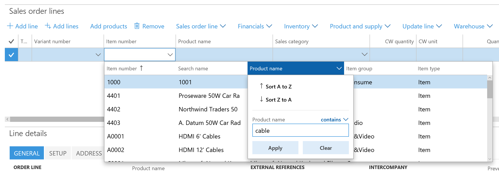

---
# required metadata

title: Find information by using lookups
description: In this topic, you will learn about lookup features and will receive some helpful tips to get the optimal use out of lookups in the system.  
author: jasongre
ms.date: 06/20/2017
ms.topic: article
ms.prod: 
ms.technology: 

# optional metadata

# ms.search.form: 
# ROBOTS: 
audience: Application User
# ms.devlang: 
ms.reviewer: sericks
# ms.tgt_pltfrm: 
ms.custom: 269934
ms.assetid: f20cbd2c-14e0-47e7-b351-8e60d3537f96
ms.search.region: Global
# ms.search.industry: 
ms.author: jasongre
ms.search.validFrom: 2016-02-28
ms.dyn365.ops.version: AX 7.0.0

---

# Find information by using lookups

[!include [banner](../includes/banner.md)]

Many fields have lookups that can help you easily find the correct or desired value. Several enhancements have been added to lookups that make these controls more usable and make users more productive. In this topic, you will learn about these new lookup features and will receive some helpful tips to get the optimal use out of lookups in the system.

## Responsive lookups

In previous versions, when interacting with a lookup control, a user would have to take an explicit action to open the drop-down menu. This may have been by typing an asterisk (\*) in the control to filter the lookup based on the current value of the control, clicking the drop-down button, or by using the **Alt**+**Down arrow** keyboard shortcut. Lookup controls have been modified in the following ways to better align with current web practices:

- Lookup drop-down menus will now open automatically after a slight pause in typing, with the drop-down menu contents filtered based on the lookup control's value.

    Note that the old behavior of automatic opening of the dropdown after typing an asterisk (\*) has been deprecated.

- After the lookup drop-down menu has opened, the following will occur:

    - The cursor will stay in the lookup control (instead of focus moving into the drop-down menu) so you can continue to make modifications to the control's value. However, the user can still use the **Up arrow** and **Down arrow** to change rows in the drop-down menu, and enter to select the current row in the drop-down menu.
    - The contents of the drop-down menu will adjust after any modifications are made to the lookup control's value.

For example, consider a lookup field called **City**.

When focus is in the **City** field, you can start looking for the city that you want by typing a few letters, like "col." After you stop typing, the lookup will open automatically, filtered to those cities that begin with "col".

At this point, the cursor is still in the lookup field. If you continue typing so the value is "colum," the lookup contents adjust automatically to reflect the latest value in the control.

Even though focus is still in the lookup control, you can also use the **Up arrow** or **Down arrow** keys to highlight the row that you want to select. If you press **Enter** the highlighted row will be selected from the lookup and the control's value will be updated.

## Typing in more than IDs

When entering data, it's natural for users to attempt to identify an entity, such as a customer or vendor, in terms of the name rather than an identifier representing the entity. Many (but not all) lookups now allow contextual data entry. This powerful feature allows the user to type the ID or the corresponding name into the lookup control.

For example, consider the **Customer account** field when creating a sales order. This field shows the **Account ID** for the customer, but a user would typically prefer to enter an **Account name** instead of an **Account ID** for this field when creating a sales order, such as "Forest Wholesales" instead of "US-003."

If the user started to enter an **Account ID** into the lookup control, the drop-down menu would automatically open as described in the previous section and the user would see the lookup as shown below.

However, the user can also now enter the beginning of an **Account name** as well. If this is detected, then the user will see the following lookup. Notice how the **Name** column is moved to be the first column in the lookup, and how the lookup is sorted and filtered based on the **Name** column.

## Using grid column headers for more advanced filtering and sorting

The lookup enhancements discussed in the previous two sections greatly improve a user's ability to navigate the rows in a lookup based on a "begins with" search of the **ID** or **Name** field in the lookup. However, there are situations in which more advanced filtering (or sorting) is needed to find the correct row. In these situations, the user needs to use the filtering and sorting options in the grid column headers inside the lookup. For example, consider an employee entering a sales order line who needs to locate the right "cable" as the product. Typing "cable" into the **Item number** control isn't helpful, as there are no product names that begin with "cable."

Instead, the user needs to clear the value of the lookup control, open the lookup drop-down menu, and filter the drop-down menu using the grid column header, as shown below. A mouse (or touch) user can simply click (or touch) any column header to access the filtering and sorting options for that column. For a keyboard user, the user simply needs to press **Alt**+**Down** **arrow** a second time to move focus into the drop-down menu, after which the user can tab to the correct column, and then press **Ctrl**+**G** to open the grid column header drop-down menu.

After the filter has been applied (see the image below), the user can find and select the row as usual.

<!---
title: Informationen per Suchen finden
description: Viele Felder verfügen über Suchen, mit denen Sie schnell den richtigen oder gewünschten Wert finden. Den Suchen wurden viele Erweiterungen hinzugefügt, die diese einfacher und produktiver in der Anwendung machen. In diesem Thema erfahren Sie mehr über die neuen Suchfunktionen und erhalten wertvolle Tipps für deren optimale Nutzung.
author: jasongre
manager: AnnBe
ms.date: 06/20/2017
ms.topic: article
ms.prod: ''
ms.service: dynamics-ax-applications
ms.technology: ''
audience: Application User
ms.reviewer: sericks
ms.custom: 269934
ms.assetid: f20cbd2c-14e0-47e7-b351-8e60d3537f96
ms.search.region: Global
ms.author: jasongre
ms.search.validFrom: 2016-02-28
ms.dyn365.ops.version: AX 7.0.0
ms.openlocfilehash: a555db8ced5981abf1f3f58f16b77e1c263dcfa2
ms.sourcegitcommit: f5e31c34640add6d40308ac1365cc0ee60e60e24
ms.translationtype: HT
ms.contentlocale: 
ms.lasthandoff: 12/08/2020
ms.locfileid: "4693640"
---
# Informationen per Suchen finden

[!include [banner](../includes/banner.md)]

Viele Felder verfügen über Suchen, mit denen Sie schnell den richtigen oder gewünschten Wert finden. Den Suchen wurden viele Erweiterungen hinzugefügt, die diese einfacher und produktiver in der Anwendung machen. In diesem Thema erfahren Sie mehr über die neuen Suchfunktionen und erhalten wertvolle Tipps für deren optimale Nutzung.

## Responsive Suchen

In älteren Versionen musste der Benutzer explizit eine Aktion durchführen, um das Dropdownmenü zu öffnen. So musste beispielsweise ein Sternchen (\*) im Steuerelement eingegeben werden, um die Suche basierend auf dem aktuellen Wert des Steuerelements zu filtern. Oder der Benutzer musste auf die Dropdownschaltfläche klicken oder eine Tastenkombination aus **ALT**+**NACH-UNTEN** verwenden. Suchsteuerelemente wurden wie folgt modifiziert, um den aktuellen Webmethoden besser gerecht zu werden:

- Dropdownmenüs für Suchen öffnen sich nun automatisch, sobald die Dateneingabe pausiert. Dabei werden die Inhalte des Dropdownmenüs basierend auf dem Wert des Suchsteuerelements gefiltert.

    Beachten Sie, dass das alte Verhalten, bei dem das Dropdownmenü automatisch geöffnet wurde, wenn der Benutzer ein Sternchen (\*) eingegeben hat, nicht mehr unterstützt wird.

- Nach dem Öffnen des Suchendropdownmenüs geschieht Folgendes:

    - Der Cursor bleibt im Suchsteuerelement (kein Fokus auf einen Wechsel zum Dropdownmenü), sodass Sie weiterhin Änderungen am Wert des Steuerelements vornehmen können. Allerdings kann der Benutzer noch die **NACH-OBEN-TASTE** und die **NACH-UNTEN-TASTE** verwenden, um Zeilen im Dropdownmenü zu ändern und die aktuelle Zeile im Dropdownmenü auszuwählen.
    - Der Inhalt des Dropdownmenüs wird angepasst, nachdem die Änderungen am Wert des Suchsteuerelements vorgenommen wurden.

Angenommen Sie haben ein Suchfeld namens **Stadt**.

Ist der Fokus auf dem Feld **Stadt**, können Sie nach der gewünschten Stadt suchen, indem Sie einige Buchstaben, beispielsweise "tan", eingeben. Nachdem Sie die Texteingabe beendet haben, öffnet sich die Suche automatisch, und es werden alle Städte angezeigt, die mit "tan" beginnen.

Zu diesem Zeitpunkt ist der Cursor noch im Suchfeld. Wenn Sie die Eingabe fortsetzen und diese sich zu "Tanne" ändert, passt sich der Inhalt der Suche automatisch an und gibt den letzten Wert des Steuerelements wieder.

Obwohl der Fokus noch auf das Suchsteuerelement gesetzt ist, können Sie die **NACH-OBEN-TASTE** oder die **NACH-UNTEN-TASTE** nutzen, um die Zeile zu markieren, die Sie auswählen möchten. Wenn Sie die **Eingabe-Taste** drücken, wird die markierte Zeile von der Suche ausgewählt und der Wert des Steuerelements aktualisiert.

## Mehr als nur IDs eingeben

Bei der Eingabe von Daten versuchen Benutzer in der Regel, eine Entität, beispielsweise einen Debitor oder Kreditor, anhand des Namens zu identifizieren und nicht anhand des Bezeichners, der die Entität wiedergibt. Viele (jedoch nicht alle) Suchen lassen jetzt kontextabhängige Dateneingabe zu. Diese leistungsstarke Funktion ermöglicht dem Benutzer, die ID oder den entsprechenden Namen in das Suchsteuerelement einzugeben.

Beachten Sie dazu beispielsweise das Feld **Debitorenkonto** beim Anlegen eines Auftrags. Dieses Feld zeigt die **Kontokennung** des Debitors, allerdings würde ein Benutzer eher einen **Kontonamen** statt einer **Kontokennung** für das Feld eingeben, wenn er einen Auftrag anlegt, beispielsweise "Forest Wholesales" anstelle von "US-003."

Beginnt der Benutzer mit der Eingabe einer **Kontokennung** in das Suchsteuerelement, öffnet sich das Dropdownmenü automatisch so wie im vorherigen Abschnitt beschrieben und der Benutzer sieht die Suche wie unten gezeigt.

Allerdings kann der Benutzer jetzt auch den Anfang eines **Kontonamens** eingeben. Wird dies erkannt, wird dem Benutzer die folgende Suche angezeigt. Beachten Sie, wie die Spalte **Name** zur ersten Spalte in der Suche wird und wie die Suche basierend auf der Spalte **Name** sortiert und gefiltert wird.

## Verwenden der Rasterspaltenüberschriften für eine erweiterte Filterung und Sortierung

Die Sucherweiterungen, die in den beiden vorherigen Abschnitten vorgestellt wurden, haben die Navigationsmöglichkeiten eines Benutzers in Zeilen einer Suche basierend auf einer "Beginnt mit"-Suche für die Felder **Kennung** oder **Name** in der Suche stark verbessert. Allerdings gibt es Situationen, in denen eine erweiterte Filterung oder Sortierung erforderlich ist, um die richtige Zeile zu finden. In solchen Fällen muss der Benutzer die Filter- und Sortieroptionen in den Rasterspaltenüberschriften innerhalb der Suche verwenden. Angenommen, ein Mitarbeiter gibt eine Auftragsposition ein, bei der das richtige "Kabel" als Produkt gefunden werden muss. "Kabel" in das Steuerelement **Artikelnummer** einzugeben ist nicht hilfreich, da kein Produktname mit "Kabel" beginnt.

Stattdessen muss der Benutzer den Wert des Suchsteuerelements löschen, das Suchdropdownmenü öffnen und das Dropdownmenü mittels der Rasterspaltenüberschrift wie unten gezeigt filtern. Ein Maus- oder Touch-Benutzer kann einfach auf eine beliebige Spaltenüberschrift klicken bzw. tippen, um auf die Filter- und Sortieroptionen für diese Spalte zuzugreifen. Ein Tastaturbenutzer muss die Kombination **ALT**+**NACH-UNTEN** **Pfeil** ein weiteres Mal drücken, um den Fokus auf das Dropdownmenü zu legen. Danach kann der Benutzer in die richtige Spalte wechseln und **STRG**+**G** drücken, um das Dropdownmenü für die Rasterspaltenüberschrift zu öffnen.

Nachdem der Filter angewendet wurde (siehe Bild unten), kann der Benutzer die Zeile wie gewohnt suchen und auswählen.

--->