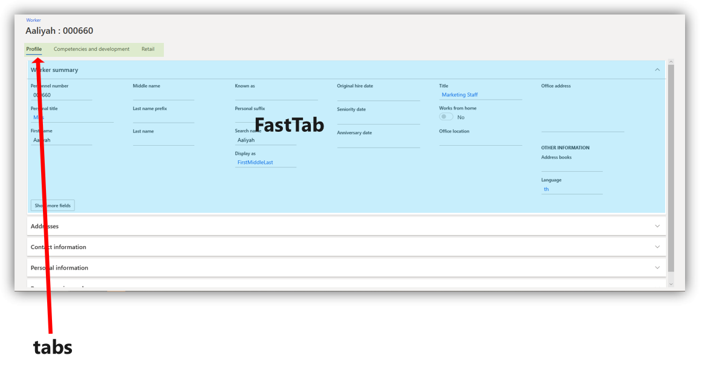
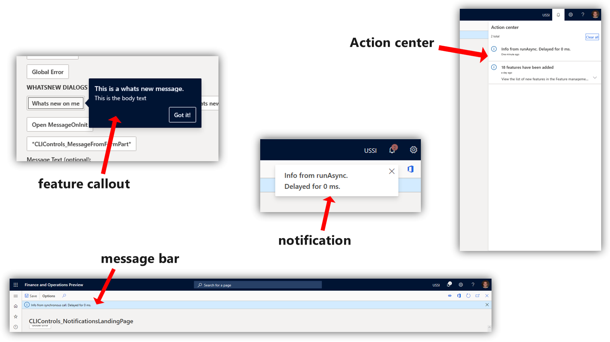

---
# required metadata

title: User interface elements
description: This topic describes the user interface (UI) elements in the app.
author: tlefor
ms.date: 08/09/2019
ms.topic: article
ms.prod: 
ms.technology: 

# optional metadata

# ms.search.form:  
audience: Application User
# ms.devlang: 
ms.reviewer: sericks
# ms.tgt_pltfrm: 
# ms.custom: 
ms.search.region: Global
# ms.search.industry: 
ms.author: tlefor
ms.search.validFrom:  
ms.dyn365.ops.version: 7.3
---

# User interface elements

This topic describes the user interface (UI) elements used in the app. Before users can navigate the interface, it's important to know the names and functions of the elements that make up the interface.

## Overview

- **Action Pane** - The bar beneath the navigation bar. Here, you can select tabs to change records shown in the page. You can edit and save the records here.  
- **FactBox** - You can see information and follow the activities of certain records in this pane.  
- **FactBox pane** Here, you can scroll through different aspects of a record to view in the FactBox.  
- **Filter pane** - On some pages, you can select **Show filters** to open this pane. It allows you to narrow the results visible to you on the page.  
- **Navigation bar** - The bar at the top of the interface. It contains the **Dynamics 365 portal**, **Search**, **company picker**, **Action center**, **Settings**, **Help & Support**, and the user profile.  
- **Navigation list** - On some pages, you can scroll through this pane to find a specific record. When selected, the details of the record will appear in the page.  
- **Navigation pane** - The left-most pane. From here, you can find any page in the product.  
- **Page** - The central focus of the interface. Selections made on the other UI components will affect what records are shown here.  
- **Pane** - The right-most pane. This will open in some cases when aspects of a record need to be changed and saved.  
- **Tab** - When referring to the Action Pane, it's a menu of options that appears when you select a given option in the Action Pane.  

## Tabs, fields, and sections

A *tab* is a selection made on the page that opens a different aspect of a record on the same page. Often, it will allow you to change certain *fields*, or UI elements that allow typed input. 

A *FastTab* is a tab with the added benefit of allowing multiple tabs to be visible at the same. You can expand a FastTab by selecting the downward-pointing arrow on the right end of it.

A *section* is similar to a tab. The word "section" is often used to describe any area of a page that organizes a specific category of information. In the following image, Summary, Orders and favorites, and Links are all examples of sections.

## Dialog boxes and drop-down menus

A *dialog box* is a pane that opens when certain selections are made to change or create a record. Dialog boxes contain fields that allow you to enter typed input. Sometimes, a given field will allow you to select a downward facing arrow that opens a list of options to choose from. This is called a *drop-down menu*. In the following image, the **Type** and **Customer group** fields contain the option to open a drop-down menu.

In some cases, a dialog box will open near a given button when you select it. This is called a *drop-down dialog box*. In the following image, the **As of date** button was selected, which opened a drop-down dialog box.

## Notifications

Certain changes to the objects you oversee will appear as *notifications*. Notifications may notify you when a specific customer's information has been changed, or it may alert you when the system can't accept inputs you've added in certain fields. You can learn how to customize what you receive notifications about in the [Alerts overview](../get-started/alerts-overview.md).

Notifications appear in a variety of ways.
- **Feature callout** - This will appear next to a field, tab, or other button to offer an explanation of what the feature is used for. 
- **Action center** - A box that contains the notification will appear next to the Action center button on the navigation bar. You can see details about the notification by selecting **Action center**.  
- **Message bar** - This will appear beneath the Action Pane.  

The following image shows examples of these types of notifications.

- **Message box** - This will appear over the interface and must be interacted with before you can continue to use the product.  

## Toolbars, grids, and lists

A *toolbar* contains tools, such as the ability to add fields or remove records. Sometimes, a toolbar will appear on the page above a *grid*. This area, grid, is a name given to rows of records with various columns of data. Not all grids have toolbars above them.

A *list* is the name given to a collection of records that you can scroll through. You can bring these records into the page by selecting them. Often, this will open a grid.

<!---
title: Benutzeroberflächenelemente
description: Dieses Thema beschreibt die in der App verwendeten Elemente der Benutzeroberfläche (UI).
author: tlefor
manager: AnnBe
ms.date: 08/09/2019
ms.topic: article
ms.prod: ''
ms.service: dynamics-ax-applications
ms.technology: ''
audience: Application User
ms.reviewer: sericks
ms.search.region: Global
ms.author: tlefor
ms.search.validFrom: ''
ms.dyn365.ops.version: 7.2999999999999998
ms.openlocfilehash: 0c58ac63a4eae61c9a1cc6134bd0857394895e30
ms.sourcegitcommit: f5e31c34640add6d40308ac1365cc0ee60e60e24
ms.translationtype: HT
ms.contentlocale: 
ms.lasthandoff: 12/08/2020
ms.locfileid: "4693592"
---
# Benutzeroberflächenelemente

Dieses Thema beschreibt die in der App verwendeten Elemente der Benutzeroberfläche (UI). Bevor Benutzer durch die Oberfläche navigieren können, ist es wichtig, die Namen und Funktionen der Elemente zu kennen, aus denen sich die Oberfläche zusammensetzt.

## Übersicht

- **Aktionsbereich** - Die Leiste unter der Navigationsleiste. Hier können Sie Registerkarten auswählen, um die auf der Seite angezeigten Datensätze zu ändern. Hier können Sie die Datensätze bearbeiten und speichern.  
- **FactBox** - In diesem Bereich können Sie Informationen anzeigen und die Aktivitäten bestimmter Datensätze verfolgen.  
- **FactBox-Bereich** Hier können Sie durch verschiedene Aspekte eines Datensatzes blättern, um ihn in der FactBox anzuzeigen.  
- **Filterbereich** - Auf einigen Seiten können Sie **Filter anzeigen** auswählen, um diesen Bereich zu öffnen. Es ermöglicht Ihnen, die für Sie auf der Seite sichtbaren Ergebnisse einzugrenzen.  
- **Navigationsleiste** - Die Leiste oben auf der Oberfläche. Es enthält das **Dynamics 365 Portal**, **Suche**, **Firmenauswahl**, **Aktionszentrum**, **Einstellungen**, **Hilfe & Support** und das Benutzerprofil.  
- **Navigationsliste** - Auf einigen Seiten können Sie durch diesen Bereich blättern, um einen bestimmten Datensatz zu finden. Wenn diese Option ausgewählt ist, werden die Details des Datensatzes auf der Seite angezeigt.  
- **Navigationsbereich** - Der linke Bereich ganz oben. Von hier aus können Sie jede beliebige Seite im Produkt finden.  
- **Seite** - Der zentrale Fokus der Schnittstelle. Auswahlen, die auf den anderen UI-Komponenten getroffen werden, beeinflussen die hier angezeigten Datensätze.  
- **Bereich** - Der rechte Bereich ganz oben. Dies wird in einigen Fällen geöffnet, wenn Aspekte eines Datensatzes geändert und gespeichert werden müssen.  
- **Tab** - Wenn Sie sich auf das Aktionsfenster beziehen, ist es ein Menü von Optionen, das erscheint, wenn Sie eine bestimmte Option im Aktionsfenster auswählen.  

## Registerkarten, Felder und Abschnitte

Ein *Tab* ist eine Auswahl auf der Seite, die einen anderen Aspekt eines Datensatzes auf der gleichen Seite öffnet. Oftmals können Sie damit bestimmte *Felder* oder UI-Elemente ändern, die eine typisierte Eingabe ermöglichen. 

Ein *FastTab* ist ein Tab mit dem zusätzlichen Vorteil, dass mehrere Tabs gleichzeitig sichtbar sind. Sie können einen FastTab erweitern, indem Sie auf den nach unten gerichteten Pfeil am rechten Ende klicken.

Ein *Abschnitt* ist ähnlich wie eine Registerkarte. Das Wort „Abschnitt“ wird oft verwendet, um jeden Bereich einer Seite zu beschreiben, der eine bestimmte Kategorie von Informationen organisiert. Im folgenden Bild sind Zusammenfassung, Bestellungen und Favoriten sowie Links Beispiele für Abschnitte.

## Dialogfelder und Dropdown-Menüs

Ein *Dialogfeld* ist ein Fenster, das sich öffnet, wenn bestimmte Auswahlmöglichkeiten zum Ändern oder Erstellen eines Datensatzes getroffen werden. Dialogfenster enthalten Felder, die es Ihnen ermöglichen, typisierte Eingaben zu machen. Manchmal erlaubt es Ihnen ein bestimmtes Feld, einen nach unten gerichteten Pfeil auszuwählen, der eine Liste von Optionen zur Auswahl öffnet. Dies wird als *Dropdown-Menü* bezeichnet. In der folgenden Abbildung enthalten die Felder **Typ** und **Kundengruppe** die Option, ein Dropdown-Menü zu öffnen.

In einigen Fällen öffnet sich bei der Auswahl einer bestimmten Schaltfläche ein Dialogfeld. Dies wird als *Dropdown-Dialogfeld* bezeichnet. Im folgenden Bild wurde die Schaltfläche **Als Datum** ausgewählt, die eine Dropdown-Liste öffnete.

## Benachrichtigungen

Bestimmte Änderungen an den von Ihnen betreuten Objekten werden als *Benachrichtigungen* angezeigt. Benachrichtigungen können Sie benachrichtigen, wenn sich die Informationen eines bestimmten Kunden geändert haben, oder sie können Sie benachrichtigen, wenn das System keine Eingaben akzeptieren kann, die Sie in bestimmten Feldern hinzugefügt haben. Wie Sie das, worüber Sie Benachrichtigungen erhalten, anpassen können, erfahren Sie in der Übersicht [Alarme](../get-started/alerts-overview.md).

Benachrichtigungen werden auf verschiedene Weise angezeigt.
- **Feature-Vorstellung** - Dies wird neben einem Feld, einer Registerkarte oder einer anderen Schaltfläche angezeigt, um eine Erklärung zu geben, wofür die Funktion verwendet wird. 
- **Aktionscenter** - Ein Feld, das die Benachrichtigung enthält, wird neben der Schaltfläche Aktionscenter in der Navigationsleiste angezeigt. Details zur Benachrichtigung finden Sie unter **Aktionszentrum**.  
- **Meldungsleiste** - Dies wird unter dem Aktionsfenster angezeigt.  

Die folgende Abbildung zeigt Beispiele für diese Art von Benachrichtigungen.

- **Nachrichtenbox** - Diese erscheint über die Schnittstelle und muss mit ihr interagiert werden, bevor Sie das Produkt weiter verwenden können.  

## Symbolleisten, Gitter und Listen

Eine *Werkzeugleiste* enthält Werkzeuge, wie z.B. die Möglichkeit, Felder hinzuzufügen oder Datensätze zu entfernen. Manchmal erscheint eine Symbolleiste auf der Seite über einem *Raster*. Dieser Bereich, das Raster, ist ein Name für Zeilen von Datensätzen mit verschiedenen Datenspalten. Nicht alle Raster haben Symbolleisten über ihnen.

Eine *Liste* ist der Name einer Sammlung von Datensätzen, durch die Sie blättern können. Sie können diese Datensätze auf die Seite bringen, indem Sie sie auswählen. Häufig wird dadurch ein Raster geöffnet.

--->