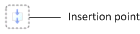

---
# required metadata

title: Configure parallel activities in a workflow
description: To configure a parallel activity, complete the following procedures in the workflow editor.
author: ChrisGarty
ms.date: 06/20/2017
ms.topic: article
ms.prod: 
ms.technology: 

# optional metadata

# ms.search.form: 
# ROBOTS: 
audience: Application User, IT Pro
# ms.devlang: 
ms.reviewer: sericks
# ms.tgt_pltfrm: 
ms.custom: 195753
ms.assetid: 6d0656df-b5af-4001-96e6-6f0fcc44d022
ms.search.region: Global
# ms.search.industry: 
ms.author: cgarty
ms.search.validFrom: 2016-02-28
ms.dyn365.ops.version: AX 7.0.0

---

# Configure parallel activities in a workflow

[!include [banner](../includes/banner.md)]

To configure a parallel activity, complete the following procedures in the workflow editor.

A parallel activity consists of workflow branches that run at the same time.

## Name a parallel activity

Follow these steps to enter a name for a parallel activity.

1. Right-click the parallel activity, and then click **Properties** to open the **Properties** form.
2. In the left pane, click **Basic Settings**.
3. In the **Name** field, enter a unique name for the parallel activity.
4. Click **Close**.

## Configure the branches of a parallel activity

Follow these steps to add and configure the branches of this parallel activity.

1. Double-click the parallel activity to display the branches of the parallel activity.
2. To add a branch, drag the **Branch** element from the **Workflow elements** area to an insertion point on the canvas. The following figure shows an insertion point.

    

    > [!NOTE]
    > The order of the branches is not important because all the branches of a parallel activity run at the same time.

3. To configure each branch, see [Configure parallel branches in a workflow](configure-parallel-branch-workflow.md).

<!---
title: Konfigurieren paralleler Aktivitäten in einem Workflow
description: Führen Sie im Workflow-Editor die folgenden Schritte aus, um eine parallele Aktivität zu konfigurieren.
author: ChrisGarty
manager: AnnBe
ms.date: 06/20/2017
ms.topic: article
ms.prod: ''
ms.service: dynamics-ax-applications
ms.technology: ''
audience: Application User, IT Pro
ms.reviewer: sericks
ms.custom: 195753
ms.assetid: 6d0656df-b5af-4001-96e6-6f0fcc44d022
ms.search.region: Global
ms.author: cgarty
ms.search.validFrom: 2016-02-28
ms.dyn365.ops.version: AX 7.0.0
ms.openlocfilehash: 8043e2854ccc8db0128969ffe36a5517a12c37ac
ms.sourcegitcommit: f5e31c34640add6d40308ac1365cc0ee60e60e24
ms.translationtype: HT
ms.contentlocale: 
ms.lasthandoff: 12/08/2020
ms.locfileid: "4693353"
---
# Konfigurieren paralleler Aktivitäten in einem Workflow

[!include [banner](../includes/banner.md)]

Führen Sie im Workflow-Editor die folgenden Schritte aus, um eine parallele Aktivität zu konfigurieren.

Eine parallele Aktivität besteht aus Workflowverzweigungen, die gleichzeitig ausgeführt werden.

## Name der Parallelaktivität

Gehen Sie folgendermaßen vor, um einen Namen für die parallele Aktivität einzugeben.

1. Klicken Sie mit der rechten Maustaste auf die parallele Aktivität, und klicken Sie anschließend auf **Eigenschaften**, um das Formular **Eigenschaften** zu öffnen.
2. Klicken Sie im linken Bereich auf **Grundeinstellungen**.
3. Geben Sie im Feld **Name** einen eindeutigen Namen für die parallele Aktivität ein.
4. Klicken Sie auf **Schließen**.

## Konfigurieren der Verzweigungen der parallelen Aktivität

Gehen Sie folgendermaßen vor, um die Verzweigungen dieser parallelen Aktivität hinzuzufügen und zu konfigurieren.

1. Doppelklicken Sie auf die parallele Aktivität, um die Verzweigungen der parallelen Aktivität anzuzeigen.
2. Ziehen Sie zum Hinzufügen einer Zweigstelle das Element **Zweigstelle** aus dem Bereich **Elemente** hinzu. Die folgende Abbildung zeigt einen Einfügepunkt.

    

    > [!NOTE]
    > Die Reihenfolge der Verzweigungen ist nicht relevant, da alle Verzweigungen einer parallelen Aktivität gleichzeitig ausgeführt werden.

3. Informationen zum Konfigurieren jeder Zweigstelle finden Sie unter [Konfigurieren paralleler Verzweigungen in einem Workflow](configure-parallel-branch-workflow.md).
--->