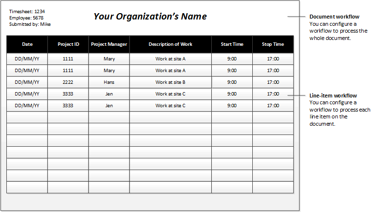

---
# required metadata

title: Workflow elements
description: This topic describes the various elements that make up a workflow.
author: ChrisGarty
ms.date: 11/03/2017
ms.topic: article
ms.prod: 
ms.technology: 

# optional metadata

# ms.search.form: 
# ROBOTS: 
audience: Application User, IT Pro
# ms.devlang: 
ms.reviewer: sericks
# ms.tgt_pltfrm: 
ms.custom: 56441
ms.assetid: de740262-6ffd-42b9-a325-540eae5cec94
ms.search.region: Global
# ms.search.industry: 
ms.author: cgarty
ms.search.validFrom: 2016-02-28
ms.dyn365.ops.version: AX 7.0.0

---

# Workflow elements

[!include [banner](../includes/banner.md)]

This topic describes the various elements that make up a workflow.

A workflow consists of elements. The sections that follow describe each type of element.

## Tasks

A *task* is a unit of work that must be performed. Two types of tasks can be added to a workflow: manual tasks and automated tasks.

### Manual task

A *manual task* is a unit of work that must be performed by a user. For example, an expense report workflow can have manual tasks that require the assigned users to complete the following actions:

- Review the receipts that are submitted together with an expense report.
- Call an employee's manager.

### Automated task

An *automated task* is a unit of work that must be performed by the system. No human interaction is required. For example, a sales order workflow can have automated tasks that require the system to complete the following actions:

- Perform a credit check.
- Create a customer record for the customer, if a record doesn't already exist.

## Approval processes

An *approval process* is a process that consists of separate steps. At each approval step, the user can perform the following actions:

- Approve the document.
- Reject the document.
- Request a change to the document.
- Assign the document to another user for approval.

## Line-item workflow elements

A workflow can be created to process either documents or the line items on a document. For example, you've created an approval workflow for timesheets. (We will refer to this workflow as the *document workflow*.) You can add a *line-item workflow* element to that document workflow. When the line-item element is run, each line item on the document is submitted for processing. You might want all the line items to be processed by the same line-item workflow, or you might want each line item to be processed by a different line-item workflow. Imagine that an employee has submitted a timesheet that resembles the following figure.

In this scenario, you might want to create the following line-item workflows:

- **Line-item workflow 1** – This workflow is used to process line items where the project ID is 1111.
- **Line-item workflow 2** – This workflow is used to process line items where the project ID is 2222.
- **Line-item workflow 3** – This workflow is used to process line items where the project ID is 3333.

## Flow-control elements

The following elements let you design workflows that have alternate branches or branches that run at the same time.

### Manual decision

A *manual decision* is a point where a workflow divides into two branches. A user must make a decision, and this decision determines which branch is used to process the document that was submitted.

### Conditional decision

A *conditional decision* is also a point where a workflow divides into two branches. However, the system decides which branch is used to process the document that was submitted. To make this decision, the system evaluates the document to determine whether it meets specified conditions.

### Parallel activity

A *parallel activity* is a workflow element that includes two or more workflow branches that run at the same time.

### Subworkflow

A *subworkflow* is a workflow that runs in the context of another workflow.

<!---
title: Workflowelemente
description: Dieses Thema beschreibt die verschiedenen Elemente, die einen Workflow darstellen.
author: ChrisGarty
manager: AnnBe
ms.date: 11/03/2017
ms.topic: article
ms.prod: ''
ms.service: dynamics-ax-applications
ms.technology: ''
audience: Application User, IT Pro
ms.reviewer: sericks
ms.custom: 56441
ms.assetid: de740262-6ffd-42b9-a325-540eae5cec94
ms.search.region: Global
ms.author: cgarty
ms.search.validFrom: 2016-02-28
ms.dyn365.ops.version: AX 7.0.0
ms.openlocfilehash: b681d4da750df502987bd00ab52c1cb6eecdf30e
ms.sourcegitcommit: f5e31c34640add6d40308ac1365cc0ee60e60e24
ms.translationtype: HT
ms.contentlocale: 
ms.lasthandoff: 12/08/2020
ms.locfileid: "4694238"
---
# Workflowelemente

[!include [banner](../includes/banner.md)]

Dieses Thema beschreibt die verschiedenen Elemente, die einen Workflow darstellen.

Ein Workflow besteht aus Elementen. In den folgenden Abschnitten wird jeder Elementtyp beschrieben.

## Aufgaben

Bei einer *Aufgabe* handelt es sich um eine auszuführende Arbeitseinheit. Es können zwei Arten von Aufgaben zu einem Workflow hinzugefügt werden: manuelle Aufgaben und automatisierte Aufgaben.

### Manuelle Aufgabe

Bei einer *manuellen Aufgabe* handelt es sich um eine Arbeitseinheit, die von einem Benutzer auszuführen ist. Beispielsweise beinhaltet ein Workflow für Spesenabrechnungen manuelle Aufgaben, die von den zugewiesenen Benutzern folgende Aktionen erfordern:

- Prüfen der zusammen mit einer Spesenabrechnung eingereichten Belege.
- Anrufen des Vorgesetzten eines Mitarbeiters.

### Automatisierte Aufgabe

Bei einer *automatisierten Aufgabe* handelt es sich um eine Arbeitseinheit, die vom System auszuführen ist. Es sind keine manuellen Benutzeraktivitäten erforderlich. Beispielsweise beinhaltet ein Workflow für Aufträge automatisierte Aufgaben, die vom System folgende Aktionen erfordern:

- Ausführen einer Kreditprüfung.
- Erstellen eines Debitorendatensatzes für den Debitor, sofern noch nicht vorhanden.

## Genehmigungsprozesse

Bei einem *Genehmigungsprozess* handelt es sich um einen Prozess, der aus getrennten Schritten besteht. Bei jedem Genehmigungsschritt kann der Benutzer die folgenden Aktivitäten ausführen:

- Dient zum Genehmigen des Dokuments.
- Dient zum Ablehnen des Dokuments.
- eine Änderung am Dokument anzufordern,
- Dokument einem anderen Benutzer zur Genehmigung zuweisen.

## Elemente von Positionsworkflows

Ein Workflow kann zum Verarbeiten von Dokumenten oder der Positionen in einem Dokument erstellt werden. Angenommen, Sie haben einen Genehmigungsworkflow für Arbeitszeitnachweise erstellt. (Wir bezeichnen diesen Workflow als *Dokumentworkflow*.) Sie können ein *Positionsworkflow*-Element zu diesem Dokumentworkflow hinzufügen. Bei der Ausführung des Positionselements wird jede Position im Dokument zur Verarbeitung übermittelt. Dabei können alle Positionen durch denselben Positionsworkflow oder jede Position durch einen anderen Positionsworkflow verarbeitet werden. Angenommen, ein Mitarbeiter hat einen Arbeitszeitnachweis übermittelt, der der folgenden Abbildung ähnelt.

In diesem Szenario möchten Sie vielleicht die folgenden Positionsworkflows erstellen:

- **Positionsworkflow 1** – Dieser Workflow wird zum Verarbeiten von Positionen mit Projektkennung 1111 verwendet.
- **Positionsworkflow 2** – Dieser Workflow wird zum Verarbeiten von Positionen mit Projektkennung 2222 verwendet.
- **Positionsworkflow 3** – Dieser Workflow wird zum Verarbeiten von Positionen mit Projektkennung 3333 verwendet.

## Flusssteuerelemente

Mithilfe der folgenden Elemente können Sie Workflows mit alternativen Verzweigungen oder gleichzeitig ausgeführten Verzweigungen entwerfen.

### Manuelle Entscheidung

Eine *manuelle Entscheidung* ist ein Punkt, an dem sich ein Workflow verzweigt. Ein Benutzer muss eine Entscheidung treffen, und diese Entscheidung bestimmt, welche Verzweigung zum Verarbeiten des übermittelten Dokuments verwendet wird.

### Bedingte Entscheidung

Eine *bedingte Entscheidung* ist ein Punkt, an dem sich ein Workflow verzweigt. Das System entscheidet jedoch, welcher Zweig zum Verarbeiten des übermittelten Dokuments verwendet wird. Um diese Entscheidung zu treffen, wertet das System das Dokument aus, um zu bestimmen, ob es den angegebenen Bedingungen entspricht.

### Parallele Aktivität

Eine *parallele Aktivität* ist ein Workflowelement, das zwei oder mehr Workflowverzweigungen enthält, die gleichzeitig ausgeführt werden.

### Untergeordneter Workflow

Ein *untergeordneter Workflow* ist ein Workflow, der im Kontext eines anderen Workflows ausgeführt wird.
-->