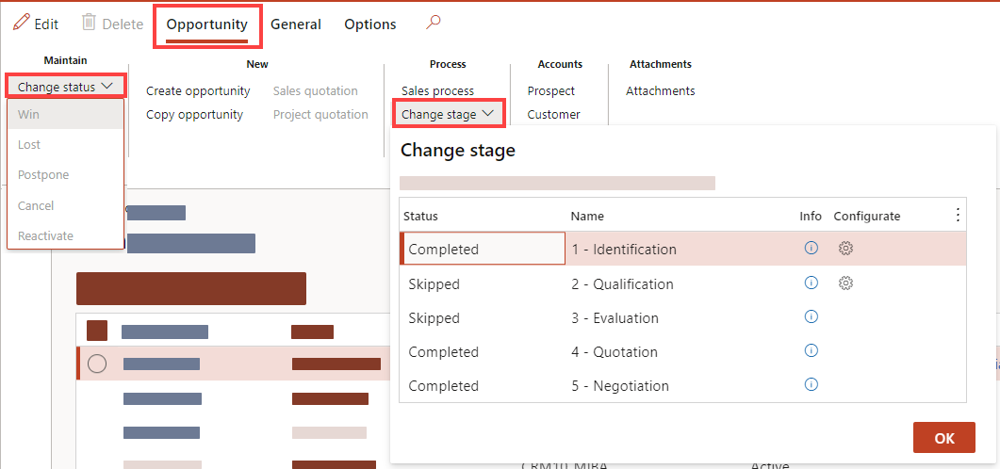
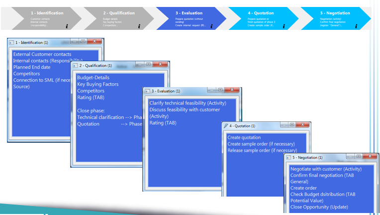

# Opportunities

>[!NOTE]
>Alle wichtigen Begriffe zum CRM Modul sind in der Terminologie Datenbank ausführlich erklärt:
>http://intranet.corp.root.int/portals/corp/sales/crm/Lists/Terminologies/AllItems.aspx

>[!NOTE]
>Weitere Unterlagen und Präsentationen  zu diesem Thema befinden sich hier:
>http://intranet.corp.root.int/portals/corp/sales/crm/Training%20Material/Forms/AllItems.aspx
 
# Opportunity Process
An opportunity is a lead who is now almost ready to buy—in other words, a deal that you're ready to win.
With an opportunity, you can forecast sales revenue, set a potential close date, and factor in a prob-ability for the sale to occur.

When you create an opportunity, you must specify an existing account or contact record. When you add a price list to an opportunity, it helps in automatically calculating pricing of the proposed products that the opportunity is interested in purchasing.

## Ways to create opportunities
*(Microsoft Standard, not used in WIKA right now) You can create a new opportunity that didn't originate from a lead, or you can convert qualified leads to opportunities without reentering the data, and then you can track opportunities through the sales cycle. When you convert a qualified lead to an account, contact, or opportunity, you can access the lead record, which includes activities and notes, from the corresponding opportunity form. You can also access the lead information if you create a new opportunity and link it to a lead record. You can't convert an opportunity to a lead; you can only close opportunities. (Microsoft Stand-ard, not used in WIKA right now).*
Here are the different ways in which you can create an opportunity:
1. Qualify or convert a lead. More information: Qualify a lead and convert it to an oppor-tunity (Microsoft Standard, not used in WIKA right now).
2. Import opportunity records. More information: Import data (Microsoft Standard, not used in WIKA right now).
3. Create an opportunity from the Opportunities list. More information: Create an opportunity.

## How to access Opportunities

1. `Sales And Marketing >> Relationships >> Opportunities >> All Opportunities
-> Action Pane Tab Opportunity >> New >> Create Opportunity`
2. `Relationships >> CRM360° -> Select a Prospect or Customer and Go to the Opportunities Overview Button Create Opportunity`

## Status vs. Stage

**Status:**
Standard value of D365. The status reflects the general state of the opportunity. The status can be active, won, lost, postpone and reactivate.

**Stage:**
 A stage is a process step within the opportunity process. There are five predefined Stages due to the selectable Sales Process. A Opportunity has to pass every stage until we can make adjustments in the opportunity status.

## Access process stage menu

In D365 you can review the stage in the Action Pane Tab Opportunities > Select Stage Dropdown.
Clicking on the gear wheel in the Select Stage Dropdown to access a slider where you can insert de-tailed information which are required for the stage.
If you want to Change the Process Stage, select a dataset in the dropdown and click <OK>.

#### Review required Information:
1. Action Pane Tab **Opportunities > Select Stage** Dropdown
2. Click Info  of your specific stage

#### Open Stage Slider to fill in required fields:
1. Action Pane Tab **Opportunities > Select Stage** Dropdown
2. Click gear wheel  of your specific stage

#### Change stages:
1. Action Pane Tab **Opportunities > Select Stage** Dropdown
2. Click on the stage which you want to enter next
3. Click OK

# Create a Opportunity

1. Two different entry points

`Sales And Marketing >> Relationships >> Opportunities >> All Opportunities 
-> Action Pane Tab Opportunity >> New >> Create Opportunity`

OR

`Relationships >> CRM360°  Select a Prospect or Customer and Go to the Opportunities Overview  Button Create Opportunity`

2.	A new slider **Create Opportunity** opens:
* Select the Type (Prospect/Customer)
* Insert a Prospect/Customer Number
* Insert a name of the sales opportunity
* and, if necessary, change the date for the <planned end> of the opportunity.
* Then confirm with <OK>. 
* The opportunity is now created and you can open the maintaining stage 1 opens automatically.

>[!TIP]
>From the CRM360°, the information about the prospect/customer is al-ready pre-filled. If you open a new sales opportunity from the opportunity details, this information must be filled in first.

Overall, the process for creating a new opportunity is divided into five stages, which are represented by the numbers 1 to 5 in the stage header field.

To review the needed information for each Stage, you can access the Stage informations (Access process stage menu) The info sliders of each process stage provides information about what is to be maintained in the individual stages. Some of the information is entered in separate masks, some in the tabs.

Therefore, these information boxes serve in particular to check whether all relevant steps have been completed.

The following steps are defined in the overview:

## Stage 1 - Identification

Open Stage Slider to fill in required fields:
1.	Action Pane Tab Opportunities > Select Stage Dropdown
2.	Click on the gear wheel of 1 - Identification 

In the Identifier area, the identifier of the sales opportunity is displayed. This is automatically assigned by the system.In the **parent opportunity** field, you can select another opportunity and assign it as superior.

Information from the customer is already prefilled in the sales opportunity area. The business model is automatically taken from the business relationship, but can also be changed manually. A best and a worst case date can be entered in the data fields. This means when the project ends in the best case and in the worst case.
These fields are only to be filled in for the EPC and OEM business models. 

In the Contacts section, you can add an existing contact or create a new contact person. 

In the Responsibilities Fast Tab you can assign these. If there is already a mapping in the Custom-er/Prospect, the responsibilities are filled in automatically. By creating a line ( “+Add”) you can manually add or delete a responsible.

>[!NOTE]
> It is only possible to store two or more product managers or other responsibilities by selecting Product Manager 1 and Product Manager 2 accordingly. The same responsibility cannot exist more than once.

In the **Handled CoEs** FastTab, a flag can be used to mark which CoEs are relevant for this sales opportunity.

>[!NOTE]
> A detailed description of the CoE designations can be found in the terminology database.
> http://intranet.corp.root.int/portals/corp/sales/crm/Lists/Terminologies/AllItems.aspx

In the FastTab Source, you can define the source of the opportunity. 
For example, a sales opportunity may result from a campaign, in which case you can enter campaign as **source type** and select the corresponding campaign from the drop-down **source identifier**.

Once all the data has been entered, exit stage one with **OK**.
All data that has now been entered is automatically stored by the system in the respective tabs.

To proceed to the next stage, use the function button **Change Stage** to switch to stage 2.

## Stage 2 - Qualification

Open Stage Slider to fill in required fields:
1. Action Pane Tab Opportunities > Select Stage Dropdown
2. Click on the gear wheel of 2 – Qualification to open the slider
In stage two, data that has already been stored is automatically pre-filled. However, these can be subsequently modified or supplemented with additional data.

In the **Key buying factors** Fast Tab, key factors for the purchase can be stored. 
The marking of the treated CoEs is already marked from Stage 1, but this marking can still be adjust-ed.

Close the slider and Review the required information like Fast Tabs Budget Details and Distribution 

In the Fast Tab the turnover potential per CoE can be entered in EUR. 
Based on these values, the precalculated turnover is then automatically calculated as a total.

>[!NOTE]
> Kann man bereits eine Umsatzgröße abschätzen, eine Zuordnung zu einem bestimmten CoE ist jedoch noch nicht möglich, dann das CoE „Sonstiges“ wählen.

After completing the stage, close the window with **OK**.

At this point you decide whether you want to switch to Stage 3 or directly to Stage 4.
If an internal request is made in the process, switch to Stage 3. If this is not necessary, switch directly to Stage 4.

## Stage 3 – Evaluation

>[!NOTE]
> In this stage, there is a link to other processes, the "internal enquiry" process and the "quotation process".

In the first step, an offer can now be created directly from the sales opportunity via the function but-ton In the Action Pane Tab Opportunity >> Create quotation.

This automatically takes you to the standard form for entering a new quotation.
However, it is important to create the quotation from the sales opportunity, as this is how the quotation is linked to this sales opportunity.

The further procedure in the quotation process will not be discussed further in this manual.

After the quotation has been created, it is also found in the sales opportunity.

In the next step, an internal request can be created.

The further procedure in the IR process will not be discussed further in this documentation site. Please review the IR process documentation

In order to create an activity for the sales opportunity, create a new activity in the sales opportunity in the tab Activities via CTRL+N or **New**.
How to create an activity is described in detail in [Activities Section](xref:Core_CRM_Activities).
After this, the activity needs to be assigned to the opportunity.

Before Stage Three can be completed, make the rating in the **Rating** FastTab by clicking on the selections.

 The evaluation results as follows:

| Value | Description |
|----------------|---------------|
| Rating bar  | The progress of the bar rating results from the rating made.|
| Progress bar  | The percentage of the progress bar depends on which stage you are in.   Example: you are in Stage 3 before IR release -> progress bar at 30%. |
| Value bar  | The value is then calculated by multiplying the rating by the progress.   Value x Budget = Probable Turnover |

 
After completing Stage 3, switch to the next stage using the **Change Stage** function button. 

## Stage 4 - Quotation

If Stage 3 has already been completed, complete the bid from Stage 3. If stage 3 has been skipped, create an offer and carry out the evaluation in this stage. 

If necessary, a sample order can be created from the quotation at this stage. This is then also assigned to the sales opportunity.
 

After completing Stage 4, switch to Stage 5 using the <Change Stage> function in Action Pane Tab Opportunity.

## Stage 5 - Negotiation

After the final negotiation with the client is completed, set a flag at **final negotiation completed**.

Now, optionally, an order can be created based on the quotation.
The process of creating or converting an order is not covered in this manual.

Finally, check the budget distribution and the valuation again and adjust it if necessary.

In the **Distribution** FastTab, turnover potentials for the coming years can also be distributed.
 
To do this, enter the sales manually in the table.

Finally, close the sales opportunity completely. To do this, go to **Update status**.
 
Either mark as confirm, lost or cancel the opportunity.

>[!IMPORTANT]
> Once an opportunity has been marked as confirmed, it cannot be reactivated. This is only possible for lost and cancelled. Then set the opportunity active again via **Update** -> Reactivate.

When confirming an opportunity, the system checks whether there are still open activities or offers.

If this message appears, check the activities/offers and close them. The **Completed** flag indicates whether the activity is completed.

When confirming, cancelling or losing the opportunity, select a reason and click **OK**.
 
>[!NOTE]
> When confirming, losing or cancelling an opportunity, only the reasons from the list can be selected. Reasons other than those shown are not possible.

The opportunity is then given the status Confirmed, Lost or Canceled.

# Further Links/Information

* Internal Request (@UId: Core_IR)
* Quotation Process (@UId: Core_CRM)
* Sales Process (@UId: Core_Sales)

[Quotation Process](xref:Quotation)
[Sales Process](xref:Core_Sales)