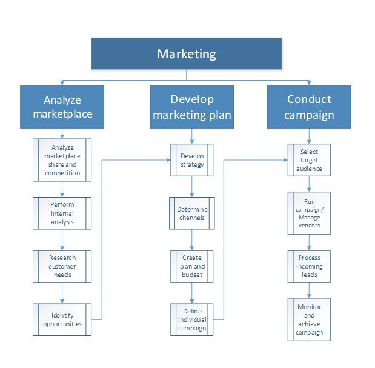
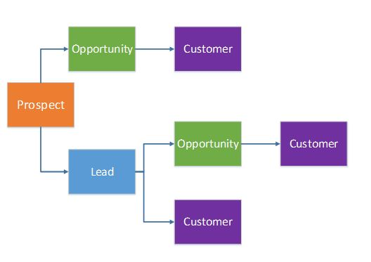

# CRM

Marketing
---------

You use marketing campaigns and activities to find and build relationships with potential customers, so that initial interactions can develop into sales relationships. The following process flow shows the business process for marketing. 

### Relationships

In sales and marketing, the initial interactions that you have with potential customers can occur in various situations. For example, you might find a prospective customer while you're attending a trade show, or you might have a possible lead with a customer after your organization runs a mass mailing campaign. It's very important that you understand the flow of a party’s entity before that party becomes a customer. The following graphic shows the flow of entity relationships as a potential customer becomes an actual customer. 

### Campaigns

A campaign targets the contacts for prospects, leads, opportunities, and customers that have been selected to participate in the campaign. In Supply Chain Management, you can create several types of campaigns, such as telemarketing, mailing, and email campaigns, to maximize your customer potential. As your campaign progresses and you receive positive responses, you can begin the sales process with those recipients who have responded positively to the campaign.