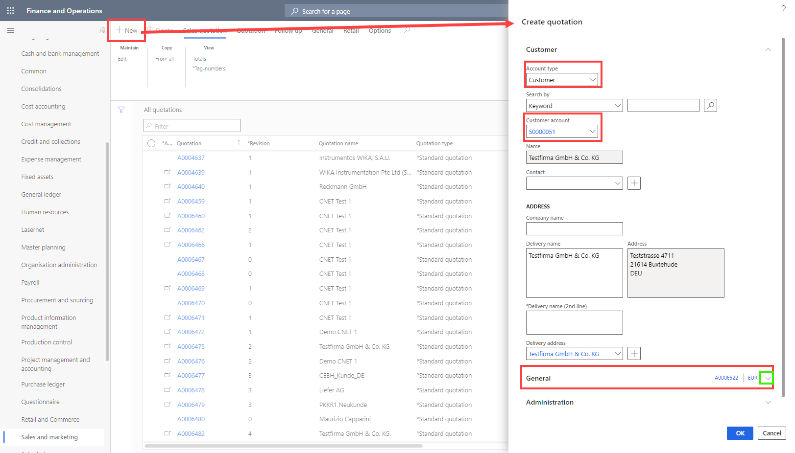
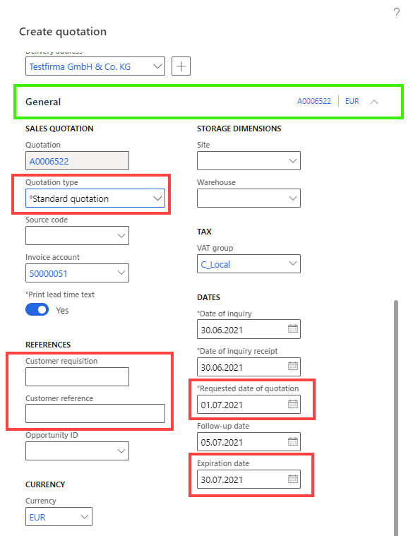
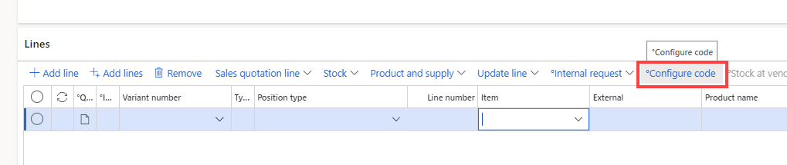
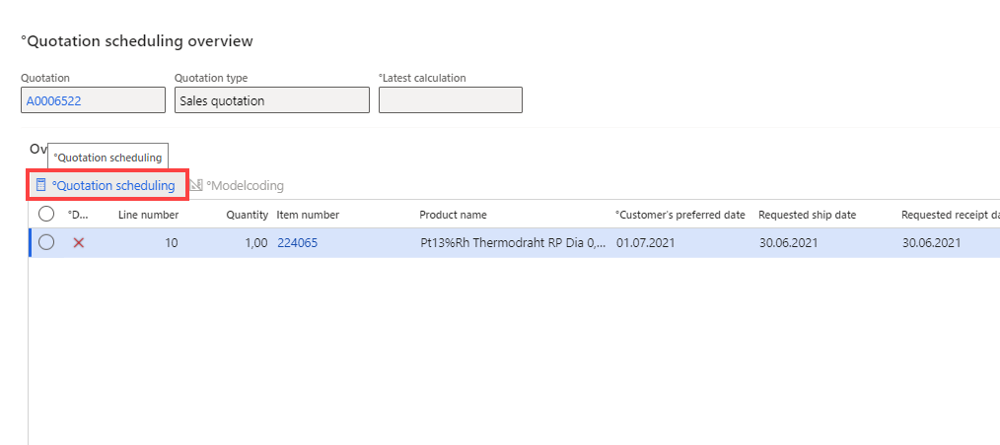

# Quotations overview

You create sales quotations to present customers an offer of the goods or services that you will be providing. A customer might request a quotation, or you might create a quotation in response to a request from a potential or existing customer. When the customer approves the sales quotation, you can convert it to a sales order.

# Create and edit sales quotations
This procedure demonstrates how to create and update a sales quotation. You can run this procedure on your own data or in demo data company USMF.

## Create a sales quotation
1. Go to **Navigation pane > Modules > Sales and marketing > Sales quotations > All quotations**.
1. In the opened form click **New**.
1. In the **Account type** field, select 'Prospect' or 'Customer'.
1. In the **Prospect** or **Customer account** field, enter or select a value.

5. Expand the **General** section. Because you chose to create a quotation from the Sales and Marketing area, the type is automatically set to 'Sales quotation'. To create a quotation for a project you must access it from the **Project management and accounting** module.
    
    - In **Customer requisition** fill in the quotation number from customer
    - In **Customer reference** fill in the additional references from customer
    - Fill in the required **Date fields**
6. Click **OK**. 
 
 
The fields and actions on the quotation lines are very similar to the ones on the sales order lines.
Like sales orders, quotations can be created for a specific item or, when item number is not known or does not exist at the time of quotation creation, quotations can be created for a sales category.

>[!NOTE]
>Most of the header data will be automatically populated from the customer master or the prospect data of the selected customer.
>When creating a new quotation it is possible to see if the selected customer is stopped (marked in the stopped column with a red cross).

7. In the **Item** field, enter or select a value or Click on Modelcoding Button.

1. In the **Quantity** field, enter a number. If there are valid [Guideline](xref:Guideline) for the item selected on the line, the applicable price and discounts will be automatically copied to the quotation line. Make sure that the Unit price field contains a value and you can also enter discount values if you want to.

9. Click **Save**.
1. On the **Action Pane**, click **Quotation**.
1. In Section **Generate** click **Quotation scheduling**.
1. Click on **Quotation Scheduling**.

1. On the **Action Pane**, click **Quotation**.
1. In Section **Generate** click **Send quotation**.
1. Select 'Yes' in the **Print quotation** field.
1. Click **OK**. The report may take a minute to generate. Don't close the page until it does so.
1. The **Activity** opens to schedule the follow up for this Quotation. It is recommended to use the standard set up and Click **OK**.

## Update a sales quotation
1. Go to **Navigation pane > Modules > Sales and marketing > Sales quotations > All quotations**.
2. On the **Action Pane**, click **Follow up**.
3. Click **Convert to customer**.
4. In the **Customer account** field, type a value.
5. Click **Check**. Make sure you see a message that the account number you typed in is free to use.  
6. Click **OK**. The system has now created a new customer account for the prospect on the quotation.  
7. Close the page.
8. On the **Action Pane**, click **Follow up**.
9. Click **Confirm**,**Cancel** or  **Lost Quotation**.
    - When the quotation is confirmed, a sales order will automatically be generated. The sales order number is referenced in the sales order column on the quotation header. The quotation status is changed from Sent to Confirmed. To navigate directly to the sales order from the quotation form, right click on the sales order number and go to the main table form.
    The information from the quotation will be transferred to the sales order. After the sales order information has been reviewed, the sales order can be processed as usual.
10. In the **Reason** field, enter or select a value.
1. Click **OK**.
1. Now the system generates a Sales order and if it is generated, it will be displayed. This takes a while.

# Functions in Sales Quotations
## Tag Numbers
This function allows for the entry of tag numbers and the selection of the type of tag to be used.

1. Expand **Line Details** and go to Tab **Tag numbers**.
1. Click on **Edit**.
1. In the new Form Click on **New** (Write down the Number in the Line) or **Import** (Use Copy/Paste from Excel file).

>[!TIP]
>To import a list of tag numbers from an Excel spreadsheet, type the tag numbers into an excel sheet, copy the tag numbers and and parte these in the open window of **Import**.

## Generate letter
Automatically generates a decline or clarification letter for this quotation. The language depends on the language settings in the customer data.

2. On the **Action Pane**, click **Quotation**.
3. Click **Generate letter**.
1. Choose the value you want in the drop down.

# Further Links/Information

[Sales Order](xref:SalesOrder)

[Mass Create Quotations](xref:Mass_create_quotations)

[Price Simulation](xref:Price_simulation)

