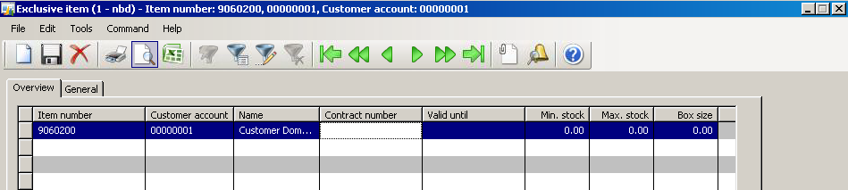
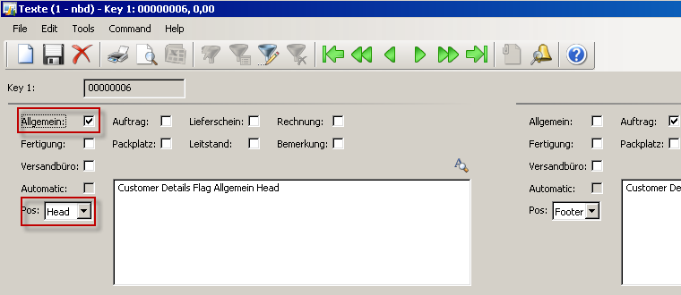
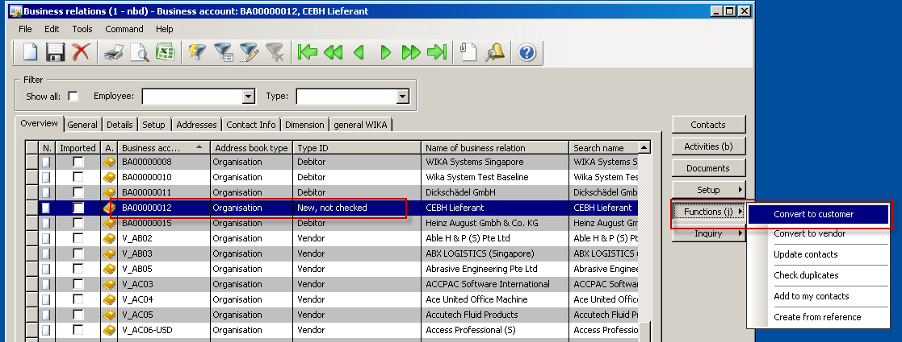
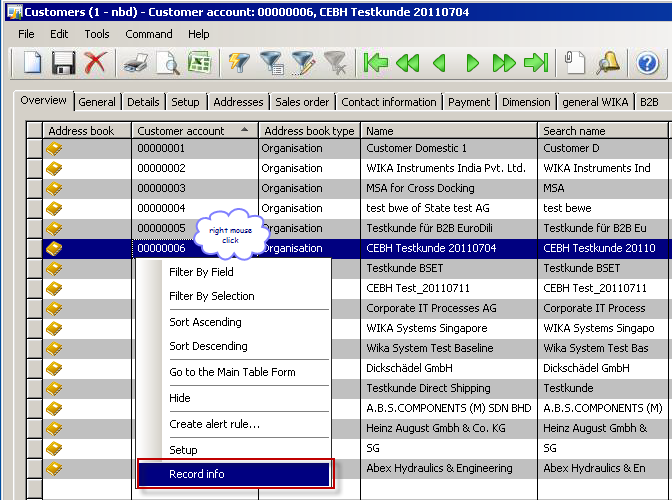
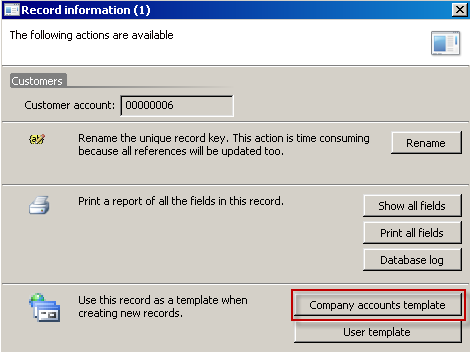
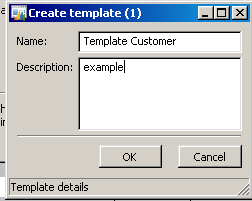

# Customer
In addition to the prospect details the customer details has all the financial, logistic and all further set ups for the sales process.
The base to create a new customer is to convert a prospect.

> [!NOTE]
> The Customers can be found in Module **Sales and Marketing >> Customers > All customers**.

## Functions in the Customer Form

### External item description
Reference from own item number to external item number from customer. It is possible to enter the external item number from customer into the sales order with this set up
### Numbersequence references
Own numbersequence for serial numbers for gauges. Will be created with the [Work order](xref:WorkOrder).
### Exclusive item
Defines relation from item numbers to customer. If this item is related to the customer no other customer can order this item. It is not possible to create a sales order line with this item for an other customer.

| Field | Description |
|:---:|--------|
|Contract number | Information text field |
|Valid until | Defines valid date, not mandatory |
|Min. stock | Information text field |
|Max. stock | Information text field |
|Box size | Information text field |

### Button Texts

Text function for texts set up, which will be printed on every sales order of this customer. With the Flags will be defined, on which printout the text will be shown. This Logic is the same in every modul of AX. Most important function is on the item master for the model code text

| German | English |
|:---:|--------|
|General | General text, printed on every printout|
|Auftrag | Sales Order|
|Lieferschein | Delivery note|
|Rechnung | Invoice |
|Fertigung | Production order |
|Packplatz | not used |
|Leitstand | not used |
|Bemerkung | Notes, will not be printed anywhere, just note |
|Versandbüro | not used |
|Automatik | based on customer not used (for text from model code) |
|Pos. | defines the position of the text
Head: printed above the lines
Footer: printed below the lines |

# Create a new Customer
In according to the rules to the company who is authorized to create a customer and who is responsible for correct customer and also finance settings, the recommended way to create a customer is to convert a prospect.
Then the references from the customer to a prospect is connected.

## Convert a prospct in a customer

`Sales and Marketing >> Relations >> Prospects >> All prospects`
Button Functions/convert to a customer and fill in the necessary fields on the customer details

## Create a Template 
To create a customer or also a prospect you can create a template according to a standard customer to enter the important fields by sample.

1. Click on a customer (with accurate datas) for the master template.

2. Click company accounts template

3. Name the template
e.g. for a local customer, international customer, customer of the WIKA group, etc.
