# Guideline
The Guideline is the platform, where all the conditions of the customer will be maintained. The guideline regarding the price of an item is based on the basic pricelist and 3 levels.

| Function| Description |
|:---:|--------|
| Level 1 | Special net prices |
| Level 2 | Model discount |
| Level 3 | Sales discount classes |

The logic of charging runs in that levels.
E.g.: at first is a check of the special net prices, is a special net price found a model discount won´t be considered.  

Sales ledger/customer details/Trade agrmt./Guideline
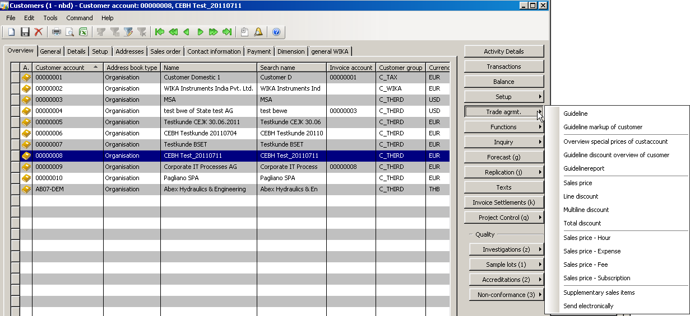
 
OR
WIKA-Ordercode/Guideline/Customer/Guideline
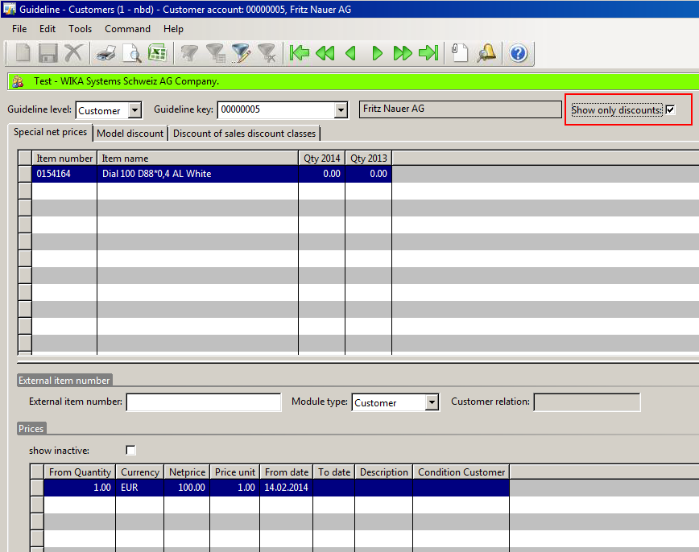
 

1. All item numbers/model discounts/sales discouts from item master
1. onditions for selected customer 

## Guideline level: 
Level, the maintance of the data will be based on 
-	Customer
-	Price group
-	Pricelist

##	Tab special net prices
Item number:
Item name:
Qty 2011: not used
Qty 2010: not used

All the item numbers are available. A filter can be used to choose the right part number
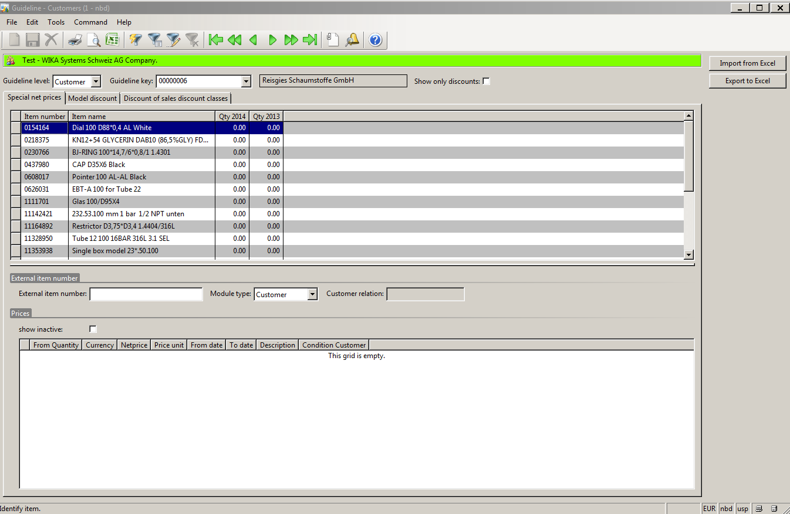
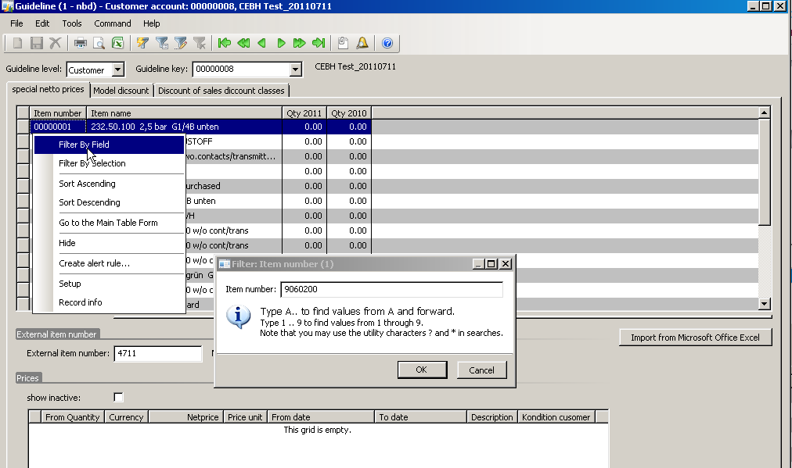

 
External part number: 	number for the item in the customers´ system
As soon as the part number is selected the external part number can be entered
Prices:
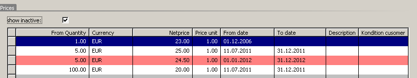

###	Enter special net prices
Click in the grid prices and click new/or Ctrl.+N

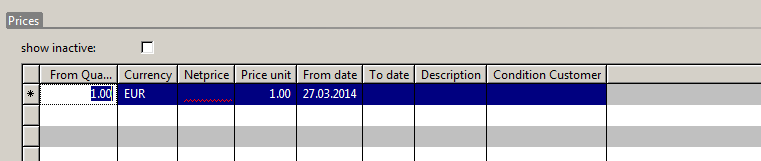

A new line will appear. Now enter the data from the contract with customer.

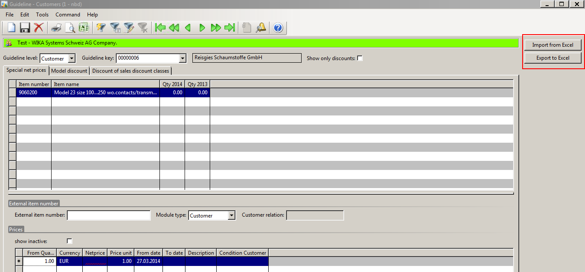

Also an import or an export of an Excel Sheet is possible.

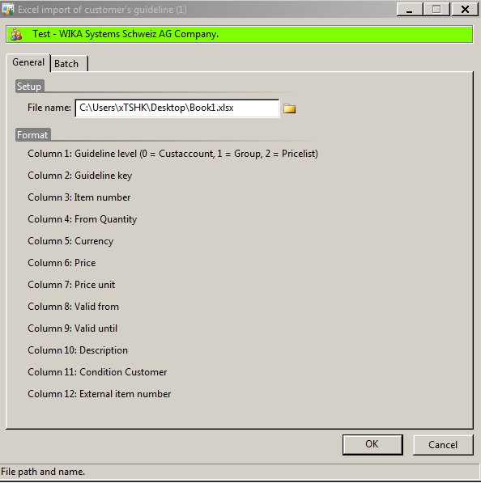

Enter the file name in the field (click on the folder symbol).
Export a file first to avoid wrong data in the import.

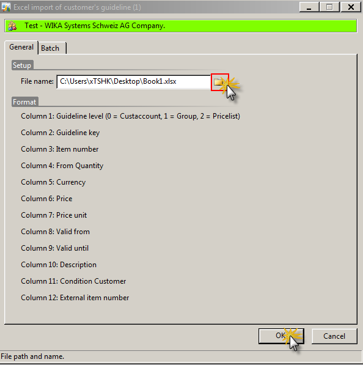

To export data into excel, click on <Export to Excel> and select a destination for the file. Then press OK.
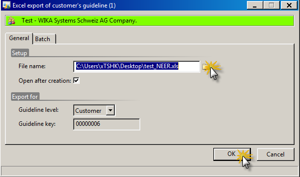

The excel form opens and the sheets contain the exported data.

## Tab Model discout
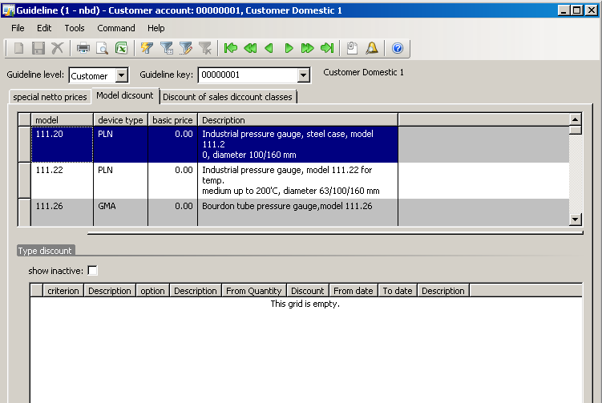

### Enter model discount
Filter on the model.
Click in the grid prices and click new/or Ctrl.+N
A new line will appear.
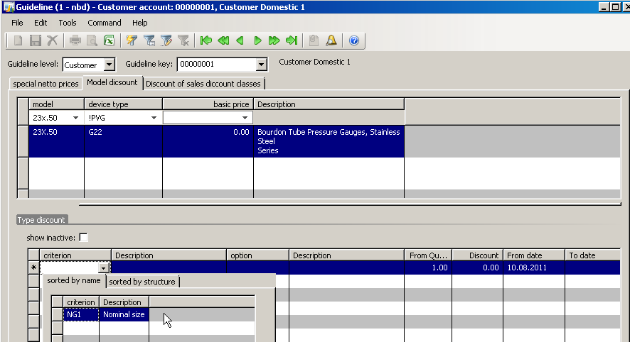

It is possible to enter a price relevant criteria, but not mandatory. If there is a discout just on the mod-el no criteria will be added.
Now enter the data from the contract with customer.

OR
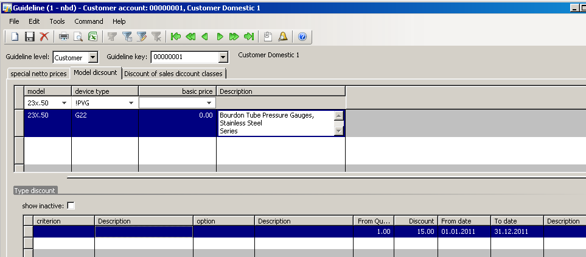

## Tab Discount of sales discount class
To avoid adding too many discounts on models there are discount classes. 
The discount classes are a summary (upper level) of models with similar design and construction.
These classes are predefined and each modelcode is associated to one.
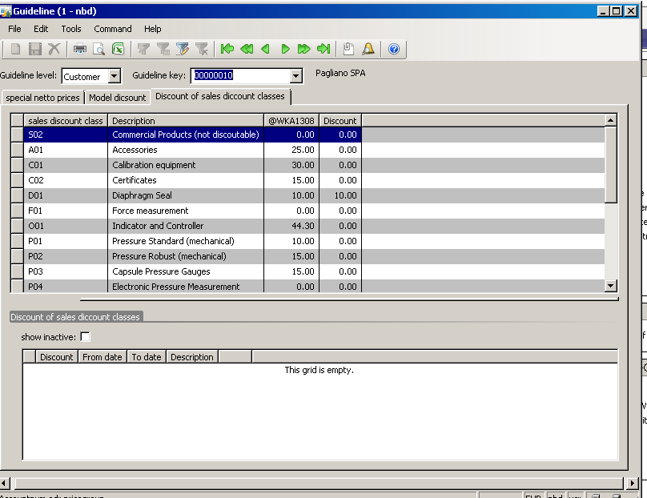

### Enter discount class
Click into the grid and click new or Ctrl+N
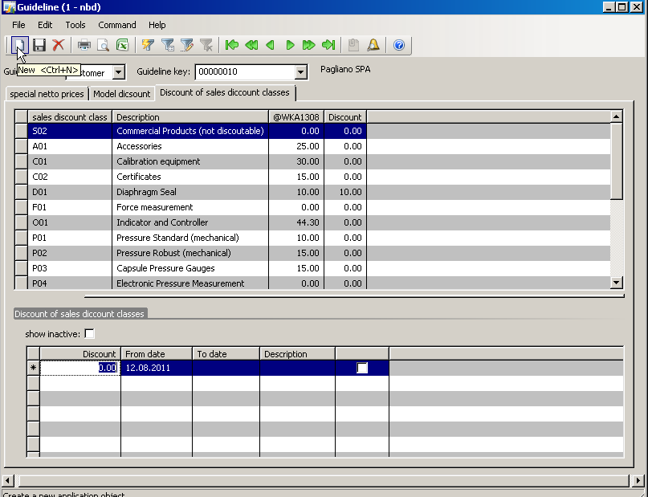

Add discount for the discount class and the valid dates
Description is just a text field for information
The last check mark is just for filtering for showing inactive lines.

#	Guideline markup of customer
## Guideline addons customer
All the charges for a customer, which are valid for every sales order of the customer can be main-tained in this form (e.g. Freight, Packing). 
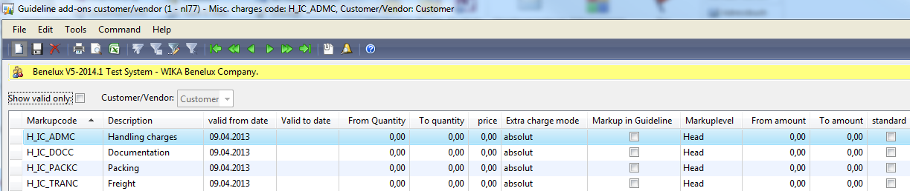
 

Price: please find further information below in the information box

> [!NOTE]
> The price in the guideline add-on form has the currency of the pricelist behind the customer.
> 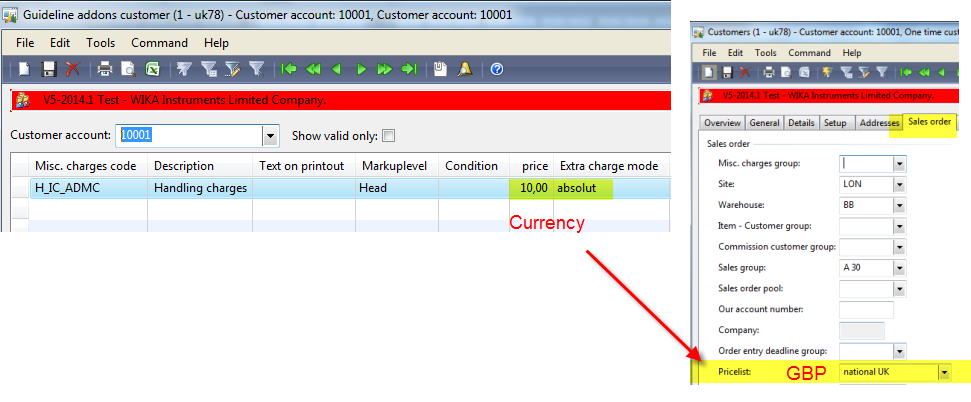
>
> When creating a quotation or a sales order the price will be converted automati-cally based on the currency of this pricelist.
> Example: a price of 10 is maintained for customer 10001 (the currency of the pricelist behind this customer is GBP).
> When creating a new sales order with currency EURO for this customer 10001, the price is converted into EURO based on the currency rate maintained in AX.
> The converted price is shown.
>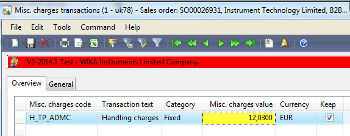
>If the pricelist behind the customer has the same currency as the sales order, the price will not be converted.
 
### Functions
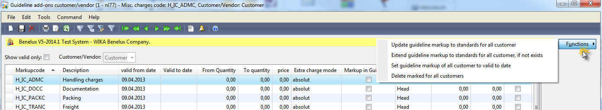

| Function| Description |
|:---:|--------|
| Update guideline markup to standards for all customer: | setup for all customers, if the surcharge has the flag “standard” checked |
|Extend guideline markup to standards for all customer, if not exists: | If the surcharge is not set up at the customer and is checked with “standard” then the sur-charge can be added |
| Set guideline mark up of all customer to valid to date: | Change the valid date of the surcharge in general |
| Delete marked for all customers: | Cancel surcharge for all customers |

#	Guidline overview and update
With the following functions it is possible to get on overview of all the conditions of a customer or price group. Also the possibilities of updates are decribed.
## Overview special net prices
WIKA ordercode/Guidline/Customer/Overview special netprice of custaccount
OR
Sales Ledger/common forms/customer details/trade agrmt./overview special net prices of customer
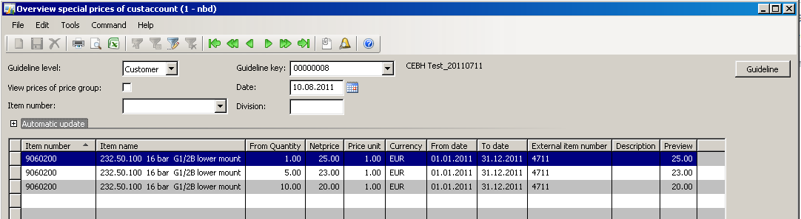

Choose Guideline level (Customer or price group) and Guidelinekey
Overview of all the items with special net prices
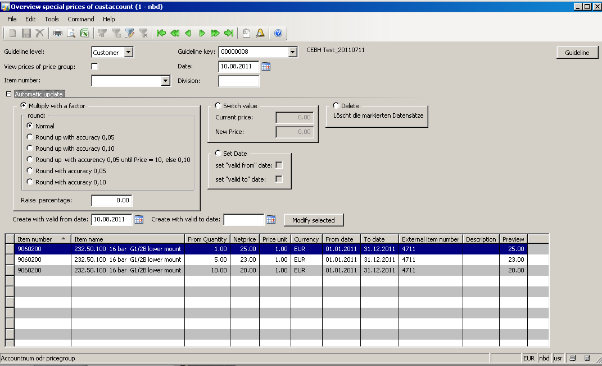
With a click on the Button Guideline, you can open the guideline for data maintenance, chapter 2.3.1/2.4.1./2.5.1
## Update special net prices
With a click on the plus symbol a data update can be defined
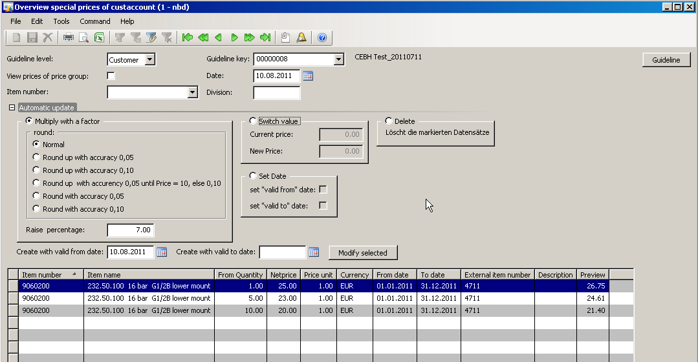
 
###	Mutiply with a factor
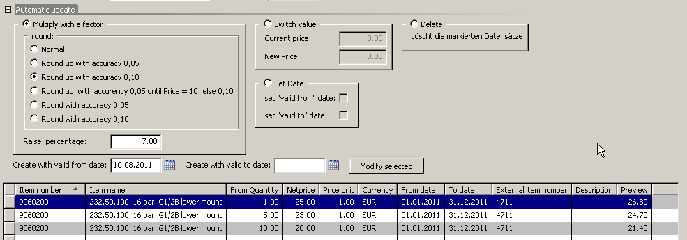
Enter a raise percentage
Define, if there should be a rounding on the prices. In the column Preview the new price is shown

| Function| Description |
|:---:|--------|
| Normal: | Without rounding |
| Roundup: | With 0,05, 0,10…. is possible. |

Once you change the options, the new price is shown in the column
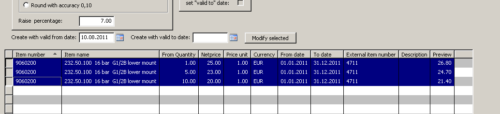

Now mark all the concerned item number with a click on the line. If you want to mark more than one, please use the Ctrl-Key and the left mouse click.
All lines which should be updated have to be marked!

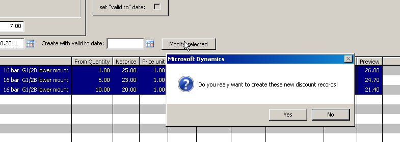

Click Button Modify selected and a new form will open. Click YES for update (or NO, if you want to adjust your choice)

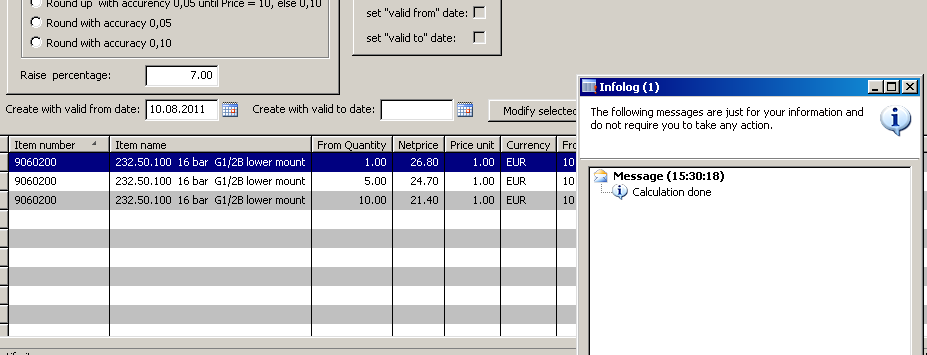

An Infolog will confirm the update

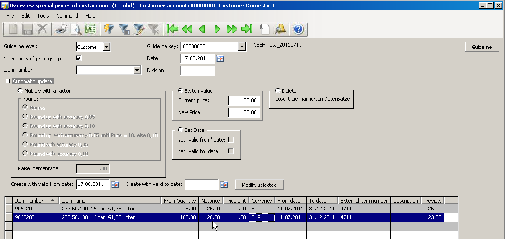

### Switch value
With this function it is possible to update prices from an old value into a new one. E.g. all items with the current price 20 EUR should be 23 EUR. Also you can see in the Preview column, which lines are considered (second line in the form)
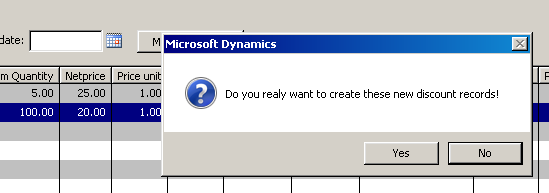

Click Button Modify selected and a new form will open. Click YES for update (or NO, if you want to adjust your choice)

An Infolog will confirm your update
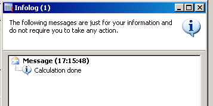

### Set date
If just an update on the valid dates is necessary use the set date function.

Choose the date which should be updated. E.g. only the “valid from” date
Enter the date into the field Create with valid from date.
If you enter a date also into the field Create a valid to date, it is not considered, as long as you do not check the mark in the Set Date “valid to” date:

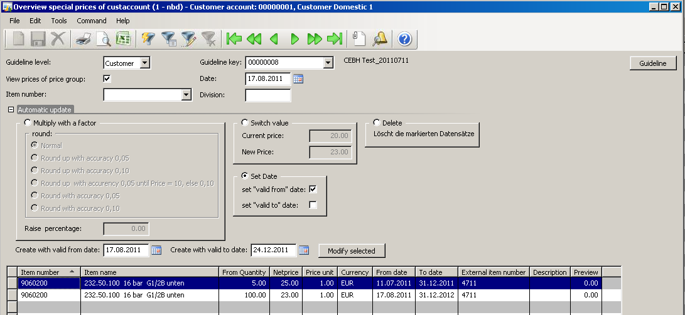

Click Button Modify selected and a new form will open. Click YES for update (or NO, if you want to adjust your choice)

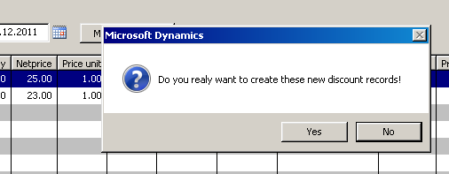

An Infolog will confirm your update

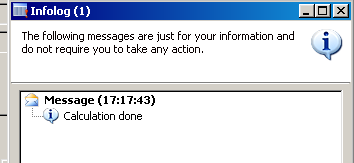

## Overview model discount 
WIKA ordercode/Guidline/Customer/ guideline discount overview of customer
OR
Sales Ledger/common forms/customer details/trade agrmt./guideline discount overview of customer

Choose Guideline level (Customer or price group) and Guidelinekey
Overview of all the model discounts in the first tab

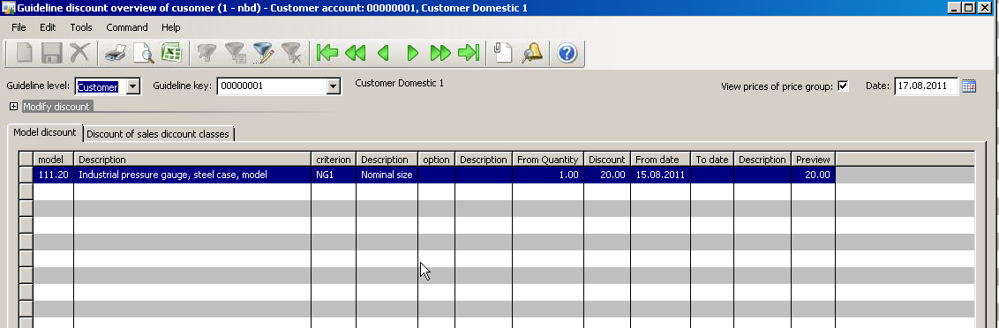
 
## Update model discount
Click on the plus symbol and the update area is open. Choose formula and factor for update rules.
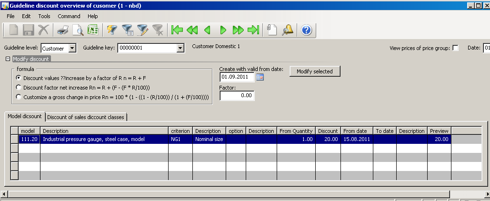
 
### Discout values increase by factor
Change the factor of the discount
R: discount 
F: factor
Consider the Preview field

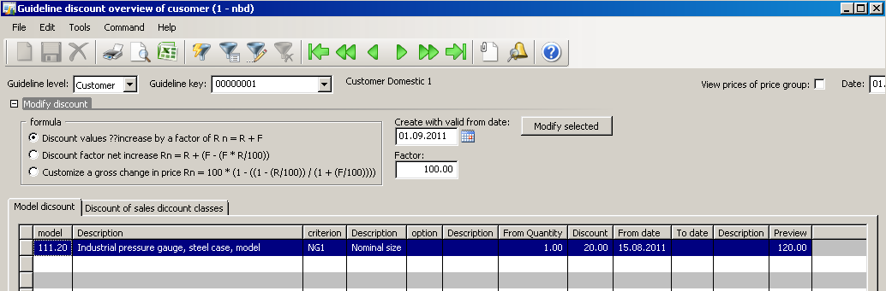 

### Change discount factor
Change net discount with the factor
R: discount 
F: factor
Consider the Preview field

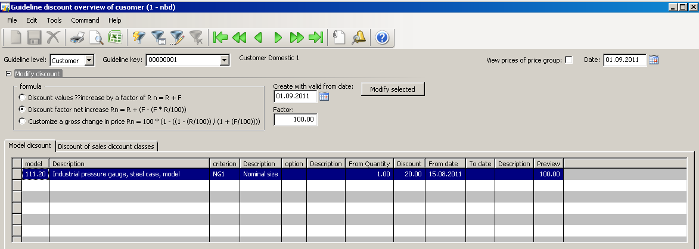

### Gross price change 
Reverse gross price increase with discout adjustments
R: discount 
F: factor
Consider the Preview field
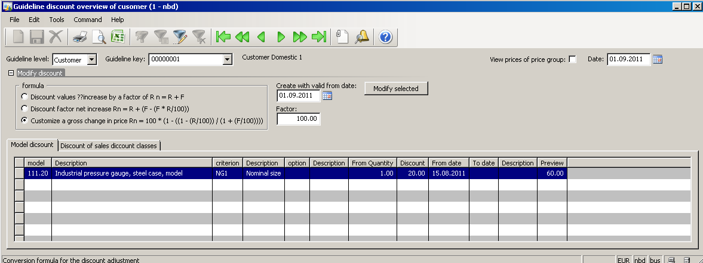

## Overview sales discount classes
WIKA ordercode/Guidline/Customer/ guideline discout overview of customer
OR
Sales Ledger/common forms/customer details/trade agrmt./guideline discout overview of customer

Choose Guidelinelevel (Customer or price group) and Guidelinekey
Overview of all the sales discounts in the second tab

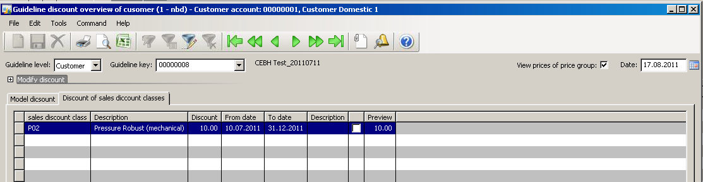 

## Update sales discount classes
Click on the plus symbol and the update area is open. Choose formula and factor for update rules.

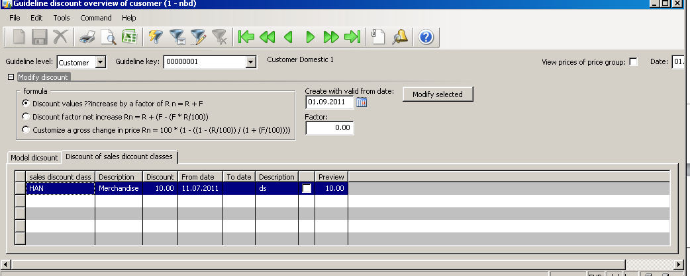

#	Guidelinereport
Sales ledger/Common Forms/Customer details/trade agrmts/Guidelinereport

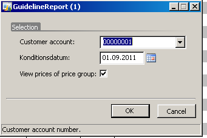

| Function| Description |
|:---:|--------|
| Customer account | Customer from customers detail |
| Konditionsdatum | Choose date, the report will be generated with the set up of the guide-line which is valid in the choosen date |
| View prices of price group | if checked and the customer has a reference to a price group (in cus-tomer details/tab sales order/field price group) the guideline from the pricegroup also will be printed). |

Click OK and the report will be generated as a pdf-document. 

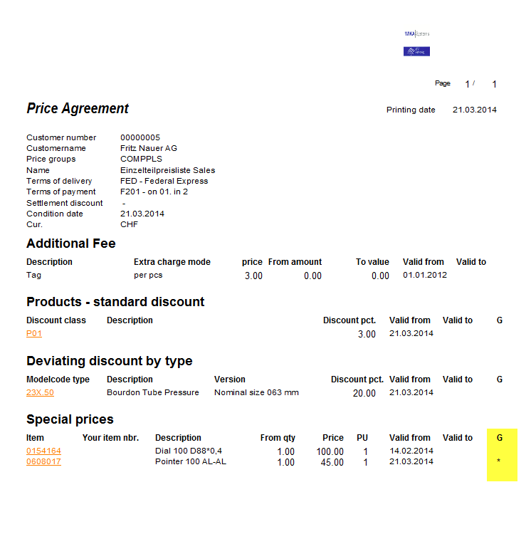

#	Further functions
## Lock guideline
WIKA order code/Guideline/Customer/Lock guideline

It is possible to lock a guideline from a customer. It is also possible to lock the special net prices or the model discouts or the sales discount classes
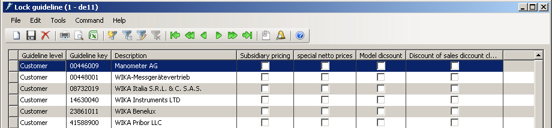

## Copy guideline
Job to copy a guideline from customer/price group from a other customer/price group. The selection defines which part of the guideline will be copied.
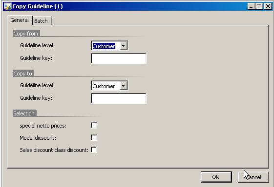

## Guideline delete
Job to delete a guideline from customer/price group. The selection defines which part of the guideline will be deleted.
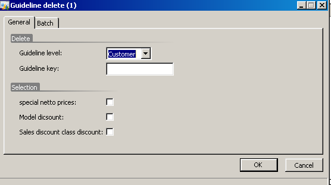

## Manually sales discount classification without modelcode
If an item do not have a modelcode behind, there is a possibility to enter the discount class manual in the item master:
Stock management/common forms/item details
On the Tab other can the discount group entered manually in the field discount class.
The basic price will be maintained in the parts pricelist.
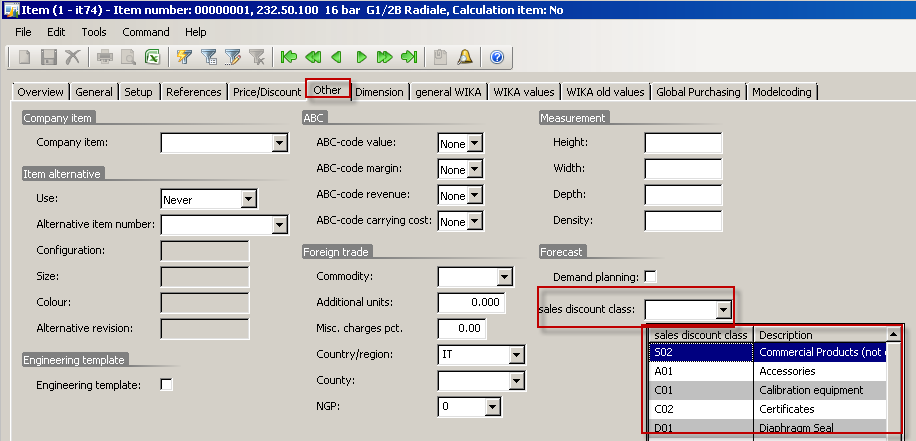

## Applying a sales guideline to a business relation
Sales guidelines can be established for customers but not for business relations. There is an option to reference a Price customer on each business relation. A sales guideline can be established for the price customer and the assigned discounts will be carried over to the business relation, via the price customer.

On the “General” tab of the business relation form, the Price customer can be entered.

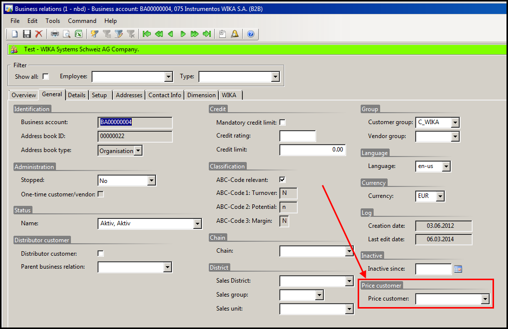

## Creating a Sales guideline for the „Price customer“

Customer number 00000019 was created for the customer „Price Customer for Business Relations“. This is just a test customer to be used in this example.

A Model discount of 10% was assigned to the model 23X.50 for customer 00000019.
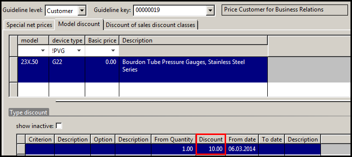

## Setup of business relation
A test business relation was created, to which the price customer 00000019 was assigned.

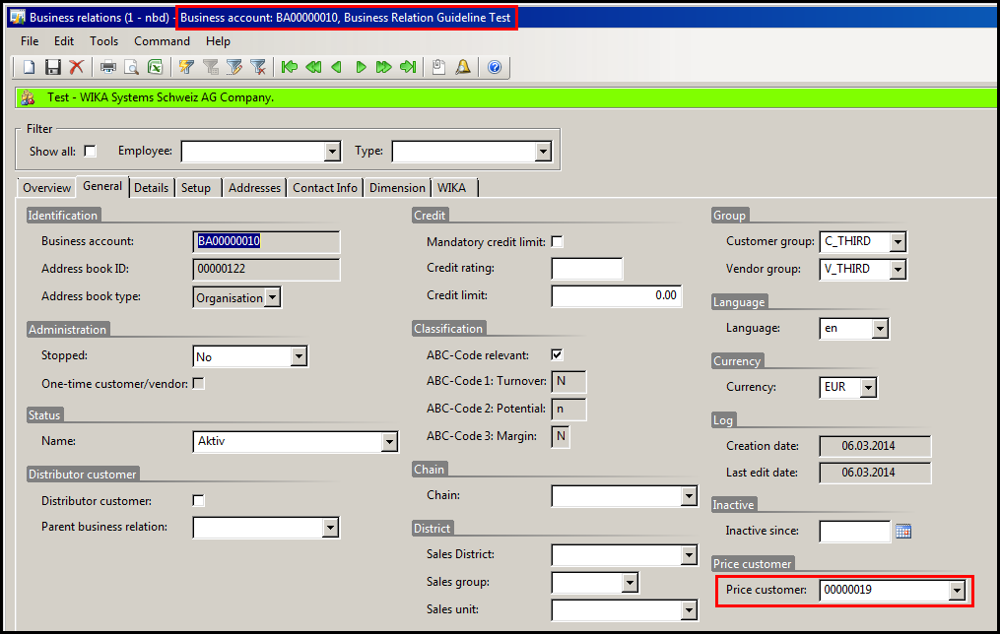

## Quotation created for business relation

When a quotation is created for the test business relation, the model discount from the sales guide-line set up for the Price customer will be used.
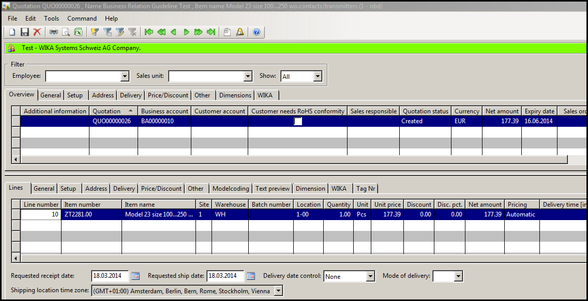

The discount can be seen on the “Modelcoding” tab under the “Pricing” sub-tab.

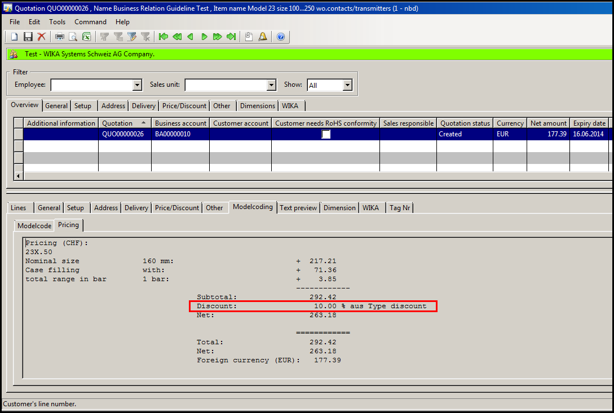