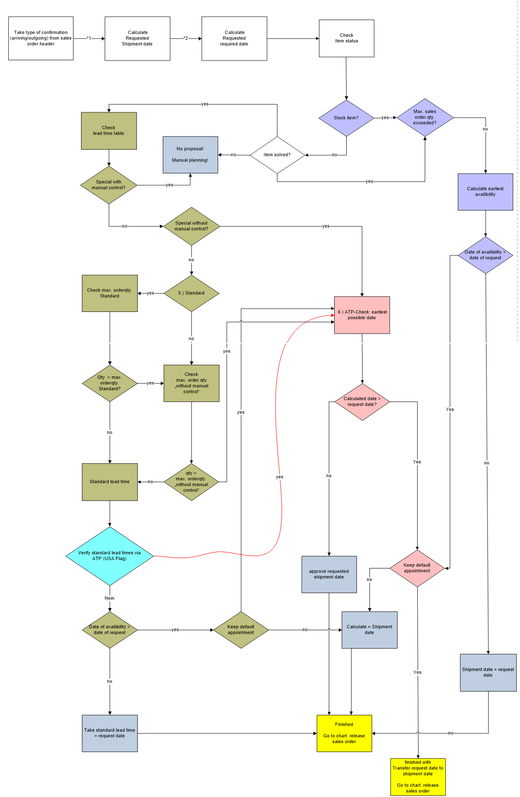
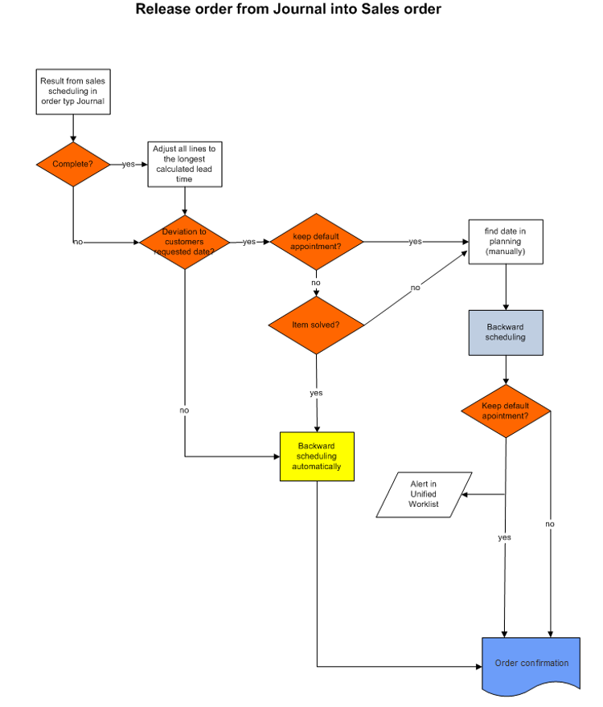

# Sales order

## Create a Sales Order
1. Go to **Navigation pane > Modules > Sales and marketing > Sales orders > All sales orders**.
2. Select **New**.

### Enter sales order header details
1. Go to **Navigation pane > Modules > Sales and marketing > Sales orders > All sales orders**.
2. Select **New**.
3. In the **Customer account** field, select the drop-down button to open the lookup.
4. In the list, find and select the customer record.
>[!NOTE]
>It is not possible to create a sales order for a stopped customer, that is stopped for ALL. If a customer is stopped, this is shown by the red cross in the column <Stopped>. This <Stopped> setup is made in the **Customer master Fast Tab Miscellaneous details > Stopped > Invoicing and delivery on hold**. If a customer is stopped for Sales-/Purchase order it is still possible to create a quotation or a sales order but it is not possible to ship.
>All the defaults from the customer details will be filled in, when the customer is selected. Each set up can be adjusted for special agreements for the sales order. Also the fields can be changed in the sales order itself again.

5. Fill in following Fields:

| Field | Description |
|:---:|--------|
| Contact | Choose from the customer master or enter manually |
| Customer´s preferred date | Important in combination with the fields on the right hand. This will be the base for the sales scheduling. |
| Date of order | date from purchase order from the customer |
| Date of order receipt | Date, when the order reached the company |
| Customer requisition | Purchase order from customer |
| Reference | Further reference from customer (e.g. project no) |

6. Select **OK**.

### Enter sales order line details
    
The products sold by your organization may come in variants differentiated by dimensions, such as configuration, color, size, and style. Also, products may be set up to use storage dimensions, such as site, warehouse, and pallet, and tracking dimensions, such as batch and serial numbers. When these dimensions are assigned, you must select the values for those dimensions on the order line. To improve order entry efficiency, you may want to add the respective dimension fields to the order grid.
    
1. Under the **Sales order lines** section, select the **Sales order line**.
2. Select **Dimensions**.
    
    For this example, select the Color, Site and Warehouse dimensions. The dimensions you select here will appear in the sales order grid. If you want your selections to persist, set the **Save setup** option to Yes.
    
3. Select **OK**.
4. In the **Item number** field, select the drop-down button to open the lookup or open the **Modelcoding**

    - If the item is part of a sales category, the item name will automatically appear in the Sales category field.  
    - If product dimension fields already contain a value, this is because the value was copied from the product record where it is defined as a default product dimension. You can change the default value at any time.
8. In the **Quantity** field, enter a number.
8. In the **Price** field, enter a number <if it is not pre-filled>
>[!NOTE]
>If the item number has a [Modelcode](xref:Modelcode) the price will be calculated automatically according to the [Guideline](xref:Guideline)  (special net price or discounts). Also misc. charges will be calculated if the [Modelcode](xref:Modelcode) has a reference to them. Price can be overwritten/entered also manually.

## Sales scheduling
As soon as the data in the sales order line and header are completely filled in and all relevant data are checked the sales order scheduling has to run and the order has to be released. This step has to be done in every sales order. Then the references to the sales order will be generated.

>[!NOTE]
>Sales scheduling can be accessed only from Sales Order Details (not from Sales Order Overview List Page of all Sales Orders)
> Open Sales scheduling from **Action Pane > Tab Sell > Section Calculate > Sales Scheduling**

With the sales order scheduling the leadtime will be calculated. Either on base of the lead time table in the [Modelcode](xref:Modelcode)or the ATP check. THe ATP CHeck will be described below.

The date in the field confirmed ship date is base for the production order, picking list or purchase order.

There are a few combination possible:

| Possible Combination | Description |
|:---:|--------|
| Stock item | Green mark, customer´s preferred date can be met according to confirmed ship date => release order |
| Finish good out of lead time | Green mark, customer´s preferred date can be met according to confirmed ship date => release order |
| Finish good within lead time | Red Stop sign, customer´s preferred date can´t be met, according to sales scheduling confirmed ship date will be calculated => if ok, release order. |
| Finish good within lead time not accepted | Red Stop sign, customer´s preferred date can´t be met, according to sales scheduling confirmed ship date will be calculated => if not ok, check keep default appointment, run sales scheduling again and release the order. |

> [!NOTE]
> Details see on the Tab Full History, reference will be generated.

If you have checked everything, you can **release the Order**.

# SALES ORDER SCHEDULING

## ORDER TYPE SALES ORDER

# 	DIRECT DELIVERY

## DIRECT DELIVERY CUSTOMERS

In the vendor master it is possible to define direct delivery customers for a vendor.
The Setup can be don on the Customer on Setup-> Direct delivery customers

If direct delivery is not allowed, the direct delivery flag will be removed automatically. 

Scenario 1: DD should always be allowed for this vendor
-> leave the customer account column empty and select ALL in the first line 
 Scenario 2: DD should never be allowed for this vendor
-> leave the customer account column empty and select NOT in the first line 
 Scenario 3: DD should never be allowed for this vendor, except for one or more 
customers
-> create a line [empty/NOT] and [Customer123/Table]
 
##	COMBINATION DIRECT DELIVERY AND COMPLETE WITH TWO DIFFERENT VENDOR DUNS
The combination of direct delivery and setting all lines to complete in a sales order with two different vendor DUNS numbers is impossible.
If the flag “switch all lines to complete” is set an infolog message pops up.

6.	IMPLEMENTATION OF PROJECT ORDERS IN EXCEL
6.1.	TEMPLATE GENERATION

Access: Sales order details-> on Sales order line-> Functions-> Import sales lines from excel

 

The following form is opened.
 

Click at template generation

 

Specify a data name and select a destination folder. Then start coding by clicking on Configure code.

When the configurator is opened, code your type as known. After finishing press the button Apply.

 

Then the following form is opened.
 

Click on <next>.
Now it is possible to define the variable parameters by setting a flag for this Criterion.

 

Then press the button <Next>

Now an excel file is created with these information.

Now all free cells can be filed with the shoer information of the type code.
For example not “10 bar” but “BG410”

The cells Tag number, Price and Tag design have always to be filled.

 	ATTENTION
	•	Parameters will be implemented according to Typecode
•	„new items“ must be introduced for each changing parameter
•	items must be separated with one free line

6.2.	EXCEL IMPORT INTO AX

Create a sales order, and delete the first item. Now use the function import saleslines from excel.

 

Now select the created excel file by clicking on the file symbol and press OK.

Then the automatical import starts. The data will be imported in the background of AX. During the import it is possible to proceed working.

 

After the import the lines were shown in the sales order.

 

