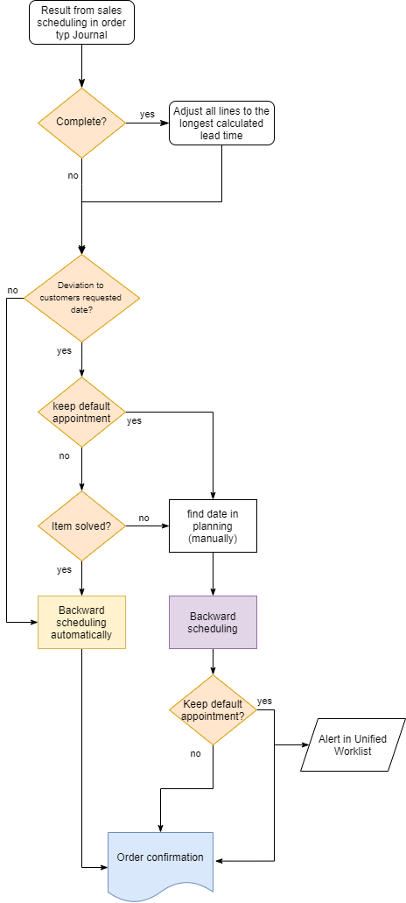
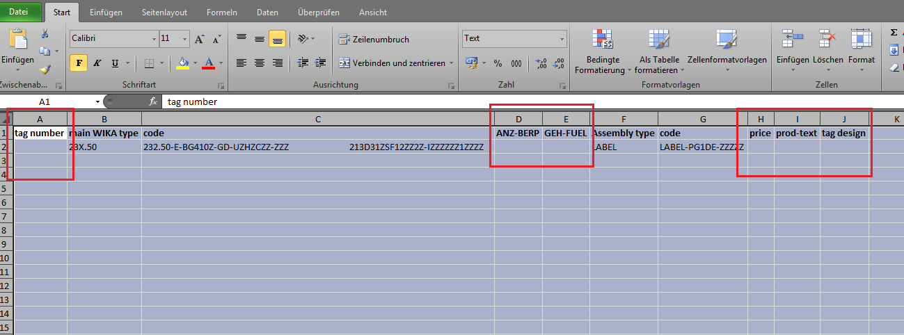
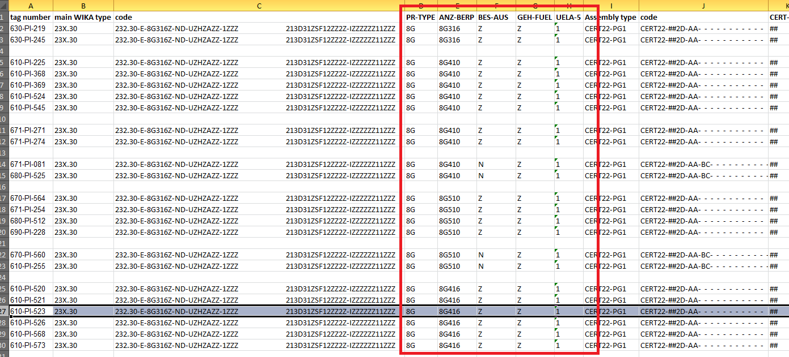

# Create Sales Order

Sales ledger -> common forms -> sales order details

## Create Head

Make sure you are on the header of the sales order table and click **New** or **CTRL + N**

Fill in the customer account number. If a customer is stopped, this is shown by the red cross in the column **Stopped**.

It is not possible to create a sales order for a stopped customer, that is stopped for ALL. If a customer is stopped an infolog popup will be shown.

The popup also shows for what the customer ist stopped. This setup is made in the customer master, General ledger -> Administration -> Stoped.

If a customer is stopped for Sales-/Purchase order it is still possible to create a quotation or a sales order but it is not possible to ship.

All the defaults from the customer details will be filled in, when the customer is selected. Each set up can be adjusted for special agreements for the sales order. Also the fields can be changed in the sales order itself again.

Fill in:
* Contact:  choose from the customer master or enter manually.
* Customer's preferred date: Important in combination with the fields **Complete, Deliver at once, Keep default appointment, Penalty clause and Manual days**. This will be the base for the sales scheduling.
* Date of order: date from purchase order from the customer.
* Date of order receipt: date, when the order reached the company.
* Customer requisition: purchase order from customer.
* Reference: further reference from customer (e.g. project no)

Click OK

## Create Line

### Create line with item number

Click into the field item number and enter the item number and quantity.
If the item number has a modelcode the price will be calculated automatically according to the guideline (special net price or discounts). Also misc. chargeds will be claculated if the modelcode has a reference to them.
Price can be overwritten/entered also manually.

>[!Important]
>If a valid sales contract exists for the customer and item number entered on the sales order, a message will pop up that reads "Delete line and create a new one with the contract?".
>If yes is clicked the sales contracts will be shown and a release order can be generated.
>If no is clicked the sales order (without the contract) will be created.

### Create line with modelcode

Click in the field item number and press ENTER, then the modelcoding form is opening. Default is model 111.20.
Enter required model code and press enter.
Double click on the criterias to choose the code.
If you have an assembly code, fill in the type (e.g. the diaphrame seal) and the model will appear in the Assembly box. Click on the Assembly box to fill in the code.

Click Select item to check if there is a item number available.

Click Select Item.
Click Apply again.
And the modelcode will be transferred into the sales order.

The price will be calculated automatically according to the guideline (special net price or discounts). Also misc. charges will be calculated if the modelcode has to reference to them.
Price can be overwritten/entered also manually.

## Sales scheduling
As soon as the datas in the sales order line and header are completely filled in and all relevant datas are checked the sales order scheduling has to run and the order has to be released. This step has to be done in every sales order. Then the references to the sales order will be generated.

With the sales order scheduling the leadtime will be calculated. Either on base of the lead time table in the
modelcode or the ATP check.
Details see LINK LINK LINK LINK LINK LINK LINK LINK

The date in the field confirmed ship date is base for the production order, picking list or purchase order.
There are a few combination possible:

### Stock item
Stock item:
Green mark, customer´s preferred date can be met according to confirmed ship date -> release order

### Finish good out of lead time
Green mark, customer´s preferred date can be met according to confirmed ship date -> release order
Details see on the Tab Full History, reference will be generated.

### Finish good within lead time
Red Stop sign, customer´s preferred date can´t be met, according to sales scheduling confirmed ship date will be
calculated -> if ok, release order
Details see on the Tab Full History, reference will be generated.

### Finish good within lead time not accepted
Red Stop sign, customer´s preferred date can´t be met, according to sales scheduling confirmed ship date will be
calculated -> if not ok, check keep default appointment, run sales scheduling again and release the order.
Details see on the Tab Full History, reference will be generated.

# Sales Order Scheduling

## Order type Journal

")

## Order Type Sales Order

**Sales Scheduling: Release order from Journal into Sales order**

# Implementation of project orders in excel

## Template Generation

Access: Sales order details -> on Sales order line -> Functions -> Import sales lines from excel

In the now opening form click on *template generation*

Specify a data name and select a destination folder. Then start coding by clicking on Configure code.
When the configurator is opend, code your type as known. After finishing press the button *Apply*

On the following form click on *next*.
Now it is possible to define the variable parameters by setting a flag for this Criterion.
Then press the button *Next*.

Now an excel file is created with htese information.

Now all free cells can be filed with the shoer information of the type code.
For example **not "10 bar"** but **"BG410"**.

The cells Tag number, Price and Tag design have always to be filled.

>[!Important]
>* Parameters will be implemented according to Typecode
>* "new items" must be introduced for each changing parameter
>* items must be separated with one free line

## Excel import into D365

Create a sales order and delete the first item. Now use the function import Saleslines from excel.

Now select the created excel file by clicking on the file symbol and press OK.

Then the automatical import starts. The data will be imported in the background of D365. During the import it is possible to proceed working.
After the import, the lines are shown in the sales order.

# Direct Delivery

## Direct Delivery Customers

In the vendor master it is possible to define direct delivery customers for a vendor.

Access: Vendor details -> Setup -> Direct delivery customers

If direct delivery is not allowed, the direct delivery flag will be removed automatically.

**Scenario 1:** DD should always be allowed for this vendor
-> leave the customer account column empty and select ALL in the first line

**Scenario 2:** DD should never be allowed for this vendor
-> leave the customer account column empty and select NOT in the first line

**Scenario 3:** DD should never be allowed for this vendor, except for one or more
customers -> create a line where Customer account is *empty* and the Account code is *Not* **and** -> create a line where Customer account is *Customer123* and the Account code is *Table*

## Combination direct delivery and complete with two different vendor DUNS

The combination of direct delivery and setting all lines to complete in a sales order with two different vendor DUNS
numbers is impossible.
If the flag “switch all lines to complete” is set an infolog message pops up.

# Index

| Index | Status   | Date | Author          | Reason for change |
|:-----:|----------|:----:|-----------------|-------------------|
| 01    | Released | TBD  | Simon Berberich | Publication       |

