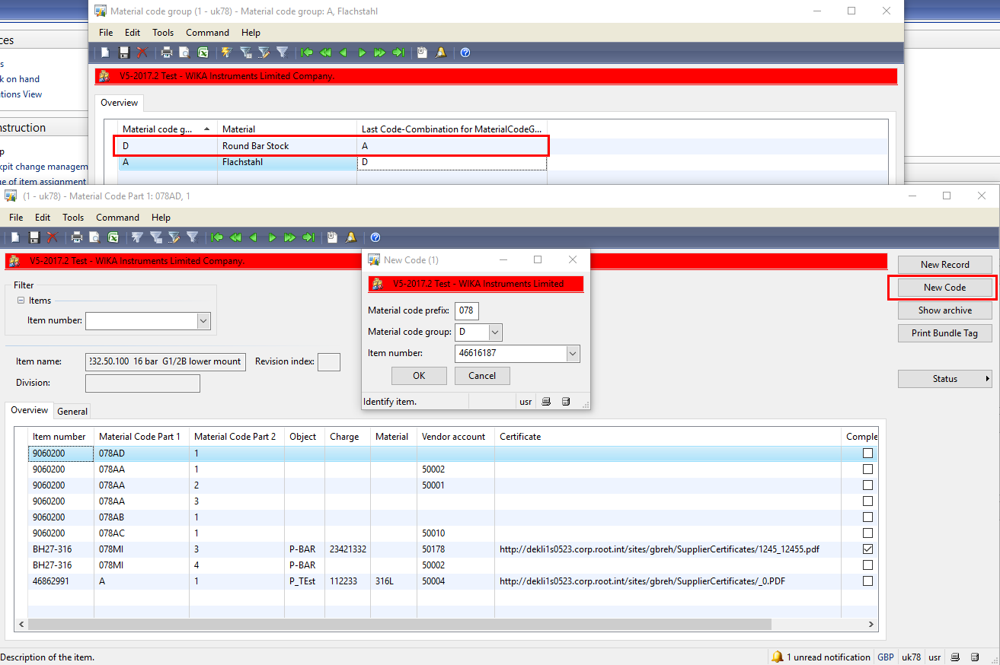
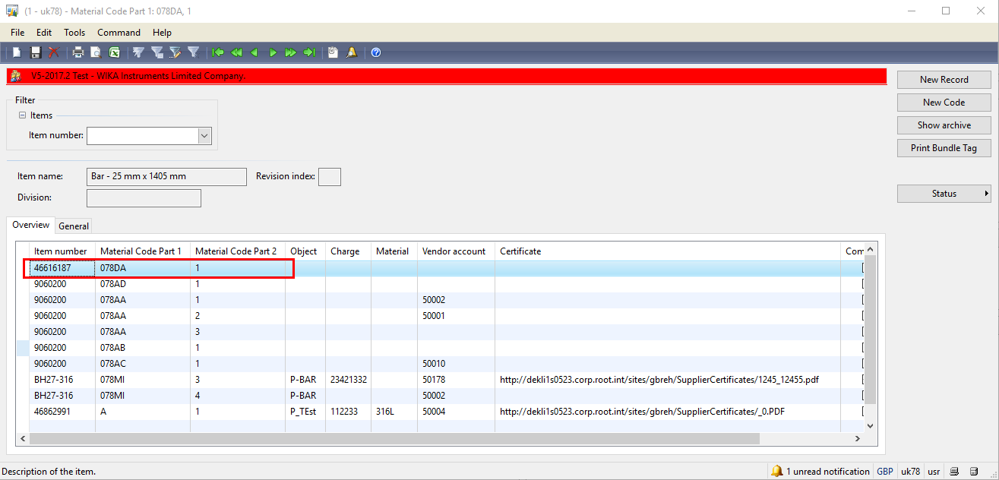
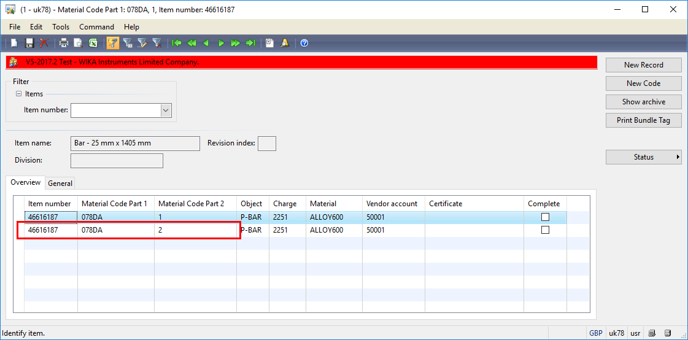
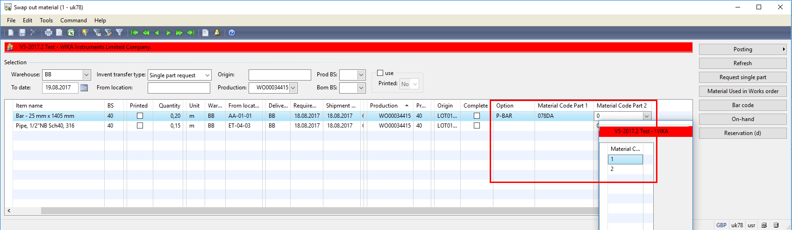

# Creating a new Code

When a new product is received, user should open the form “Material Code” (Stock Management -> MaterialCode -> Material Code) and click button **New Code**
Insert a Material Code Group and Item number

In the example, the Material code group is “D” and for it, the last used combination is A. That means system will create a new entry for the selected item number with “Material Code 1” as XXXDA and “Material Code 2” as 1.

>[!Note]
>The XXX part of “Material Code 1” represents the company number and it is configured under: Production -> Certificate -> Setup -> Parameters
>

>[!Important]
>The certificates should be saved on SER System.

## Creating a new record 

When a product is received and it belongs to same batch used in a previous shipment, user should open the form “Material Code” (Stock Management -> MaterialCode -> Material Code), select the previous register in grid and click button **New Record**
System will create a new entry with same data as the selected register and increases the “Material Code Part 2”

## Assign a material code to a Work Order

### Swap out material form

When user opens the Swap out Material form, D365 will pre-select a material code based on item number.

[Swap Out Material](xref:Swap_Out)

#### Possibility 1

If the requested quantity is within on Material Code only, user might select the Material Code parts 1 & 2 direct in the grid as showed in above picture

#### Possibility 2

If the requested quantity need more than one Material Code, user should click button **Material Used in Works Order** and individually assign the Material Codes for the Work Order

#### Possibility 3

Assign the Material Code individually per serial number
click button **Material Used in Works Order** and individually assign the Material Codes for the Work Order.
Select one material code and click tab **Assignment Serial No to Material Code**

Assign the serial number by double click them in “Serial Number” area

## Work Order Detail Form

To access the Material Used in Work Order form, user should click button **Inquiries -> Material Used in Work Order**

Follow process described in [Possiblity 2](#3312) and [Possibility 3](#3313).

## Stock Management Area

User could access directly the Material Used in Work Order form in 
Stock Management -> MaterialCode -> Material Used in Works Order

# Assign a Material Code to Sales Order

Stock Management -> MaterialCode -> Material Used in Sales Order

User should insert manually all data regarding: Sales Order, Sales Order Line, Item Number and the Raw material code

# Index

| Index | Status   | Date | Author          | Reason for change |
|:-----:|----------|:----:|-----------------|-------------------|
| 01    | Released | TBD  | Simon Berberich | Publication       |

