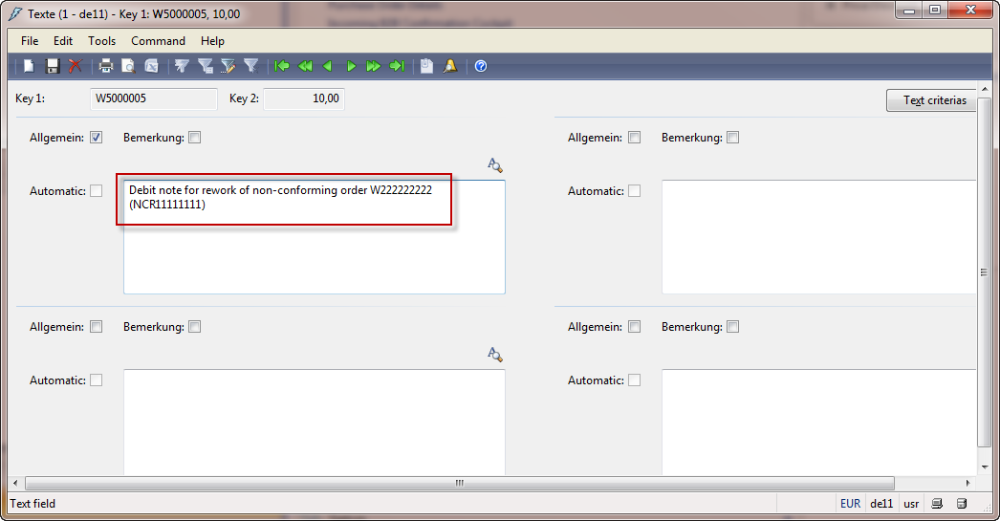
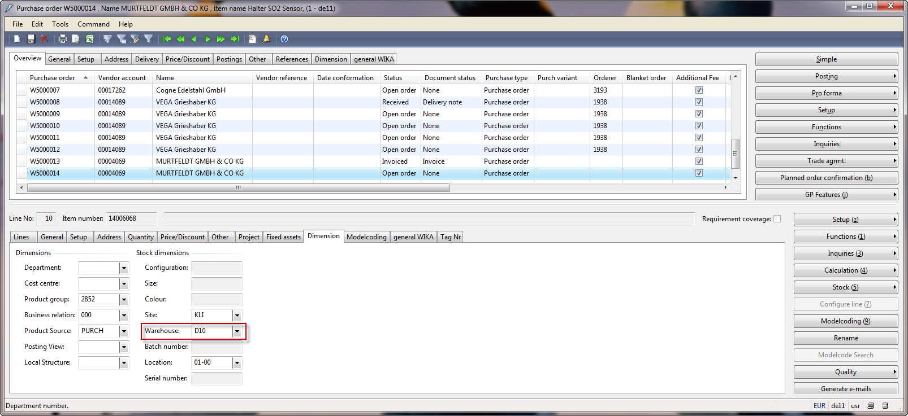

# Debit Notes
## Debit Note - for rework or material costs (no movement of goods)
For use with:
Purchase Orders with order type “returned order”. 
If necessary, enter „1“ as the return number (if delivery terms are not maintained in the vendor master).

Process Steps:
1.	Create a Returned order for Item number „ZS3000.01“ 
2.	Enter the quantity “-1“
3.	Manually enter the required order value
4.	Update item text
5.	Post the invoice for the returned order

**Example step 1 to 3:**

**Example step 4:**

**Example step 5:**

## Incorrect order value charged - Value correction

>[!Note]
>Items requiring inspection will have the „Quarantine management“ flag checked in the item master. This flag must be unchecked before executing this process and then re-checked upon completion.

Example: The company was charged 19,45€ for 10 pcs, but the agreement was for 10 pcs at 17,45€.

Process Steps
1.	Create a new purchase order
2.	Enter: Line. 10    Item Number     Correct Quantity        New Value    Main warehouse
3.	Enter: Line. 20    Item Number     „-„ Correct Quantity    Old Value 	Main warehouse
4.	Update values & surcharges as needed
5.	Invoice the order with the corrected value

**Example step 1 to 3:**

>[!Note]
>Values and surcharges in the replacement line must match the originally invoiced amount before the replacement line is submitted for invoicing. To determine the originally invoiced values & surcharges amount, navigate to:
>Original Purchase order (with incorrect value) -> In the header section, click the “Inquiries” button and select “Invoice” -> On the invoice journal, navigate to the Lines tab -> Click the “Misc. charges” button -> View the Misc. charges value field. 

**Example step 4:**

Enter the correct values/surcharges amount in the “Correction” purchase order. 

**Example step 5:**

## Incorrect Quantity Received - Quantity Correction

>[!Note]
>Items requiring inspection will have the „Quarantine management“ flag checked in the item master/register. This flag must be unchecked before execution of this process and then re-checked upon completion.

Example: 100 pcs were ordered and delivered but 110 pcs were systemically received into the main warehouse.
 
1. If the affected order has not yet been invoiced, then the receipt must be reversed and re-received for the correct quantity. These steps are **NOT** detailed below.

2. If the affected order has been invoiced, then:

Process Steps
1.	Create a new purchase order
2.	Enter: Line. 10 	Item Number	Correct Quantity	Value	 Main warehouse 
3.	Enter: Line. 20	Item Number	“-“ Incorrect Quantity 	Value 	 Main warehouse 
4.	Post the delivery note to receive the corrected quantity
5.	Submit the order for invoicing

Example:

 
 

**Example step 1 to 3:**

 

**Example step 4:**

 

 

Step 5 - Upon completion, the new purchase order must be invoiced through Financial Accounting.

## Return delivery from blocked inventory
(where rewort (replacement order) is performed for "0"€.)

Create a Debit Note (Function -> Return Order) with value – Order booking (Invoice), Do **NOT** send – Block Debit Note from Payment

Steps
1.	Create debit note (Function -> Return order)
2.	Create replacement order with value 
3.	Enter receiving warehouse on Delivery note
4.	Invoice the order  
5.	Block the applied debit note and advise the finance dept.

**Example step 1:**

**Example step 2 and 3:** Return Delivery and Create Replacement Order

**Example step 4:**

**Example step 5:** Block Debit Note

When “Release for payment” is not checked, the invoice is blocked for payment.

Provide the invoice number to the Finance group.

## Debit Note of Value and Order of Value
Refer to standard process for vendor return.

# Index

| Index | Status   | Date | Author          | Reason for change |
|:-----:|----------|:----:|-----------------|-------------------|
| 01    | Released | TBD  | Simon Berberich | Publication       |
