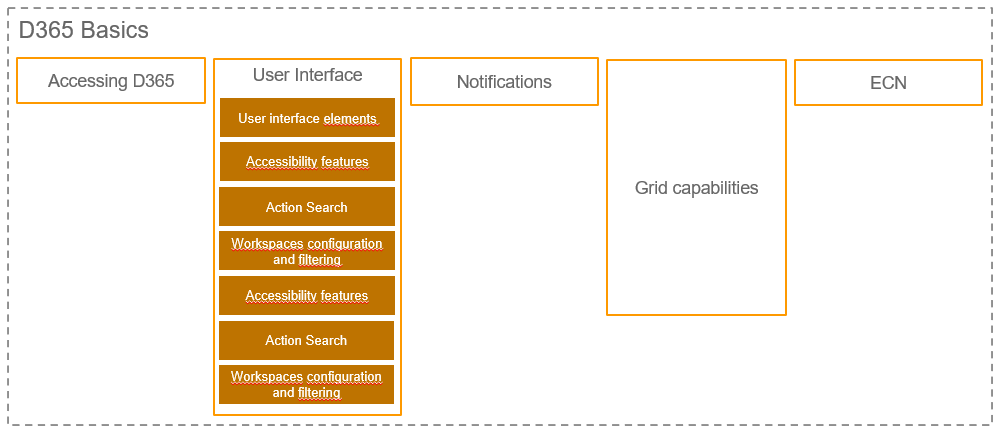

# Basics
gfdsfdsfdsfd

[Sales Process](SalesProcess.md)

## [Header1.1](href)
# Header2
## [Header2.1](href)
### [Header2.1.1](href)
## [Header2.2](href)

> [!NOTE]
> The more effective communication of users in ERP systems (AX System) is a sub-topic of SML3. The goal is to avoid unnecessary media breaks(sending mails with Outlook) and to convey an existing communication tool (notifications) to the users of AX in a new way.

>fdsfds

> [!Tip]
> The more effective communication of users in ERP systems (AX System) is a sub-topic of SML3. The goal is to avoid unnecessary media breaks(sending mails with Outlook) and to convey an existing communication tool (notifications) to the users of AX in a new way.

> [!IMPORTANT]
> The more effective communication of users in ERP systems (AX System) is a sub-topic of SML3. The goal is to avoid unnecessary media breaks(sending mails with Outlook) and to convey an existing communication tool (notifications) to the users of AX in a new way.

> [!WARNING]
> The more effective communication of users in ERP systems (AX System) is a sub-topic of SML3. The goal is to avoid unnecessary media breaks(sending mails with Outlook) and to convey an existing communication tool (notifications) to the users of AX in a new way.

