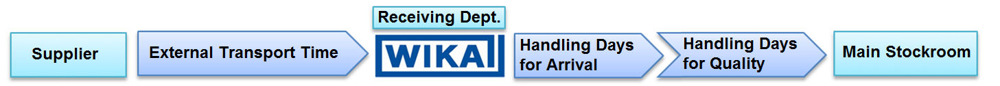
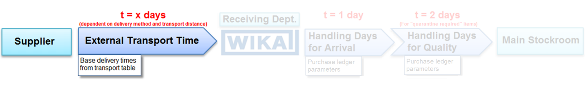
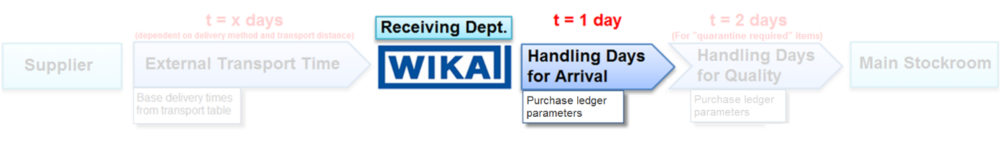
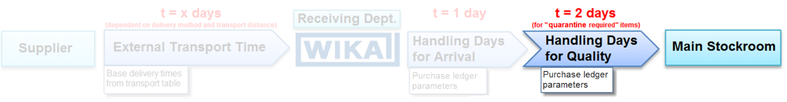
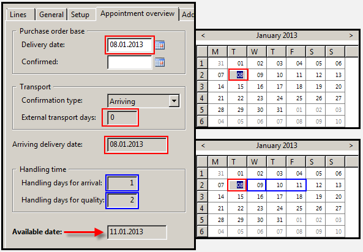
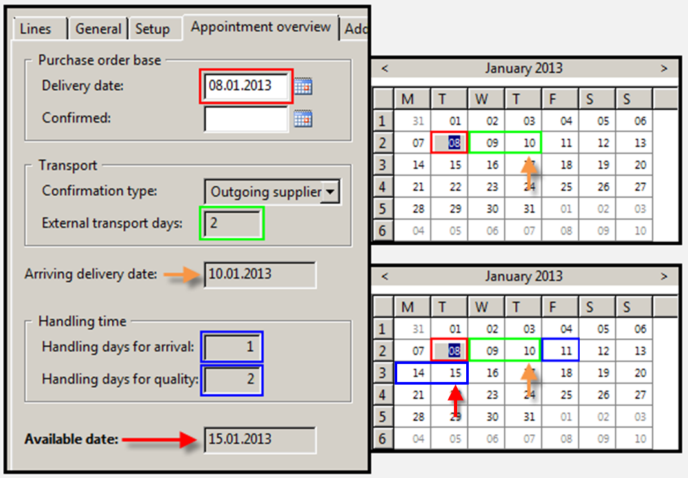
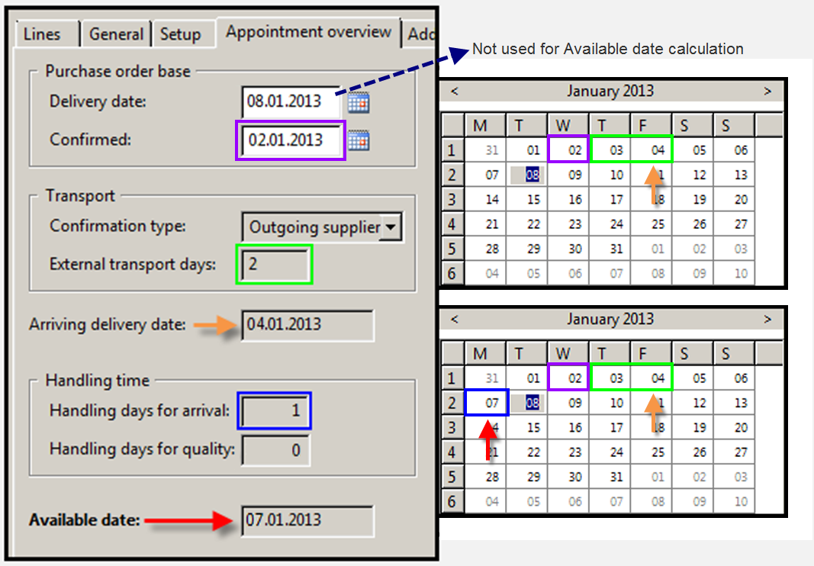
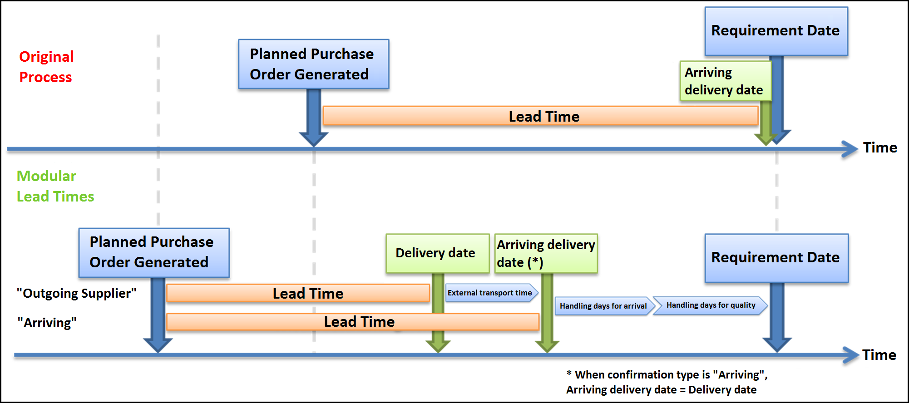
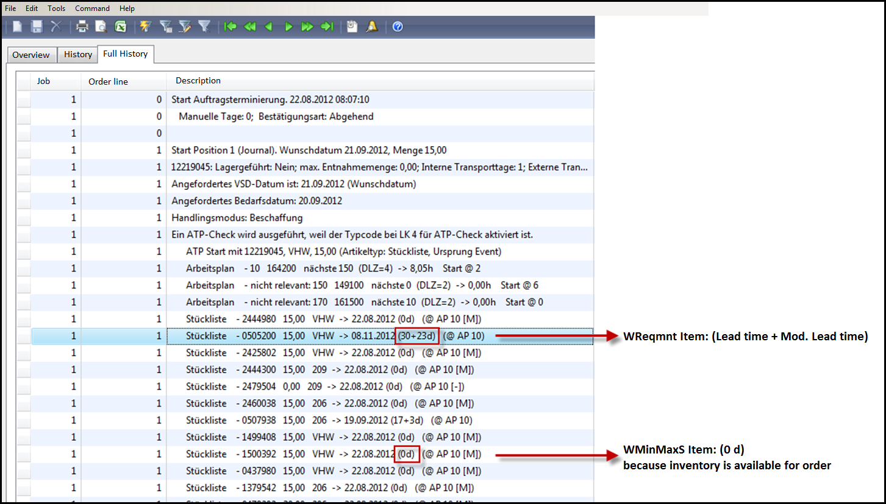

# Global parameters of the modular lead times
In order to accurately account for the total time required for the delivery of an order line, from the supplier to the main stockroom, the Modular Lead Time setup is used. 

The Modular Lead Time setup allows for the consideration of the external transport time, the internal handling days for arrival and the internal handling days for quality. These values facilitate an accurate calculation of the availability date for a purchased good in the main stockroom. 

## Time Module
### External Transport Time

The external transport time is necessary for the calculation of the availability date of an item when the supplier confirms the delivery date as the date when the order leaves his location. 

The external transport time is defined by the distance from the supplier to the receiving facility and the MOD (mode of delivery).

In D365, the base delivery times are maintained by the logistics department in the transport table. 

#### Detail Levels of the Transport Lead Times
The Transport Lead Times have a few different detail levels:

1. Base Lead Time
    * Supplier Country -> Receiving Facility
        * General lead times can be entered for the transport from a country to the receiving facility.
2. Detailed Lead Times
    * Supplier Zip Code -> Receiving Facility
        * Zip code specific lead times can be entered in D365. D365 will use these lead times when the zip code in the vendor details table matches a zip code in the transport table.
3. **MOD** Dependent Lead Times
    * Supplier Country -> Receiving Facility
    * Supplier Zip Code -> Receiving Facility
        * MOD dependent lead times can be used for lead times based on supplier country or supplier zip code. 
        * These will be used when either the zip code or country **and** either the supplier or the individual purchase order MOD match an entry in the transport table. 
        * If the MOD is not listed in the transport table, the standard transport time, based only on the zip code or country, will be used.

#### Fallback-Logic for Transport Lead Time Determination
D365 uses a fallback-logic for determining transport lead times. It begins by searching for the most detailed information to base a lead time on. For example, it searches for MOD and zip code in the vendor  or purchase order details. If it does not find a combination matching an entry in the transport table, it will search for something simpler, such as country and MOD, and if that is not found, it will search only for the zip code and then for the country.

### Handling days for arrival
“Handling days for arrival” represents the internal time required for the receiving process as well as the transport time from the receiving department to the main stockroom or quality inspection department. 
This time will be entered in the „Handling days for arrival“ field in the Purchase ledger parameters module.

>[!Note]
>The Handling days for arrival will be 1 day for all vendors. It is a global parameter and cannot be adjusted for individual vendors

The Handling days for arrival applies to all purchased items and will automatically be considered.

### Handling days for quality
For „quarantine required“ items, the time for which the item is in quality inspection, and therefore not available, must be considered.

Like the Handling days for arrival, the Handling days for quality are entered in the Purchase ledger parameters module. The Handling days for quality field is set to 2 day, which then applies to all vendors.
The Handling days for quality are only considered when a purchased item is flagged as „Quarantine required.“ If an item is not flagged as „Quarantine required,“ the purchase order Handling days for quality will bet set to 0. 

## Confirmation Type
There are two confirmation types considered by D365. Each one results in a different consideration of the lead time factors that are considered in the calculation of the availability date and the order proposal date. 

### Confirmation type "Arrival"

The confirmation type „Arrival“ is selected when the delivery date provided by the supplier represents the date that it will **arrive** at the receiving facility. Thus, the external transport time must not be considered. 

### Confirmation type "Outgoing supplier"

The confirmation type „Outgoing supplier“ is selected when the delivery date provided by the supplier represents the date on which the order leaves the supplier’s facility. The external transport time must then be considered.

## Global Parameters to be maintained
The following master data must be maintained in order to guarantee the proper consideration of the modular lead times in all relevant D365 processes:

|||
|---|---|
| **Transport Table** | *Stock management -> Setup -> Distribution -> Transport* In order to avoid a calculation of 0 days, there must be at least an external transport time on the country level in the transport table. |
| **Purchase ledger parameters** | *Purchase ledger -> Settings -> Parameter* The Handling days for arrival and quality, used for all suppliers, are entered on the Purchase ledger parameters screen. |
| **Confirmation type** | *Purchase ledger -> Common forms -> Vendor details -> Purchase order tab* The confirmaton type must be defined and maintained individually for each vendor. |

# Process logic of the modular lead times
## Manual
>[!Note]
>For more information, please read [Purchasing Basic Purchase Orders Details](Basic_Purchase_Orders_Details.md)

### Selection of the Confirmation Type
When manually creating a purchase order, the confirmation type in the „Create purchase order“ screen will automatically be populated with the confirmation type selected in the Vendors screen. 
Upon closing the “Create purchase order” dialog box, a new purchase order header will be created. The confirmation type can be edited either in the “Create purchase order” dialog box or on the purchase order header (“General” tab -> „Job control“ area).

### Available date determination
The following fields in the “Appointment overview” tab of a purchase order line are not editable and are automatically filled by D365.

|||
|---|---|
| **Confirmation type** | The confirmation type in the purchase order line is populated from the confirmation type in the purchase order header. |
| **External transport days** |	The external transport days are populated from the transport table whenever the confirmation type is set to “Outgoing supplier” and the transport table is maintained for the country/zip code of the supplier. |
| **Arriving delivery date** | *Automatically calculated* If confirmation date has _not_ been entered, then the following will apply: Delivery date _+ external transport days_ = Arriving delivery date Otherwise: Confirmation date _+ external transport days_ = Arriving delivery date |
| **Handling days for arrival** | The Handling days for arrival will be populated from the Purchase ledger parameters after the purchase order line is created. |
| **Handling days for quality** | If the purchased item is flagged as “Quarantine required,” the Handling days for quality will be populated from the Purchase ledger parameters after the purchase order line is created. |
| **Available date** | _Automatically calculated_ Arriving delivery date + Handling days for arrival _+ Handling days for quality_ = Available date |

 

**Example 1:**

*Available date calculated with:* Confirmation type „Arriving“ and no confirmed date.

 

**Example 2:**

*Available date calculated with:* Confirmation type „Outgoing supplier“ and no confirmed date.

 

**Example 3:**

*Available date calculated with:* Confirmation type „Outgoing supplier“ and confirmed date (item will arrive earlier than delivery date).

### Automatic Update After a Change in the Order
When the delivery or confirmation date is changed, the “Arriving delivery date” and “Available date” fields are automatically recalculated. 

If changes are made to the address or the MOD (for example from sea to air) in a sales order line, the “External transport days” will be recalculated. When the external transport days are changed, the “Arriving delivery date” and “Available date” are also recalculated. When such an update is made, an infolog will be generated with the details of the change.

Changes to the item number which have an impact on the Handling days for quality can only be executed before the first save of the order line. If the purchase order line has already been saved, the automatic update to the Handling days for quality will not be made. 

>[!Warning]
>In order to prevent calculation errors, the item number in the purchase order line cannot be changed. 
>
>If an item number must be changed, the line must be deleted and a new line must be created

## Planned purchase order generation through MRP
D365 considers the modular lead times when generating planned purchase orders through MRP. The standard item lead time will no longer be the only factor used in determining a purchase order lead time. D365 will now also consider the confirmation type used by the supplier and will add the external transport days if the „Outgoing supplier“ confirmation type is used. Likewise, the system will also consider the quarantine status of the item. If „Quarantine required“ if flagged on the item number, the Handling days for quality will be added to the purchase order lead time. And the Handling time for arrival will be added to the lead time for ALL purchase orders. 

The consideration of the modular lead times does NOT delay the requirement date of an item. Rather, it moves the planned purchase order generation to an earlier date. The planned purchase order generation dates will be earlier with the modular lead time process then they were with the original process. Also, the delivery dates for the purchase orders will be earlier since the handling days for arrival and quality will be considered. 

## Consideration of modular lead times for customer order scheduling
If a sales order results in a direct requirement for a purchased or dual sourced item, the modular lead times are used in the journal mode (for planned purchase orders), as long as a vendor is listed for the item.

The handling and transport days required for the order will be added separately to the lead time of the item. Thus, a sales order line is released for the earliest date on which the required item, including its transport and handling days, is available for the order.

The sales order scheduling history shows the sum of the lead times (standard lead time + modular lead time) for requirement items, as well as items that are not available and need to be ordered to satisfy the demand.

# Index

| Index | Status   | Date | Author          | Reason for change |
|:-----:|----------|:----:|-----------------|-------------------|
| 01    | Released | TBD  | Simon Berberich | Publication       |