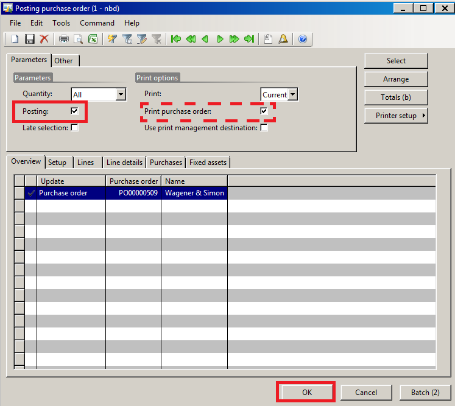
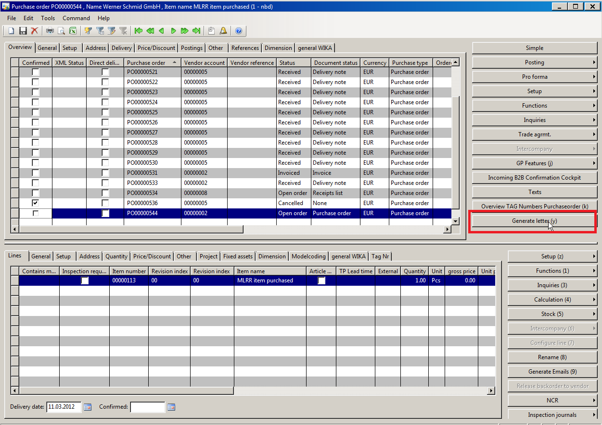

# Explanation of the purchase order form

## Creating The Order Head
Normally, orders are generated by converting a planned order into a purchase order. But there are still processes requiring a purchase order being generated without having planned order proposals in the Material Planning cockpit.

### Access: Purchase ledger area -> Common forms -> Purchase order details
To create a new purchase order press *Crtl + N* or the *New* button in the top left corner of the form. The “create purchase order” form opens.

> [!Important]
> The tab “Overview” in the head area of the form has to be selected to create a new purchase order. If the area is not selected, a new line for an existing order will be created

### Selection of the vendor
The vendor can be selected by using the drop down menu in the “create purchase order” from or by typing in the 8-digit vendor id.

### Delivery date
The favored delivery date can be selected by using the calendar function or by typing in the date (dd.mm.yyyy).

### Alternative delivery address
If the delivery address differs from the main vendor address, the alternative address can be entered in the delivery address area. Afterwards the *OK* button has to be pressed.

### Texts
To add important notes for the vendor to the purchase order, the button *Texts* has to be pressed. In the “Text” form, it is possible to enter special notes for the head or the line part of the order.

The new purchase order has been created.

## Creating the order lines
To create a new purchase order line press *Crtl + N* or the *New* button in the top left corner of the form. It is important to select the “Positions” tab in the line part of the form before pressing the *New* button. If the tab is not selected, a new order head will be generated.

### Selecting an item
The new order lines are numbered. The first order line is set 10 and the following lines are numbered in steps of ten (20, 30, …). It is possible to generate inclined positions numbered with interim numbers (e.g. 11, 15, …).
The item number can be selected by using the filter function or by selecting the number from the drop down menu. 
After the number has been selected, the following fields are filled in automatically:
* Revision index
* Revision index last order
* Quantity(=min order quantity)
* Unit
* Gross unit
* Unit price
* Net amount
* Coverage group
* Delivery date

### Creating additional order lines
To create a second or third purchase order line, press *Crtl + N* or the *New* button in the top left corner of the form. It is important again to select the “Positions” tab in the line part of the form before pressing the *New* button. If the tab is not selected, a new order head will be generated.

The line 20 is generated after having pressed the button. The selection of the item has to be processed as de-scribed above.

To generate an inclined position between line 10 and line 20, the line number has to be corrected manually.

### Required information in the tab "General"
The fields of the tab “General” are filled in by the order information and are forwarded to the vendor via B2B.

### Required information in the tab "Price/Discount"
Special prices and additional discounts which are not noted in the info record, can be entered here.

## Order head and order line charges
>[!Important]
>The assignment of charges has to be logical, otherwise the choice is not possible, e.g. unit price relevant charges can only be chosen on line level!

### Charges on head level
Using the button *Setup -> Misc. charges*, all charges concerning the complete order can be entered.

The misc. charges code can be chosen from the drop down menu. The transaction text is filled in automatically. It is important not to select any charges, being effectual on line level (e.g. alloy surcharges). Only charges being effectual on head level shall be selected.

The category as well as the misc. charges value has to be entered and confirmed by pressing the *Save* button.

### Charges on line level
Using the button *Setup - > Misc. charges* in the line part of the purchase order form, all additional charges concerning single line positions can be entered.

The line that shall be charged has to be selected before pressing the *Setup* button as the charge is always related to the marked line. After having selected the charge type and entered the category as well as the value of the charge, all entered information have to be saved by pressing the *Save button*.

## Printing the purchase order

Generally, D365 distinguishes between the following document statuses:

| the order has been | document status |
|--------------------|-----------------|
|  created           | none            | 
|  printed           | none            |
|  posted            | purchase order  |

The order posting is used to activate the order finance-related processes in D365.
Using the button *Posting -> Purchase order*, the order printing will be started.

The “printing purchase order” form opens. To check the purchase order print out before finally posting it, the field “Print purchase order” has to be check marked whereas the field “Posting” has to be left empty, otherwise the order will be posted.

It is also possible to use the *Pro forma -> Purchase order* button as here the check marks in the “printing purchase order” form are pre-set.
A pro forma print out will be generated

The print out can now be used for further processing referring to the interla signature regulations.

## Posting the purchase order

To activate the order for finance-related processes, the purchase order has to be posted.

>[!Important]
>The creation and the printing of the pro forma order **do not** suffice to activate the order for finance-related processes (e.g. invoicing). The order has to be posted!

To post the purchase order, press the button *Posting -> Purchase order*, the order posting will be started.

The “printing purchase order” form opens. To post the purchase order, the “Posting” has to be check marked. If the purchase order shall also be printed, the field “Print purchase order” has to be check marked as well. The posting has to be confirmed by pressing the *OK* button.

Now the purchase order has been activated for D365.
The postings can be checked in the tab “Postings” in the purchase order details.

## Accessing the open purchase order
There are different ways to access the open purchase order to add the order confirmation data.

### Access via the “purchase order details” form
Access: Purchase ledger area -> Common forms -> Purchase order details.

To add an order confirmation to a purchase order, the order can to be called up in the “purchase order details” form. To call up the order, the filter function can be used.

### Access via the "item details" form
Access: Stock management area -> Common forms -> Item details

The “item details” form opens. To find the purchase order, the filter on the looked for item number has to be set. Then press the button *Inquiries->Open purchase order lines*.
The “open purchase order lines” form opens. All open orders concerning the selected item are listed here.

### Order confirmation data in the order head (single order line)
The order confirmation of the vendor is added to the purchase order in the “purchase order” form.

The order confirmation has to be checked manually by the material planner. He has to check all information listed on the order confirmation, e.g. the item number, the option model, the used basic material and the item dimensions.

# Generate letters
The letter function of D365 offers the possibility to create and send standardized documents fast and comfortable. Thereby, standardized layouts as well as all specifications of the documents are automatically met and pre-defined text blocs can be included.

This letters can be generated from any D365 area, e.g.from the purchase or sales order details form. In this forms, special buttons are included, starting the generation process of the documents.

## The "generate letter" form
Depending on the way of accessing the “General letter” function, different pre-settings are made automatically by the system. Is the function accessed via the purchase order form, all pre-settings are referring to the pur-chase order, e.g. information from the purchase order are filled in.

### Settings in the tab "Overview"
The tab “Overview” contains a list of all general letters that have been created before for the used accessing reference (e.g. purchase orders, sales orders…).
To choose an existing letter, it has to be marked in the overview table. Pressing the *New* button or *Crtl+N*, a new general letter can be generated.
Use the filter function to pre-set letter references (e.g. Purchase order, Customer...).
Use check marks "Done by post room" and "Brochures" to define, how the short letter will be send to the receiver and what hast to be attached.

### Settings in the tab "General"
All detailed information concerning the letter has to be defined in the tab “General”. Several fields are automatically pre-filled by D365 but may be changed manually.

To create a new letter text, the button *Text criterias* can be pressed to choose a letter text from the standardized D365 text blocks or a free text may be entered manually (for detailed description see chapter "Using pre-defined text blocks")

### Settings in the tab "Recipient"
The address of the recipient is pre-set in the tab “Recipient” and may be changed manually if necessary.

### Settings in the tab "Brochures"
Using the tab “Brochures” it can be defined which brochures have to be attached to the letter.

## Using pre-defined text blocks
To use pre-defined and standardized text blocks for the letter generation, press the button *Text criteria* in the overview tab.
In the now opening "Text block definition" form can be used to:
1. Choose and mark the standardized text block for the letter in overview tab. The content of the text block is shown in the tab “Texts".
1. The tab “Text” offers the possibility to change the language of the chosen text block by using the drop down menu.
1. To copy the text block to the clipboard press the button *Copy and close*. 

The text is bufferd and can be entered by using *Ctrl+V* to enter the text in the free text field of the letter form. The subject can be adapted manually to the content of the letter as only the purchase order number is pre-filled.

## Printing the generated letter
To print the generated letter, press the *Print* button.
In the now open form you can see the current print options. To change the print setup, press the button *Options*.

To send a letter via Email, the option “Email recipient” has to be chosen in the setup. To open the automatically generated Email, press the *OK* button. D365 automatically generates the email to the recipient. By pressing the *send* button, the email is send to the recipient.

# Reminder
## Reminder Settings
To get messages and warnings in the case of delays, the following settings have to done once in the purchase ledger setup area.

### Access: Purchase ledger area -> Setup -> Parameters

The following settings in the "Messages/Warnings" area have to be defined:

|||
|---|---|
| Days to report a print purchase order | The material planner gets a message in his unified work list after the entered number of days, when a purchase order has not been printed and/or posted yet. |
| Days to report missing con-firmation | The number of days that has to past before the material planner gets a note in his unified work list that the vendor has not sent an order confirmation yet. | 
| Days until message delivery delay | The number of days that has to past before the material planner gets a note in his unified work list that the confirmed delivery date is exceeded and no goods have been received. (default setting = 1 day) |

## Processes
### Order confirm proc with unified work list note "order confirmation missing"
Using the unified worklist note, the material planner directly gets to the order details.
If the confirmed delivery date has been exceeded the material planner has to use the *Generate letter* button to remind the vendor of the promised delivery (for more detailed description concerning the use of text blocks see chapter "Using pre-defined text blocks").

### Order confirm process with unified work list note "delivery date exceeded"
Using the unified worklist note, the material planner directly gets to the order detailes.
If the confirmed date has been exceeded and the order status is still "Open order" and the document status is "None", the material planner has to use the *Generate letter* button to remind the vendor of the promised delivery (for more detailed description concerning the use of text blocks see chapter "Using pre-definded text blocks").

# Open purchase orders

The form "open purchase orders" contains information about all open orders.
Access: Purchase ledger -> Inquiries -> Open Purchase order lines.
Fields like Phone numer, Vendor name, Item name, Net amount, Created date are also included here.

# Navigation

[Goods Receiving](xref:Goods_Receiving)

# Index

| Index | Status   | Date | Author          | Reason for change |
|:-----:|----------|:----:|-----------------|-------------------|
| 01    | Released | TBD  | Simon Berberich | Publication       |