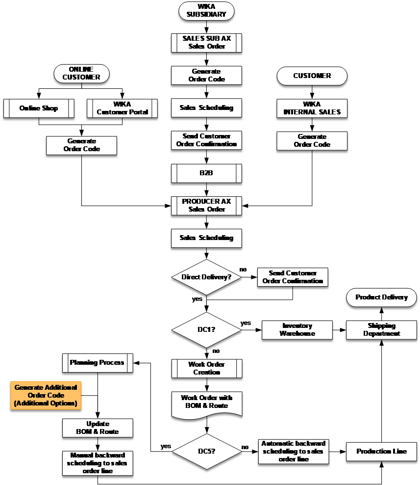

# Modelcode Basic PVG

## Introduction

&nbsp;

For trainees new to the Modelcode & PVG-Code, this introduction is intended to provide a brief overview of these tools and how they can be used. Understanding thes fundamental points is required in order to use the Modelcode & PVG-Code correctly.
The Modelcode is a product configurator (user selections generate a code-string to represent a specific product). It creates a universal language that can be understood and used by the entire WIKA world and all of its customers. Subsidiaries can access the Modelcode directly from Dynamics and some customers can access it through the Customer Portal.

With the Modelcode, a product can be configured by first selecting a product model from a list of available models and then selecting the desired options from a list of available options. Each option is assigned an alpha-numerical code so that when a product is configured, a code-string is generated which serves as a representation of the requested product. 
The Modelcode can also be used to guide customers to the selection of specific products. For many models, a wide variety of production options may exist but it is not always desirable to present these options to customers. Also, different subsidiaries may offer the same product with different options but only the standard options (defined by the product CoE) are used in the Modelcode. If additional product options are available, a free-text field can be added to the Modelcode which allows the manual entry of customer requirements by sales. When this option is used, another tool may be used for own produced products to complete the coding for the free-text. This is when the PVG (Product Variant Generator) is used. The PVG Code is not used by sales but only by work preparation department.
The PVG is similar to the Modelcode but it includes subsidiary-specific options that are missing from the Modelcode. The PVG is used, when needed, to generate a PVG-Code to complete a product configuration for a customer requirement. It also contains the structure required to link selections from the Modelcode and PVG-Code with BOM components and sub-operations in order to build the required BOM´s and Routes. All PVG details will be provided in this document. 

>[!Important]
>The PVG code cannot generate item texts or prices shown to the customer. The PVG is only used to have the possibility for automatic BOM and ROUTE Generation for own produced products. PVG has no use for purchased products. 

## Options for the creation of a PVG-Code

When setting up the Modelcode and PVG Code, there are three combination options (Modelcode, PVG Code, and Modelcode + PVG Code). The information below illustrates these combinations and provides an example of where each option might be used along with pros and cons of each option.

### PVG-Code without Structure - Version 1

&nbsp;

In this version, there is no structure in the PVG-Code. All of the options for the BOM and Route are pulled only from the Modelcode.
This setup works well for simple or standard configurations where non-standard options don´t exist.

>[!Warning]
>This version limits the BOM & Route for the product.
>
>That means if a product could be produced with different items and operations, this could not be possible due the Modelcode do not display such non-standard options and Criterias.
>
>Example: Non-standard connection thread 7/16-20 UNF for model 23x.50

### PVG-Code with Structure - Version 2

&nbsp;

This version presents a solution to the problem described in version 1.
Only the criteria groups which include the missing options have been created in the PVG-Code. This is ideal when there is a low number of options not covered by the Modelcode

### PVG-Code with Structure - Version 3

&nbsp;

In this version, all criteria groups and options are created in the PVG-Code. All BOM and Route options come from the PVG-Code. This scenario is ideal when there is a large number of options not covered by the Modelcode.
That means, more options for BOM’s and routes can be selected from the PVG-Code than the Modelcode. It is possible to code free-text selections from the Modelcode in order to better prepare the item for production readiness. So, the options of each criterion in the Model code will automatically be transferred to the same criterion in the PVG-codes.

>[!Warning]
>In this version, the structure must again be partially or completely rebuilt in the PVG-Code. With modifications to features or criteria in the Modelcode, the PVG-Code must also be updated

## CONSIDERATIONS BEFORE STARTING
Follow these steps to simplify the start-up process for developing a new PVG-Code. 

### Training
Before starting to build up / work with PVG make sure to get an official training in modelcoding an PVG from 
IT-PR.

### Assessment
Before a PVG-Code is created, it is necessary to create an assessment of all items that have ever been ordered which are to be included in the PVG-Code. 

### Pareto
From this assessment, a Pareto-analysis must be performed in order to determine which products to include in the PVG-Code. The most frequently ordered items should be included. With this analysis, the standard products and a majority of orders will be covered and the process can be started quickly. 

### Standard Goods
The goods (components or finished goods) required for the standard process (MTO) must be communicated to the dispatchers/planners. They must then mark the required flags in the ERP system to ensure that a sufficient quantity of these items is always available in stock. 

### Same Main Positions
In the case of the same or similar PVG-Structures, it is important to ensure that the most important items (i.e. sockets, cases, rings, etc.) are in the same primary position in each PVG-Code. 

>[!Important]
>Criteria which are created only for the PVG will always begin with “AV-“ and will therefore be differentiated from the criteria for the Modelcode
>
>New criteria / options and attributes / attribute values are only allowed to be created in Klingenberg D365 and not in any local system.

>[!Important]
>Requests for new options, which will only be used in the Modelcode, must first be coordinated with the Modelcode representative in the CoE.
