# Working with certificate
## Production - Certificate line which was automatically generated
User should use the “filters” area to refine their daily task and work in finished work orders (Column TS filter to 90).

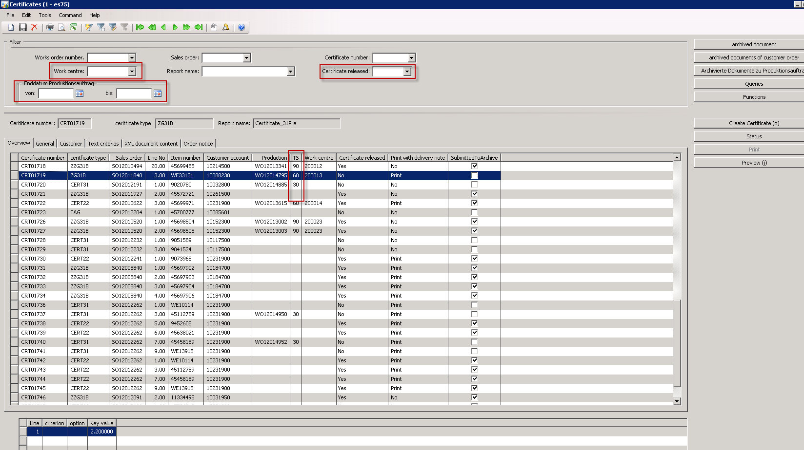

### Tab "Order notice" shows requirements from Sales or Work Order

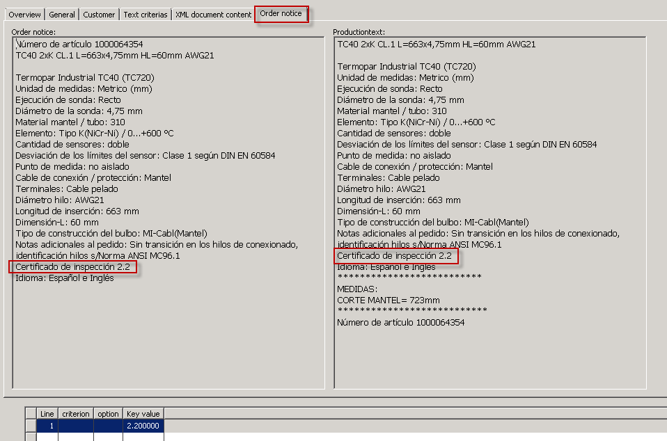

### Tab "General" - check of "Report name"

User should verify the field “Report Name” even it was automatically or manually set.
If any change is necessary, then the field “Change Reason” should be use to inform the reason.

Flag “with Pre Certificate“ must be set for 3.1 Material (certificate from vendor)

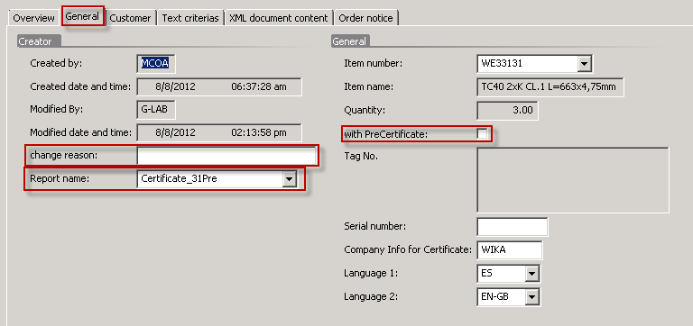

>[!Important]
>Fields "Report Name" and "Language" are mandatories

### Choosing text key values

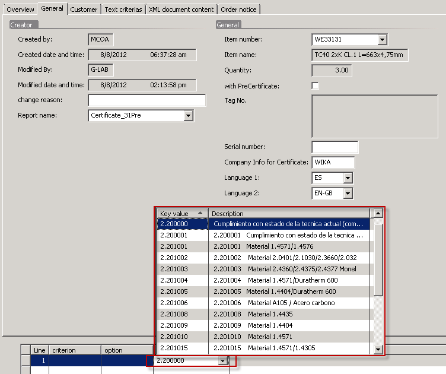

Choose right text blocks defined by order notice and report name.

>[!Important]
>Evaluate if order notice information, report name and key value belongs together

### Creating certificate text

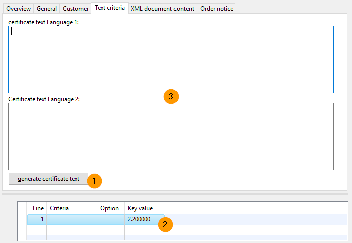

Using button **Generate certificate text** and used “key value” 2.200000 the certificate text box will be filled.
Changes are possible manually change text box or choosing a new key value

>[!Important]
>If both text boxes are filled and you press button „generate certificate text” current text value are deleted and generate new. Also manual filled in additional text description are deleted

### Certificate preview

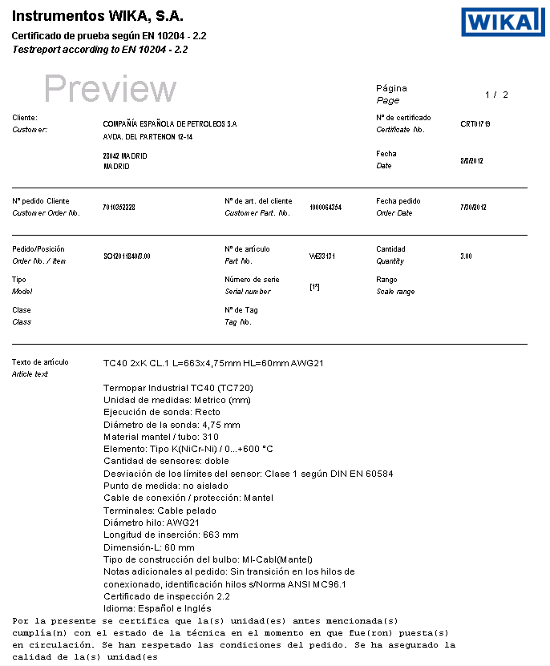

If needed, then change (key value, add manual text, …) and generate the preview again by pressing button “preview“.

### Certificate release

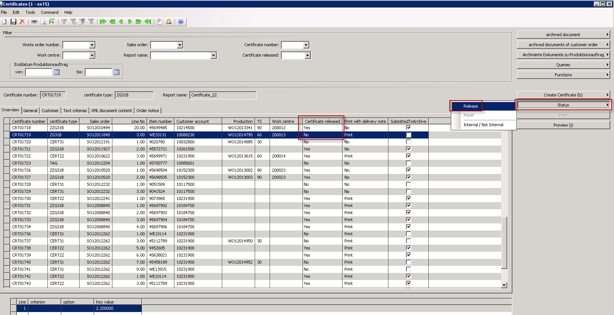

* Pressing the button **status -> release** change the status of the created certificate line from No to Yes
* Pressing the button **status -> reset** change the status of the created certificate line from Yes to No
* Pressing the button **status -> Internal / Not Internal** change the status of the created certificate line from Yes/Internal to No/Internal or vice-versa

>[!Note]
>For each release D365 archives a new document. If it's the first release then the flag "submitted to archive" is flagged.

## Manual creation of a certificate line
### From work order
Use button **Create Certificate -> from prod order** to create a certificate line with link to a work order.

>[!Note]
>For 3.1 measureing protocol you need for each gauge a line and a serial number

#### Select Work Order, certificate type and change language

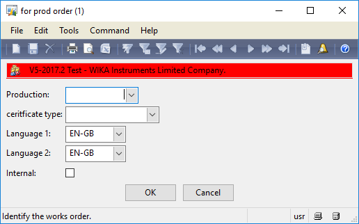

Choose Work Order number by selecting the number or fill it in manually. 
Choose Certificate type
If necessary change the language.

Result:
Certificate line is created 

Follow process described in topic **Tab "General" - check of "Report name"**

### From Sales Order
Pressing the button creates a certificate line for the whole sales order for certificate type 2.2 (CERT22ORD)

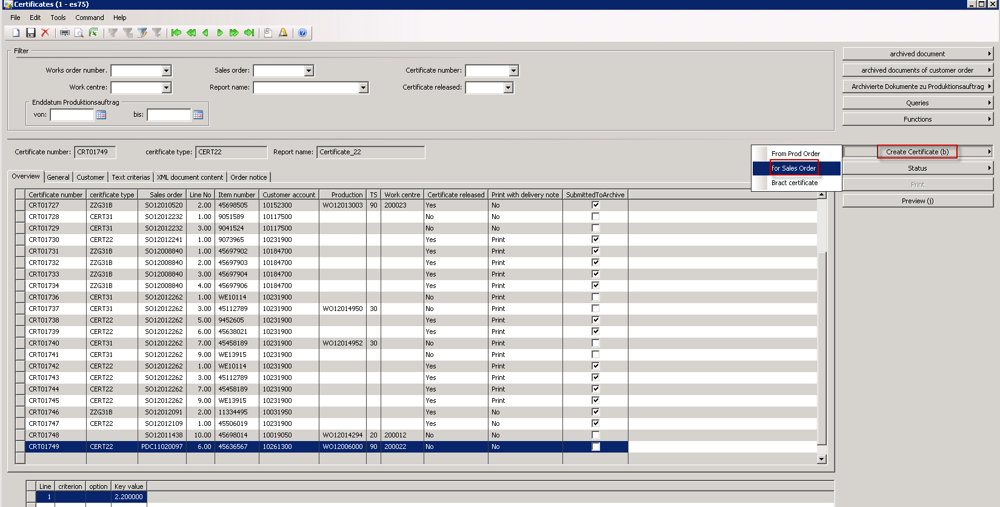

#### Select sales order number, line number and language

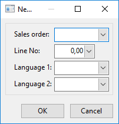

Follow process described in topic **Tab "General" - check of "Report name"**

>[!Important]
>If the sales order line was shipped before – certificate have to hand over manual to the customer. If the automatic BL Picking Batch Job is running, goods can not be shipped without certificates.

### Bract certificate
Pressing the button creates a certificate line for a bract certificate (for trading goods) 

#### Select sales order number, line no and change language

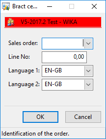

Choose sales order number
Fill in line number
And if necessary change the language

Result: Certificate line is created

Fill in the used material code and then release

# Certificate Structure

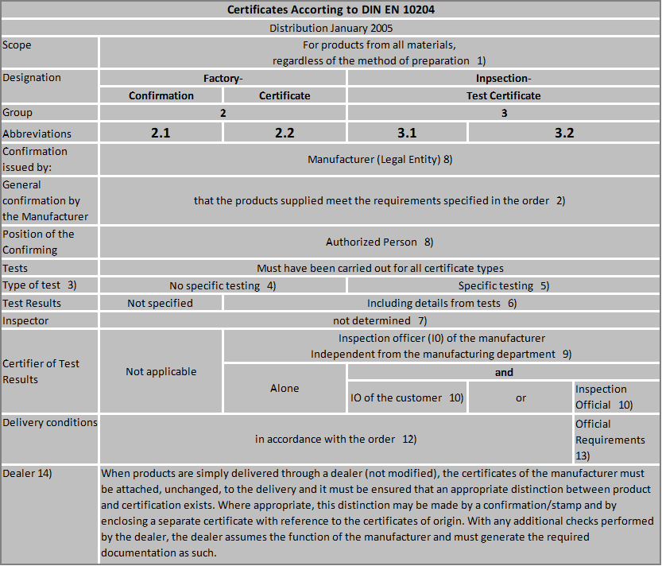

Production -> Certificate -> Setup -> Maintain Certificate Type

| Certificate Type | Description | Report name | SerialNo in Ceritficate | with PreCertificate |
|------------------|-------------|-------------|-------------------------|---------------------|
| CERT22 | E_Basis_2.2 | Certificate_22 | Serveral | No |
| CERT22ORD | Certificate per Order | Certificate_22Order | None | No |
| CERT31 | E_Basis_3.1_Miscellaneous | Certificate_31Div | Serveral | Yes |
| EXTERN | External Certificate (Only PDF) | certificate_external | None | No |
| PRODDATA | Production data – No oficial certificate | certificate_ProdData | One | No |
| SF6 | SF6-Certificate | Certificate_31SF6 | One | No |
| ZG31B | E_Basis_3 1_Electronic or E_Basis_3.1_Pressure | Certificate_31Pre | One | No |
| ZG31TEMP | 3.1 Temperature | Certificate_31Temp | One | No |
| ZG32 | Cover sheet for 3.2 Certificate | Certificate_32Mat | Serveral | Yes |
| ZGBRACT | Cover sheet certificate | Certificate_Bract | None | Yes |
| ZZG31B | E_Basis_3.1_Material | Certificate_31Mat | Serveral | No |
| ZZG31BMIT | E_Basis_3.1_Material with vendor certificate | Certificate_31Mat | Serveral | Yes |

Production -> Certificate -> Setup -> Maintain Certificates Type

| Key value | Description |
|:---------:|-------------|
| 2.200.000 | Grundeinstellung Fertigung nach Stand der Technik |
| 2.200.001 | 2.200001   Fertigung nach Stand der Technik |
| 2.201.001	| 2.201001   Werkstoff 1.4571/1.4576 |             
| 2.201.002	| 2.201002   Werkstoff 2.0401/2.1030/2.3660/2.032 |
| 2.201.003	| 2.201003   Werkstoff 2.4360/2.4375/2.4377 Monel |
| 2.201.004	| 2.201004   Werkstoff 1.4571/Duratherm 600 |
| 2.201.005	| 2.201005  Werkstoff 1.4404/Duratherm 600 |
| 2.201.008	| 2.201008   Werkstoff 1.4435 |
| 2.201.009	| 2.201009   Werkstoff 1.4404 |
| 2.201.010	| 2.201010   Werkstoff 1.4571 |
| 2.201.015	| 2.201015   Werkstoff 1.4571/1.4305 |
| 2.201.016	| 2.201016   Werkstoff 1.4571/1.4305/1.4576 |
| 2.201.020	| 2.201020   Werkstoff 2.4819 (HC276) |
| 2.201.021	| 2.201021   Werkstoff nichtmetallisch FPM |
| 2.201.026	| 2.201026   Werkstoff AISI 316 / AISI 316L |
| 2.201.027	| 2.201027   Werkstoff 1.4571/316TI / 1.4404/316L |
| 2.201.030	| 2.201030   Werkstoff 2.4360 (Monel) |
| 2.201.033	| 2.201033   Werkstoff 2.4711 / 316L VIM / VAR |
| 2.201.034	| 2.201034   Werkstoff PFA |
| 2.201.035 | 2.201035   Werkstoff PTFE |
| 2.201.036	| 2.201036   Werkstoff 1.4404 / 1.4305 |
| 2.201.043	| 2.201043   Werkstoff 1.4435/316L |
| 2.201.044	| 2.201044   Werkstoff 1.4404/316L / 1.4435/316L |
| 2.201.045	| 2.201045   Werkstoff 316SS |
| 2.201.046	| 2.201046   Werkstoff 316/1.4571 Gehäuse/Ring |
| 2.201.047	| 2.201047   Werkstoff 1.4404/316L / Tantal |
| 2.201.048	| 2.201048   Werkstoff 1.4404/316L / 2.4819/HC276 |
| 2.201.049	| 2.201049   Werkstoff 1.4404  / 2.4360 (Monel) |
| 2.201.050	| 2.201050  Werkstoff 1.4301 Gehäuse |
| 2.201.060	| 2.201060   Werkstoff Goldbeschichtung 20µm |
| 2.201.061	| 2.201061   WIKA Werkstoff PP/PVDF/EPDM |
| 2.201.104	| 2.201104   Werkstoff 2.4375/2.4360 Monel NACE |
| 2.201.111	| 2.201111   Werkstoff 1.4404/2.4375 NACE |
| 2.201.114	| 2.201114   Werkstoff 2.4375/2.4360/1.4404 NACE |
| 2.201.125	| 2.201125   Werkstoff 1.4404 NACE |
| 2.201.126	| 2.201126   Werkstoff 1.4571 NACE |
| 2.201.127	| 2.201127   Werkstoff 1.4404/1.4571 NACE |
| 2.201.128	| 2.201128   Werkstoff 2.4360 Monel 400 NACE |
| 2.201.129	| 2.201129   Werkstoff 1.4404/2.4819(HC 276) NACE |
| 2.201.130	| 2.201130   Werkstoff 1.4571/2.4819(HC 276) NACE |
| 2.201.131	| 2.201131   Werkstoff 2.4819(HC 276) NACE |
| 2.201.132	| 2.201132   Werkstoff 1.4404/1.4301 NACE |
| 2.201.133	| 2.201133   Werkstoff 1.4571/2.4711 NACE |
| 2.201.134	| 2.201134   Werkstoff 1.4435 NACE |
| 2.201.135	| 2.201135   Werkstoff 1.4435/2.4819(HC 276) NACE |
| 2.201.136	| 2.201136   Werkstoff 1.4404/1.4435 NACE |
| 2.201.137	| 2.201137   Werkstoff 1.4404/2.4360 NACE |
| 2.201.143	| 2.201143   Werkstoff 1.4404/Duratherm NACE |
| 2.201.144	| 2.201144   Werkstoff 1.4571/Duratherm NACE |
| 2.201.145	| 2.201145   Werkstoff 2.4360/1.4435/Duratherm NA |
| 2.201.146	| 2.201146   Werkstoff 1.4404/Tantal NACE |
| 2.201.147	| 2.201147   Werkstoff 1.4404/1.4462(Duplex) NACE |
| 2.201.148	| 2.201148   Werkstoff 316SS NACE |
| 2.201.150	| 2.201150   Werkstoff 1.4404 NACE / MR0103 |
| 2.201.151	| 2.201151   Werkstoff 2.4375/2.4360 NACE/MR0103 |
| 2.201.152	| 2.201152   Werkstoff 1.4571 NACE / MR0103 |
| 2.201.153	| 2.201153   Werkstoff 1.4404/1.4751 NACE/MR0103 |
| 2.201.161	| 2.201161   Werkstoff 1.4404/2.4819 NACE/MR0103 |
| 2.201.162	| 2.201162   Werkstoff 2.4360 NACE / MR0103 |
| 2.201.172	| 2.201172   Werkstoff 1.4404/1.4571 NACE/TRONIC |
| 2.201.173	| 2.201172   Werkstoff 1.4571/2.4711 NACE/TRONIC |
| 2.202.001	| 2.202001   Anzeigegenauigkeit Kl. 0,1 |
| 2.202.002	| 2.202002   Anzeigegenauigkeit Kl. 0,25 |
| 2.202.003	| 2.202003   Anzeigegenauigkeit +- 3,0 % Druck steig. |
| 2.202.005	| 2.202005   Anzeigegenauigkeit Kl. 0,5 |
| 2.202.006	| 2.202006   Anzeigegenauigkeit Kl. 0,6 |
| 2.202.010	| 2.202010   Anzeigegenauigkeit Kl. 1,0 |
| 2.202.016	| 2.202016   Anzeigegenauigkeit Kl. 1,6 |
| 2.202.017	| 2.202017   Anzeigegenauigkeit Kl. 1,6/EN 837-1 |
| 2.202.025	| 2.202025   Anzeigegenauigkeit Kl. 2,5 |
| 2.202.050	| 2.202050   Genauigkeit 0,5 der Spanne |
| 2.202.051	| 2.202051   Genauigkeit 0,25 der Spanne |
| 2.202.052	| 2.202052   Genauigkeit 0,1 der Spanne |
| 2.202.053	| 2.202053   Genauigkeit 1,0 der Spanne |
| 2.202.060	| 2.202060   Genauigkeit/Transmitter |
| 2.202.063	| 2.202063   Klassen/Anzeige Klasse A |
| 2.202.064	| 2.202064   Klassen/Anzeige Klasse B |
| 2.202.065	| 2.202065   Klassen/Anzeige Klasse 1 für TC |
| 2.202.066	| 2.202066   Klassen/Anzeige Klasse 2 für TC |
| 2.202.070	| 2.202070   Anzeigegenauigkeit Kl. xx |
| 2.203.001	| 2.203001   Anzeige- Schalt.- Spannungsprüfung |
| 2.203.004	| 2.203004   Isolationswiderstand, -festigkeit 1M |
| 2.203.006	| 2.203006   Isolationswiderstand, -festigkeit 1s |
| 2.203.007	| 2.203007   Schaltpunkte PS1... |
| 2.203.009	| 2.203009   Schaltpunkte PS1...Toleranz |
| 2.203.011	| 2.203011   Isolationswiderstand, 2,4kVAC 1sec. |
| 2.203.012	| 2.203012   Schaltpunkte PS1...Toleranz % |
| 2.203.020	| 2.203020   Schaltpunkte in Toleranz |
| 2.204.000	| 2.204000   Druckprüfung |
| 2.204.001	| 2.204001   Druckprüfung   1,3 |
| 2.204.013	| 2.204013   Druckprüfung |
| 2.205.000	| 2.205000   Dichtigkeit |
| 2.205.003	| 2.205003   Dichtigkeit 10 -3 mbar l/s |
| 2.205.005	| 2.205005   Dichtigkeit 10 -5 mbar l/s |
| 2.205.007	| 2.205007   Dichtigkeit 10 -7 mbar l/s |
| 2.205.008	| 2.205008   Dichtigkeit 10 -8 mbar l/s |
| 2.205.009	| 2.205009   Dichtigkeit 10 -9 mbar l/s |
| 2.206.003	| 2.206003   Geprüfte Schweißer EN 287 |
| 2.209.006	| 2.209006   Geräte öl- und fettfrei gefertigt |
| 2.209.162	| 2.209162   silikonfrei |
| 2.210.002	| 2.210002   Farbeindringprüfung |
| 2.211.001	| 2.211001   Schutzart IP 65 |
| 2.211.017	| 2.211017   Umgebungstemperatur -XX/+XX°C |
| 2.211.018	| 2.211018   Umgebungstemperatur +XX°C |
| 2.231.001	| 2.231001   Sauerstoff "öl- und fettfrei" |
| 2.231.002	| 2.231002   Sauerstoff |
| 2.250.002	| 2.250002   Schockwerte 10g |
| 2.250.010	| 2.250010   Vibrationsfestigkeit 10g |
| 2.270.202	| 2.270202   WIKA Füllflüssigkeiten Glyzerin 99,5% |
| 2.270.204	| 2.270204   ROHS |
| 2.270.206	| 2.270206   LZ4  Füllflüssigkeit KN 77, Durasyn |
| 2.270.207	| 2.270207   LZ4  FDA-Zulassung Dichtung |
| 2.270.210	| 2.270210   LZ4  Füllflüssigkeit KN7,Glyzerin |
| 2.270.211	| 2.270211   LZ4  Füllflüssigkeit KN 92, med. Weißöl |
| 2.270.218	| 2.270218   LZ4  Füllflüssigkeit KN 59, NEOBEE M-20 |
| 2.275.002	| 2.275002   LZ4  Oberflächenr. Schw/Membr/Dichtfl |
| 2.275.205	| 2.275205   LZ4  Oberflächenrauhigkeit <0,8 + 3A Zul. |
| 2.275.226	| Oberflächenrauhigkeit medienberührt |
| 2.275.227	| Oberflächenrauhigkeit sonstige |
| 3.100.005	| 3.100005   Werkstoffnachweis medienberührte metallische Bauteile |
| 3.100.006	| 3.100006   Werkstoffnachweis medienberührte Bauteile nicht metallisch |
| 3.100.007	| 3.100007   Werkstoffnachweis medienberührte metallische Bauteile nach weiteren Normen |
| 3.100.010	| 3.100010   Positive Materialidentifikation (PMI) |
| 3.101.101	| 3.101101   Werkstoff 1.4571 NACE |
| 3.101.102	| 3.101102   Werkstoff 1.4404/2.4375 NACE |
| 3.101.104	| 3.101104   Werkstoff 2.4375/2.4360 NACE |
| 3.101.106	| 3.101106   Werkstoff 2.4819 NACE |
| 3.101.107	| 3.101107   Werkstoff 1.4404 NACE |
| 3.101.108	| 3.101108   Werkstoff 1.4404/1.4571 NACE |
| 3.102.010	| 3.102010   Anzeigegenauigkeit Kl. 1,0 |
| 3.103.005	| 3.103005   WIKA Spannungsfestigkeit |
| 3.104.001	| 3.104001   Druckprüfung   1,3 /  5 min |
| 3.104.002	| 3.104002   Druckprüfung   1,0 / 15 min |
| 3.104.003	| 3.104003   Druckprüfung   1,5 /  5 min |
| 3.104.004	| 3.104004   Druckprüfung   1,0 /  5 min. |
| 3.104.005	| 3.104005   Druckprüfung   1,0 /  5 min.   stat. |
| 3.104.006	| 3.104006   Druckprüfung   1,0 / 15 min.   stat. |
| 3.104.010	| 3.104010   Druckprüfung: Dauer, Medium, Druck |
| 3.104.013	| 3.104013   Innendruck  60 bar / 3 min |
| 3.104.014	| 3.104014   Innendruck 150 bar / 3 min |
| 3.104.015	| 3.104015   Innendruck  60 bar / 5 min |
| 3.104.016	| 3.104016   Innendruck 150 bar / 5 min |
| 3.104.018	| 3.104018   Außendruck  30 bar / 3 min |
| 3.104.019	| 3.104019   Außendruck  60 bar / 3 min |
| 3.104.020	| 3.104020   Außendruck 150 bar / 3 min |
| 3.104.030	| 3.104030 TD   Innendruck 500 bar / 3 min |
| 3.104.035	| 3.104035 TD   Außendruck  85 bar / 3 min |
| 3.104.037	| 3.104037 TD   Außendruck 160 bar / 3 min |
| 3.105.003	| 3.105003  Dichtigkeit 10 -3 mbar l/s |
| 3.105.005	| 3.105005  Dichtigkeit 10 -5 mbar l/s |
| 3.105.007	| 3.105007  Dichtigkeit 10 -7 mbar l/s |
| 3.105.008	| 3.105008  Dichtigkeit 10 -8 mbar l/s |
| 3.105.009	| 3.105009  Dichtigkeit 10 -9 mbar l/s |
| 3.105.017	| 3.105017  Dichtigkeit 10 -7 an Membrane |
| 3.106.002	| 3.106002   LZ4  Zusatz für MDI D01, D02, D03 |
| 3.106.003	| 3.106003  Ausführung der medienberührten  Schweissnähte durch geprüfte Schweisser, nach EN 287 |
| 3.106.011	| 3.106011  Schweissnaht: massive Spitze zu Rohr |
| 3.106.012	| 3.106012  Schweissnaht: Hülse zum Flansch (FPW) |
| 3.106.013	| 3.106013  Schweissnaht: Rohr und Bodenstück |
| 3.106.014	| 3.106014  Ausführung der medienberührten Schweissnähte durch geprüfte Schweisser, nach ASME Sec. IX |
| 3.106.015	| 3.106015  Ausführung der medienberührten Schweissnähte durch geprüfte Schweisser,nach AD2000,HP2/1 |
| 3.110.002	| 3.110002  Farbeindringprüfung |
| 3.110.015	| 3.110015  Farbeindringprüfung nach DIN EN 571-1 (Schweißnaht + Federträger) |
| 3.110.016	| 3.110016  Farbeindringprüfung nach DIN EN 571-1 (Druckmittler) |
| 3.112.004	| 3.112004  Ultraschallprüfung |
| 3.112.005	| 3.112005  Ultraschallprüfung mit Vorlieferantenzeugnis |
| 3.112.006	| 3.112006  Ultraschallprüfung gemäß DIN EN 583/1 |
| 3.131.001	| 3.131001  Sauerstoff "öl- und fettfrei" |
| 3.131.003	| 3.131003  Geräte öl- und fettfrei gefertigt |
| 3.180.001	| 3.180001 WIKA Siemens Mittelstück (Lötung) |

# Index

| Index | Status   | Date | Author          | Reason for change |
|:-----:|----------|:----:|-----------------|-------------------|
| 01    | Released | TBD  | Simon Berberich | Publication       |

