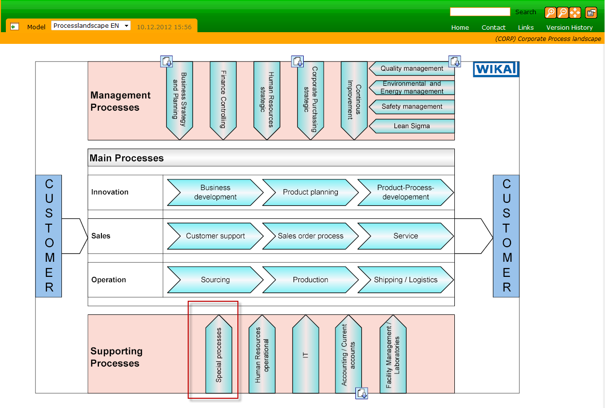
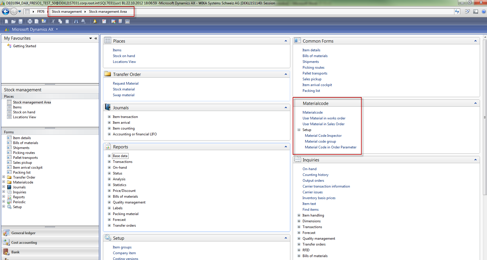
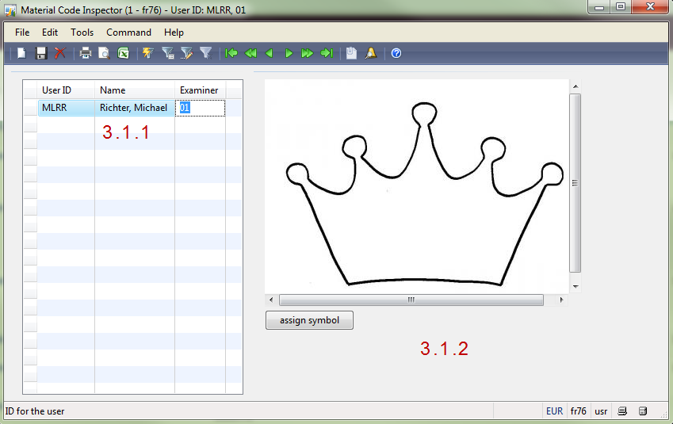
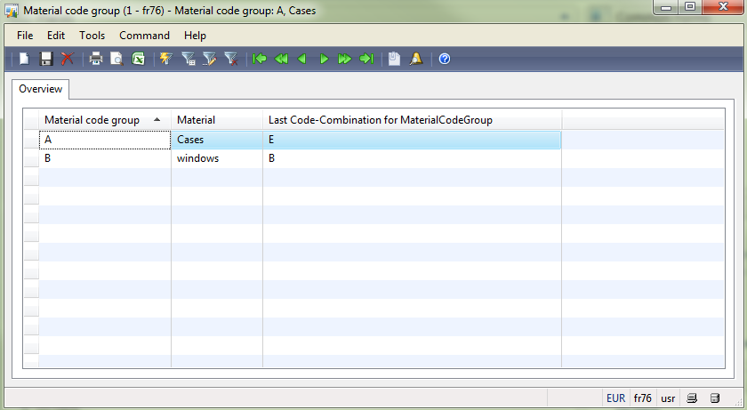
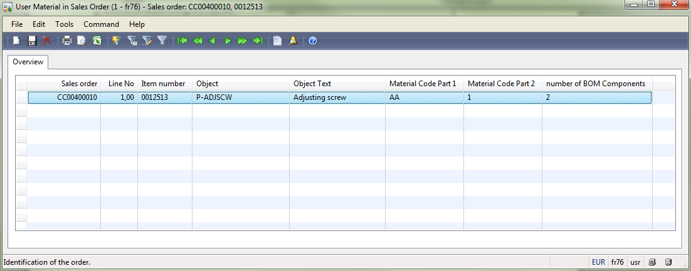

# Process visualization

All business process are described in the WIKA process landscape.
* Supporting Process / Special Processes 

# Setup

Stock Management / MaterialCode

Target:Set up in D365 for 
Material code inspector and material code grouping

## Material Code Inspector

User ID:		D365 identifier of the user
Name:			Name of the user
Examiner:		“TÜV” – number: identifier of “TÜV” for the user

The assign symbol contains the "TÜV" stored symbol of the company

## Material Code Group

Table for link between material code  and material group 

Last Code-Combination for MaterialCodeGroup: Last actual code if it’s necessary to change the code – system will automatically increase.

## Material Code in Order Parameter

This criteria generates the description (text) in "Object Text"

# Index

| Index | Status   | Date | Author          | Reason for change |
|:-----:|----------|:----:|-----------------|-------------------|
| 01    | Released | TBD  | Simon Berberich | Publication       |

