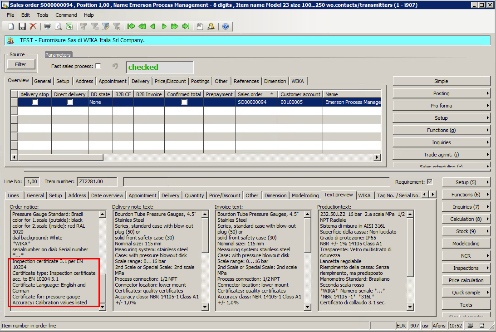
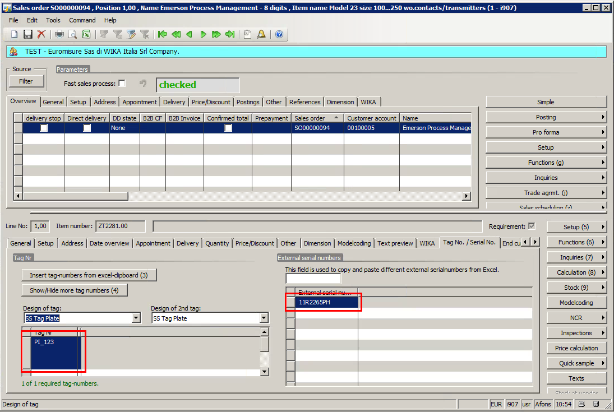
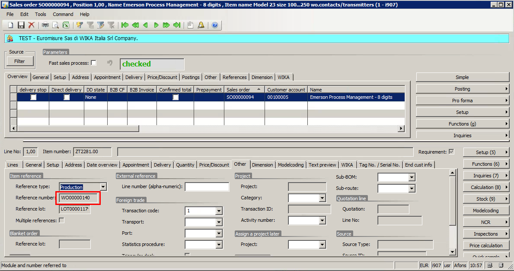
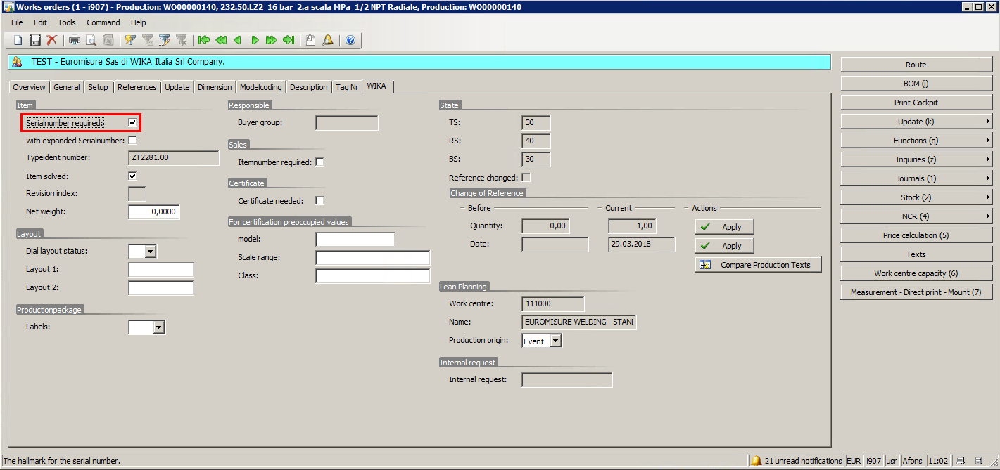
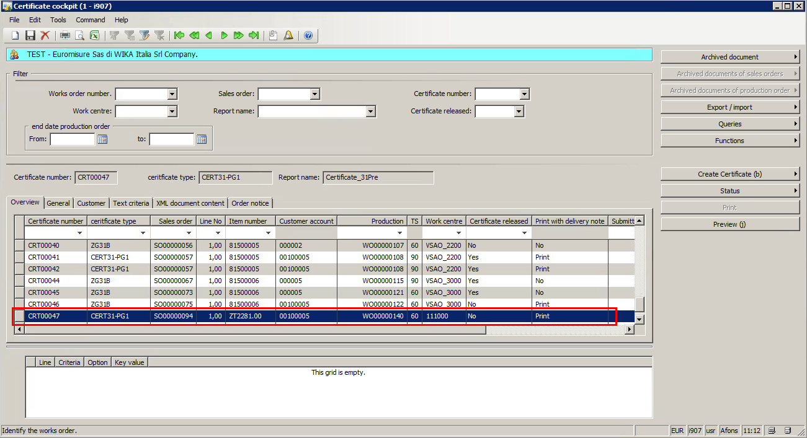
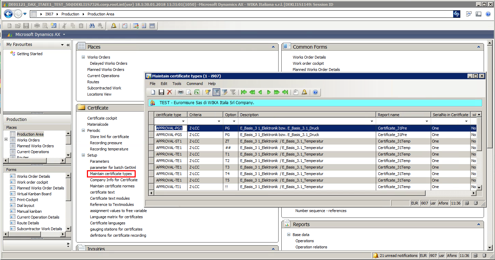
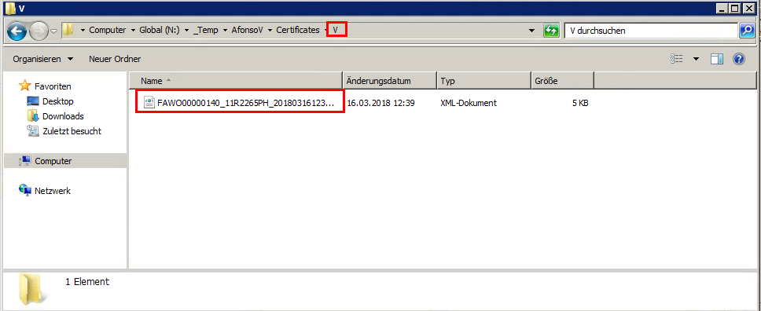

# Sales / Production

Create a Sales Order with item which has a certificate.

If necessary, TAG and Serial numbers could be added to the sales order line.

A Work Order will be generated based on this Sales Order Line

And this WO should be set to have Serial Numbers

After the WO is started / printed, Internal Serial Numbers will be generated

And a new line into Certificate will be added

>[!Note]
>For Modelcoded items, the automatic certificate line creation into Certificate Cockpit depends on setup done on:
>

>[!Note]
>For more information about Certificate creation and processes, please read: [Certificate](./Certificate.md)

## WIKA Cal

1. Select [Sales / Production](#CAL_Setup_31)
2. Enter the Work Order number and WIKA Cal will connect to D365 via BC4P and get information
3. Inform Model, Class, Scale Range and the Reference
4. Click on measurement table and inform Number of Series and Measuring Points
5. Click on table and start the Calibration Process
6. If necessary, include remarks
7. Save the Certificate
8. The Certificate data will be populated in WIKA XML Transfer Tool. If results are correct, accept it
9. Close to XML Transfer Tool
10. After close, the XML files will be copied to the Temp Folder

>[!Note]
>The Certificate folder structure are:
>* A - Cancelled
>* E - Error
>* Log - Log
>* V - Completed

## Batch Job / Certificate Cockpit

After the batch job runs, the xml will be moved to Completed folder and it will be imported to Certificate
Now, user can preview the generated certificate

# Index

| Index | Status   | Date | Author          | Reason for change |
|:-----:|----------|:----:|-----------------|-------------------|
| 01    | Released | TBD  | Simon Berberich | Publication       |

