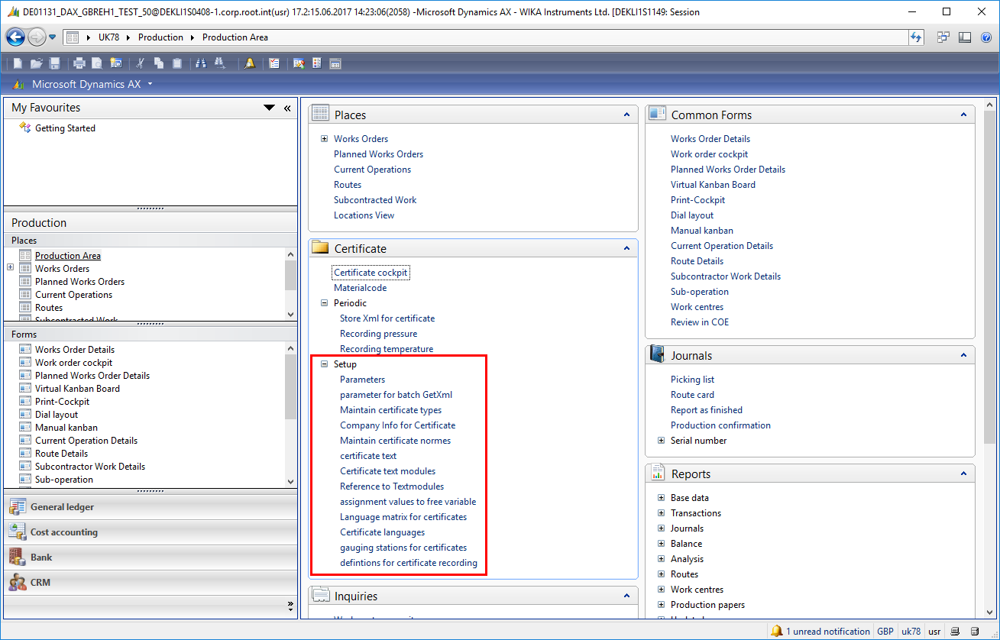
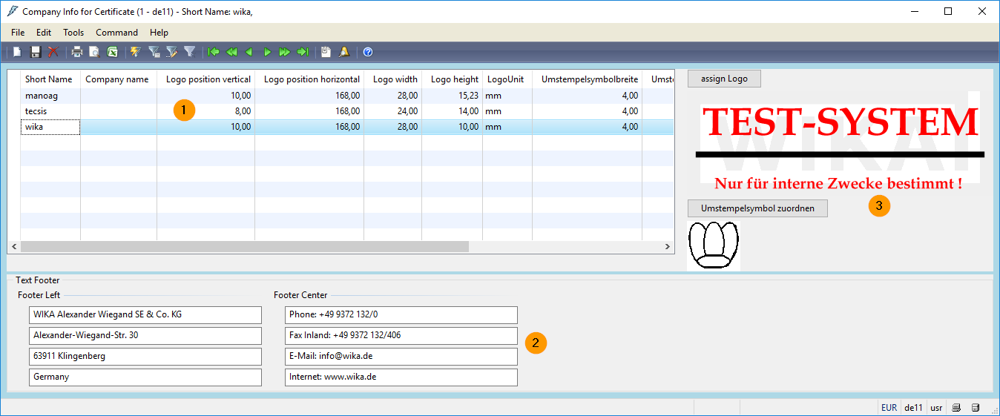

# Setup

Production -> Certificate -> Setup

## Logo for certificate

Production -> Certificate -> Setup -> Company info for Certificate

1. Company Information
2. Footer Area
3. Functional buttons