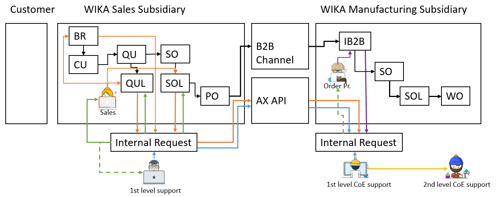
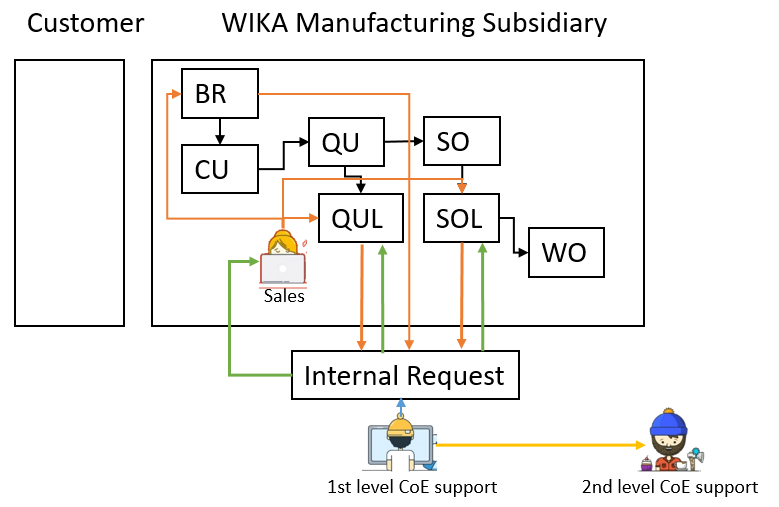

# General process description

The internal request is a request-form that allows sales to submit questions regarding e.g. price, delivery time, item number or general technical questions to the support groups. It is intended to have the clarification right in the ERP-System and over company borders. The clear advantages are e.g. that the manufacturing subsidiary can provide the sales subsidiary with an item number, price, etc. that is fully clarified and ready to order for the end customer in every related system. Also certain BI measurements are setup so that the clarification process can be measured and evaluated.

Processes
* <mark style="background-color: orange">Sales creates internal request for 1st level support or 1st level CoE support</mark>
* <mark style="background-color:blue">1st level support or 1st level CoE support clarifies the internal request or proceeds</mark>
* <mark style="background-color:yellow">1st level CoE support requests help from 2nd level CoE support</mark>
* <mark style="background-color:green">Sales gets notified out of internal request and proceeds</mark>
* <mark style="background-color:purple">Order processing creates internal request</mark>
* <mark style="background-color:grey">Advanced functionalities for Sales</mark>

# Sales create internal request for 1st level support or 1st level CoE support
<mark style="background-color: orange">&nbsp;&nbsp;&nbsp;&nbsp;&nbsp;&nbsp;&nbsp;&nbsp;&nbsp;&nbsp;&nbsp;&nbsp;&nbsp;&nbsp;&nbsp;&nbsp;&nbsp;&nbsp;&nbsp;&nbsp;&nbsp;&nbsp;&nbsp;&nbsp;&nbsp;&nbsp;&nbsp;&nbsp;&nbsp;&nbsp;&nbsp;&nbsp;&nbsp;&nbsp;&nbsp;&nbsp;&nbsp;&nbsp;&nbsp;&nbsp;&nbsp;&nbsp;&nbsp;&nbsp;&nbsp;&nbsp;&nbsp;&nbsp;</mark>
## When to create an Internal Reqeust as Sales

For sales an internal request is necessary, when…
* you need an item no., price or delivery time for an item that has a modelcode with freetext or is without modelcoding
* the support of the CoE wants you to create an internal request
* you need information on price or delivery time
* you have a DC5 item
* you need a customer specific DIAL layout or customer logo
* you need a clarified item no. for a BOM

You don’t need an internal request, when…
* you are sure, that you have an item no. with current price and delivery time from the CoE and you know that this is valid, either by a different IR or by information from the CoE that you can refer to.
* you know that when you call the CoE, you can get to the rest of the mentioned information, like price, delivery time and item number immediately.

>[!Note]
>If you don’t know, whether to create an internal request or not, please just create one. 
You will get support as soon as possible.

## How to create an Internal Request from CRM, Quotation Line and Sales Order Line

Start from the CRM cockpit, when you have a general question, not regarding a specific item number or modelcode. However, if your IR is about a BOM item, which you want to use in your production, you need to create an IR from the CRM. Here you need to use the product clarification side, to insert an item number.

>[!Note]
>When creating an IR from the CRM, you have to take care of the routing of the IR on your own.

Start from the Quotation Line or Sales Order Line, when you have a question regarding the item number, modelcode, price or delivery time. When providing a modelcode, just a ZT-Number or even an item number, your IR should be routed automatically.

>[!Note]
>In most cases, please try to provide at least a ZT-Number and if you have a modelcode, please try to code it as far as possible. This improves the routing and helps the support with the clarification.

To create an internal request choose this options from the *functions*-button from *Quotation line, Sales Order line or CRM Cockpit*

## How to fill the Internal Request form

When stating your question in the internal request. Please make sure to fill out all the fields that are shown in the general tab.

* CoE While the CoE is taken from the item master IR responsibility field (Fallback: Division) that you provided through the sales order or quotation, you need to make sure, that it is the right CoE, that you want to take care of.
* Editor Leave this field empty, unless you really want a specific person to take of the IR or you are asked by the specific support.
* Due date This date is automatically set to “Today”. However, you should provide a specific date were you want the internal request to be solved.
* Sales information Annual demand and Target price are mandatory, as soon as you want a special price. The sales quantity and Currency are automatically filled through your references line.
* Detail question Click the add button and add your question. This text will always be inserted from the top and can’t be deleted later on. When you send IRs to the CoE, make sure that your question is always stated in ENGLISH only, unless you have an agreement with the receiving CoE.
* Drag and drop After attaching files, make sure to provide more file specific information in the documents tab

>[!Note]
>Internal requests might get returned to you, if you didn’t provide enough information. Also make sure to not only refer to attachments in the document handling.

## How to forward the Internal Request to the 1st level support or 1st level CoE support

**Ready for processing** is used, when…
* you are a sales person within a sales subsidiary and you have a 1st level support in place, who checks the internal requests, before they are sent out to the manufacturing subsidiary (CoE)
* you are a sales person within the manufacturing subsidiary and you want to forward it to the internal department

**Send to CoE** is used, when…
* you are a sales person within a sales subsidiary and you don’t have a 1st level support in place and you want to send the IR directly to the manufacturing subsidiaries CoE

>[!Note]
>The **Send to CoE** functionality is only available, if the vendor on the item is enabled for internal request receiving, or if you don’t have an item number (coming from the CRM), your division is enabled for IR sending.

## How to check the receiver of the Internal Request

When using the Send to CoE functionality, you can check were the IR will go to beforehand.

When…
* coming from the CRM without an item number, the IR will use the DUNS number behind the division. The flag **Internal request sending available** sets the availability of the **Send to CoE** button
* coming from the Quotation Line or Sales Order Line, and you have an item number in your IR, the IR will use the DUNS number behind the vendor of your item. The flag **Internal request sending available** on the vendor, sets the availability of the **Send to CoE** button

## How to get a wrongly forwarded IR back, "Callback"

If you have accidentally sent the IR to the wrong subsidiary or you forgot to add some information, use the Callback functionality to get the IR back to your site.

Since the local 1st level support and Sales can both trigger the **Callback** the notification will always go to both, when you pull an IR back from the subsidiary. Also, if someone in the subsidiary, where the IR has been sent to, was already on the IR, the notification will be sent to them as well (X_REQ).

# 1st level Support or 1st level CoE support clarifies the internal request or proceeds
<mark style="background-color: blue">&nbsp;&nbsp;&nbsp;&nbsp;&nbsp;&nbsp;&nbsp;&nbsp;&nbsp;&nbsp;&nbsp;&nbsp;&nbsp;&nbsp;&nbsp;&nbsp;&nbsp;&nbsp;&nbsp;&nbsp;&nbsp;&nbsp;&nbsp;&nbsp;&nbsp;&nbsp;&nbsp;&nbsp;&nbsp;&nbsp;&nbsp;&nbsp;&nbsp;&nbsp;&nbsp;&nbsp;&nbsp;&nbsp;&nbsp;&nbsp;&nbsp;&nbsp;&nbsp;&nbsp;&nbsp;&nbsp;&nbsp;&nbsp;</mark>

## How to filter for your incoming Internal Requests

* Division: Your division e.g. IN-EP
* Status: Ready for processing, In clarification

For Callback IRs use the following filter
* Division: Your division e.g. IN-EP
* Status: Callback
* Status at the CoE: In clarification at the CoE

To further filter for IRs for your team, you can also use the following columns.
* Type (e.g. filter for Price, Modelcode or Project)
* Model (e.g. filter per specific products)
* Refernce Type (e.g. filter for quotation line or sales order line)
* Reference (e.g. filter for quotation number or sales order number)
* DUNS number (e.g. filter for external companies, who have sent the IR)
* Customer account (e.g. filter for specific customers)
* Current status (e.g. confirmed sales orders)
* 2nd level CoE clarification

## What to do first, "In clarification"

As 1st level support or 1st level CoE support, after filtering for your divisions internal requests, you need to select the one that you want to clarify and set it to *In clarification* first. You can find this option under *update*.

Then fill out now open form.

* Internal request: ID of IR
* CoE: Division from IR, can be changed here
* Editor: Should be you as the clarifier.
* Prefilled with your D365 user, will be empty, if you aren’t setup as employee
* Target date: Till when you want to clarify this IR. This will be tracked by BI and is prefilled with the due date, set by Sales.
* Status: Always In clarification
* Send notification to the requestor: Standard value is Yes, but you can manually unflag this, in case you don’t want to send the AX notification with the Target date and Clarification info
* Clarification info: Only information regarding the target date, if you can’t keep the due date.

## Which Information do I need to provide

As 1st level support or 1st level CEO support, you always want to provide the following information, depending on the available products.

The requested item is…
* available and full modelcode is available > Provide full modelcode
* available, but modelcode has free text and you are the CoE > Provide modelcode, generate item number and provide the price in the price guideline. Use the following to generate items, if available. Also, make sure to provide a special net price in the price guideline. Internal Request -> Functions -> Modelcoding -> Select items -> Generate item
* available, but modelcode has free text and you are not the CoE -> Send the IR to the CoE with the *Send to CoE* functionality (this applies only for the non CoE 1st level support). Only 1st level CoE support should create items. This allows manufacturing subsidiaries to have full control over their items.
* available, but a modelcode doesn’t exist > Create a new item from the item master and send this item number back. This item can be created as far as possible with item solved, BOM and Route, but doesn’t have to. However, it is necessary to provide a special net price in the price guideline.
* not available -> provide a text, that the item isn’t available. When solving the IR, pay attention to the IR category.

Provide your answer always through the text field, via the **Add** button and your item number, or modelcode, within the fields below.

## How to find items

You can find items by…
* looking in the select item functionality within your modelcode This will provide you with a list of items of the selected criteria. This also works for freetext within your modelcode if the freetext option is enabled for generating items. By looking at the description or the individual item in the main table, you can find out, if this is the real item number you want to provide (red indicates, that this item number is not in your current system, but globally available)
* using the Search in Internal request texts functionality.
Sales ledger > Inquiries > Search in Internal request texts
* With this you are able to search an entered text in internal request texts. The search will go through the clarified item text (also modelcoded text with free text), detail question text and the clarification text

## Provide attachments

Use the documents tab on the IR to provide further attachments.
* All attachments will be transferred, when sending the IR intercompany.
* Set the **Type of document**, when providing attachments to make it easier for colleagues to identify your attachments
* Use the **Don’t send document** flag to not send attachments to other subsidiaries

>[!Note]
>When IRs are received, they are always coming in with the **Don’t send document flag** on all attachments being set. This is to reduced the transmitted amount of data, when sending the IR back to the Sender. This means, you need to actively remove the flag, in case you updated a file.

>[!Note]
>The type **Folder** can only be used locally and can't be used intercompany.

## How to get more information from sales, "Callback"

Set the IR to Callback to get more information from the Orderer.

Internal Request -> Update -> Callback

Your text should be in the product clarification text, however you can provide some extra text in the notification. The receiver will be prefilled with the **Orderer**.

If you receive an intercompany IR, you will see that the user is not the orderer, but the **X_REQ** user. This is a system user, that will forward your notification to the appropriate **Orderer**.

## How to solve the internal request, "Solved"

After providing all your information, you can move on to solve your IR under *Update -> Solved*.

Provide a **Category** on the overview of the IR. This will be shown in the following time registration form.

Update the status to **Solved** and fill out the **Time registration** form by providing the **Required processing time (Min)**. Also make sure to rate your requesting side, by providing information about the **Quality** of the request.

## How to forward your internal request

The following cases might occur, when IRs are being sent to clarifying CoEs/subsidiaries.

* Case 1: IR has been sent to the wrong division/CoE, but the right subsidiary
  * Case 1.1: **You know the right destination division/CoE** Set the IR to “Ready for processing” and change the division to the right one.
 * Case 1.2: **You don’t know the right destination division/CoE** Set the IR to “Solved” and provide a text, that you don’t know, who can clarify this.

* Case 2: IR has been sent to the wrong subsidiary Set the IR to “Solved” and provide a text, that you are the wrong subsidiary and that the vendor on the specific item has to be changed to the right subsidiary.

>[!Note]
>Please try to provide as much clarification information as possible, to help your colleagues.

# 1st level CoE support reqeust help from 2nd level CoE support, or other colleagues
<mark style="background-color: yellow">&nbsp;&nbsp;&nbsp;&nbsp;&nbsp;&nbsp;&nbsp;&nbsp;&nbsp;&nbsp;&nbsp;&nbsp;&nbsp;&nbsp;&nbsp;&nbsp;&nbsp;&nbsp;&nbsp;&nbsp;&nbsp;&nbsp;&nbsp;&nbsp;&nbsp;&nbsp;&nbsp;&nbsp;&nbsp;&nbsp;&nbsp;&nbsp;&nbsp;&nbsp;&nbsp;&nbsp;&nbsp;&nbsp;&nbsp;&nbsp;&nbsp;&nbsp;&nbsp;&nbsp;&nbsp;&nbsp;&nbsp;&nbsp;</mark>

## How to request help from the 2nd level CoE support

Set the **2nd level CoE clarification** flag on your IR, to indicate your internal clarification status. Notice that you are still responsible to clarify this IR.

Use **Notify other user** to send a notification to a colleague.

Internal Request > Functions > Notify other user

## How to check for 2nd level CoE support clarifications

Check for your IRs, if the **2nd level CoE clarification** flag is set. Then check your sent notifications to your colleagues.

Internal Request > Inquiries > Notifications

## What to do for DIAL requests

Use **Notify other user** to send a notification to the group **DIAL**.

Internal Request > Functions > Notify other user

State in the text if you want a drawing or if a drawing has been approved by the customer
* Request drawing
* Drawing approved

Optionally provide a **Due date** and/or set the **Inform recipients via eMail**.

As 2nd level CoE support, let the requestor know, that you **attached a drawing to the** IR or that you **released the items drawing on the item itself**, by answering the notification that you received. Delete the notification, when you are done, so that your inbox has only the work “to-do” in it.

## How to use the 2nd level CoE clarification flag

If you have multiple IRs in clarification, but you want to find out, were you are waiting for a response from the 2nd level support, you can set the **2nd level CoE clarification** flag in the product clarification tab of your IR. 
Once this flag is set, you have a good indication in your overview.

# Sales gets notified out of internal request and proceeds

<mark style="background-color: green">&nbsp;&nbsp;&nbsp;&nbsp;&nbsp;&nbsp;&nbsp;&nbsp;&nbsp;&nbsp;&nbsp;&nbsp;&nbsp;&nbsp;&nbsp;&nbsp;&nbsp;&nbsp;&nbsp;&nbsp;&nbsp;&nbsp;&nbsp;&nbsp;&nbsp;&nbsp;&nbsp;&nbsp;&nbsp;&nbsp;&nbsp;&nbsp;&nbsp;&nbsp;&nbsp;&nbsp;&nbsp;&nbsp;&nbsp;&nbsp;&nbsp;&nbsp;&nbsp;&nbsp;&nbsp;&nbsp;&nbsp;&nbsp;</mark>

## When do I get notifications

Notifications are sent, when the IR status is changing to…

* **In clarification -> Orderer** gets notification with information of **Target date, Editor** (1st lvl support) and **Clarification info** text (text related only to target date or confirmed date)
* **Solved -> Orderer** gets notification with information of **Editor**.
* **Callback ->** This is prefilled with the Orderers information. Text will be individual by support.
* **In clarification at the CoE -> Orderer and Editor** gets notification with information of **Target date, CoE Editor** (1st lvl support) and **Clarification info** text (text related only to target date or confirmed date)
* **Solved from CoE -> Orderer and Editor** gets notification with information of **CoE Editor**. 
* **Callback from CoE -> Orderer and Editor** gets notification with information of **CoE Editor**.

## How to proceed when internal request is in clarification
If you are the **Orderer** of your IR and your IR has been set to **In clarification** or **In clarification at the CoE** you can find a notification in your notification list with the information of the **Editor** and the **Confirmed date**.

## How to proceed when internal request is Callback

You can use the **Add** function on the left side in the product clarification tab to add some additional information to the IR. Afterwards you can forward the IR to the support. 

## How to proceed when internal request is Solved

When your IR has been set to **Solved** and your IRs reference has been a **Quotation Line** or **Sales Order Line**, you can use the **Update reference** functionality to update your line or lines with the item and modelcode from the IR.

Internal Request -> Inquiries -> Reference

Select your reference line and the click **Update reference**.

## How to reopen the internal request

You can use the **Reopen** functionality on your IR to start the IR process again for an additional clarification. This will set the IR back into an empty state, so that you can add more information to it and then forward the IR to the support again.
This can only be done, when the IR is of status **Solved** and your **Sales order** hasn’t been confirmed yet.

Internal Request -> Update -> Reopen

## How to send the internal request to a different subsidiary

When creating an IR, the division or item used, provides usually the best guess for the target subsidiary. However, you can bump into issues, where the picked subsidiary from the system is not correct and then you have to forward your IR to a different subsidiary.

In case your IR is solved, reopen your IR first.

Internal Request -> Update -> Reopen

Then check your leading reference of the IR. 

Internal Request -> Inquiries -> Reference

* **Case 1: Your reference is a quotation line or sales order line**
When creating your IR, you must have provided an item number or ZT-Number with Modelcode on your e.g. quotation line. This item has a vendor behind it, which is the target subsidiary of the IR, because it is also the subsidiary where you would order this item from.
However, when you state your question in your IR, for the actual Item you want to have, this particular item you requested could be manufactured at a completely different subsidiary. In these cases, the CoE will tell you, that a different subsidiary is responsible for your specific item and also name this subsidiary.

Now you have to use a differen item number or ZT-Number in your quotation line. You can change the item on your quotation line with either the Function > Replace Item, or by going into the modelcoding > Select Items and picking a different ZT-Number. You need to pick an item or ZT-Number, which has the vendor set to the subsidiary, you want the IR to go to.

If no number with this vendor is available, it could be, that you need to create a local ZT-Number to solve this.

>[!Note]
> The division on the Item or in the IR has in this case no influence on the target subsidiary of the IR. Here the division only defines where the IR goes to within the target subsidiary.

* **Case 2: Your reference is a business relation**
In this case, you created the IR from the CRM Cockpit. Here you entered a division manually. Behind some divisions like “PI-PR”, there is a DUNS number setup, pointing to the subsidiary. For e.g. “PI-PR” this subsidiary is Klingenberg, while for e.g. “PI-PR (SGF)” it is SGF in Poland. Here you only have to change the division and the target subsidiary is changed, too.

At last, you can now resend your IR to the right subsidiary

# Order processing creates internal request

<mark style="background-color: purple">&nbsp;&nbsp;&nbsp;&nbsp;&nbsp;&nbsp;&nbsp;&nbsp;&nbsp;&nbsp;&nbsp;&nbsp;&nbsp;&nbsp;&nbsp;&nbsp;&nbsp;&nbsp;&nbsp;&nbsp;&nbsp;&nbsp;&nbsp;&nbsp;&nbsp;&nbsp;&nbsp;&nbsp;&nbsp;&nbsp;&nbsp;&nbsp;&nbsp;&nbsp;&nbsp;&nbsp;&nbsp;&nbsp;&nbsp;&nbsp;&nbsp;&nbsp;&nbsp;&nbsp;&nbsp;&nbsp;&nbsp;&nbsp;</mark>

Functionality still in developments

# Advanced functionalities for Sales

<mark style="background-color: grey">&nbsp;&nbsp;&nbsp;&nbsp;&nbsp;&nbsp;&nbsp;&nbsp;&nbsp;&nbsp;&nbsp;&nbsp;&nbsp;&nbsp;&nbsp;&nbsp;&nbsp;&nbsp;&nbsp;&nbsp;&nbsp;&nbsp;&nbsp;&nbsp;&nbsp;&nbsp;&nbsp;&nbsp;&nbsp;&nbsp;&nbsp;&nbsp;&nbsp;&nbsp;&nbsp;&nbsp;&nbsp;&nbsp;&nbsp;&nbsp;&nbsp;&nbsp;&nbsp;&nbsp;&nbsp;&nbsp;&nbsp;&nbsp;</mark>

## How and when to assign an Internal Request

If you have a Quotation line or Sales Order Line with an solved IR, you might have similar clarifications within the same Outation or Sales Order. After you had an IR were the clarification was very similar and resulted e.g. in the same prices and lead times, but different modelcodes, you can use the assign functionality. With this, your other “unclarified” lines will have a clarified IR behind them, that helps you to know, how you got to the certain price or delivery time. Also, when transmitted via B2B, this information will be helpful.

Quotation line -> Functions -> Assign internal request
Sales order line -> Functions -> Assign internal request

## How to set the leading reference on your internal request and delete quotation lines

In some cases it can be necessary to set the leading reference of your IR to a different one. This occurs e.g. when you create a quotation line and solve have the IR solved. If you try to delete this line with the IR, you get the following message.

The effort that is contained within the IR doesn’t allow the deletion of the line. Therefor this effort has to be assigned to a new line e.g. line 20. You do this, by assigning line 20 to the IR of line 10. Then you need to jump to the References form of the IR and use the **Set leading reference** functionality for line 20.

Afterwards you shouldn’t have any issues deleting line 10.

## When to use the Refresh functionality

Use the **Refresh** function to update the listed fields of your IR, from the **Leading reference**.

Internal Request -> Functions -> Refresh

Updated fields from reference
* CustVendAC
* CustPurchaseOrder
* CustVendRef
* OrderDate          
* LanguageId         
* OrderQty           
* ItemId             
* SalesTaker         
* SalesUnitId        
* ContactPersonId    
* ContactPersonName  
* Name
* MarketSegment
* Division
* Modelcodes
* Texts

## Message Exclusive item

When you try to insert an exclusive item as support into the IRs product clarification page, you manually have to check, if the item is appropriate for the endcustomer to order.
This may result in you sending the IR back as **Callback** and then trying to clarify the issue

# Index

| Index | Status   | Date | Author          | Reason for change |
|:-----:|----------|:----:|-----------------|-------------------|
| 01    | Released | TBD  | Simon Berberich | Publication       |
