---
# required metadata

title: Process invoice factures for export trade
description: This topic provides information about invoice factures for export sales in Russia.
author: v-nadyuz
ms.date: 05/14/2020
ms.topic: article
ms.prod: 
ms.technology: 

# optional metadata

# ms.search.form: 
# ROBOTS: 
audience: Application User
# ms.devlang: 
ms.reviewer: kfend
# ms.tgt_pltfrm: 
# ms.custom: 
ms.search.region: Russia
ms.search.industry: 
ms.author: anasyash
ms.search.validFrom: 2018-10-28
ms.dyn365.ops.version: 8.1

---

# Process invoice factures for export trade

[!include [banner](../includes/banner.md)]

Export sales are taxable at a value-added tax (VAT) rate of 0 (zero) percent. However, taxpayers can apply this tax rate only after they receive confirmation from the tax authority within a specified period. Taxpayers must collect the necessary documents to confirm their right to apply VAT at a rate of 0 percent for export sales within this period.

If the tax authority provides the confirmation within the specified period, the tax is calculated at a VAT rate of 0 percent, and a facture for confirmed export at the 0-percent rate is included in the sales book. If the confirmation isn't received in time, the taxpayer must pay tax at the standard VAT rate or reduced VAT rate that is applicable in the domestic market, together with any tax that is overdue from the export confirmation. Export factures for both confirmed export and unconfirmed export are included in the sales book.

## Overview

The following features are available for export sales processing:

- Creating factures for export sales
- Processing factures to determine the VAT tax base:

    - Preliminary processing of export factures
    - Outgoing VAT processing

- Creating corrective factures to charge the VAT on unconfirmed export during the preliminary facture processing
- Including export factures in the sales book during the outgoing VAT processing that is based on the results of the preliminary facture processing
- Calculating fines for overdue tax payments

## Number sequences for export factures and VAT processing

After export factures are processed on the **Outgoing VAT processing** page, they are reflected in the sales book in a deferred mode. Therefore, you must set up number sequences for the following documents:

- Export factures
- The ledger documents that are used to post taxes on the **Outgoing VAT processing** page

For more information, see the [Set up number sequences for export factures and VAT processing](#numbersequencesexport) section.

## Customer as a foreign counteragent

To receive items that must be exported, a customer must be set up as a foreign counteragent. The customer must be set up as a foreign counteragent before you can create a customs journal for the export operation.

For more information, see the [Set up a customer as a foreign counteragent](#foreigncounteragent) section.

## Facture for export sales

A facture is an *export facture* if it's created based on invoices that contain sales tax codes where the **Type of tax** field is set to **VAT 0%**. The tax code for the domestic market must be set up for these codes. For more information, see the [Set up a sales tax code for export trade](#salestaxcodeexporttrade) section.

> [!NOTE]
> All the invoices that are included in a facture must have the same type of VAT.

1. Go to **Accounts receivable** \> **Inquiries and reports** \> **Facture**.
2. On the **Facture journal** page, on the **Foreign trade** tab, in the **Export date** field, select the date when items were exported under customs export conditions. In other words, select the date when the customs authority allowed items to be exported. The deadline for collecting the documents to confirm your right to apply VAT at a rate of 0 percent is calculated from this date.
3. In the **Package date** field, select the date when the full package of documents that confirm your right to apply VAT at a rate of 0 percent is collected.
4. In the **Confirmation date** field, select the date when the tax authority confirmed VAT at a rate of 0 percent.

    The **Expiration date** field shows the expiration date of the period for collecting the document package that confirms your right to apply VAT at a rate of 0 percent. If the tax authority doesn't confirm this right before the expiration date, the taxpayer is obligated to calculate VAT by using the rate from the tax code for the domestic market. For more information, see the [Set up a sales tax code for export trade](#salestaxcodeexporttrade) section.

    The expiration date is automatically calculated. For more information, see the [Set up a document collection period and confirm the application of VAT at 0 percent](#documentcollectionperiod) section.

    If the **Into processing** option is set to **Yes** for the facture, the facture isn't directly included in the sales book. Instead, it's processed by the outgoing VAT processing. For more information, see the [Outgoing VAT processing](#outgoingvatprocessing) section.

    The **Operation type** field shows a rule for facture processing. The system automatically assigns a value during the preliminary processing of export factures. However, you can manually change the value. For more information about operation types, see the [Preliminary processing of export factures](#preliminaryprocessingexportfactures) and [Operation types](#operation) sections.

For more information about export factures, see the [Create a facture for export sales](#createfactureexport) section.

## Processing export factures

The preliminary processing of export factures determines the following information:

- The moment of tax base calculation
- The operation type that the facture corresponds to during the reporting period

When the amount of tax that must be charged to the budget is determined, either the 0-percent rate or the rate that is used in the domestic market is applied. The rate that is applied depends on the operation type that is assigned.

You can cancel the preliminary processing of export factures for current or previous periods.

For more information, see the [Preliminary processing of export factures](#preliminaryprocessingexportfactures) section.

###  Operation types

VAT operation types are rules that are used for the preliminary processing of export factures. The system automatically assigns a value to a facture, based on the export date, confirmation date, and expiration date.

The following table describes the operation types.
    
<table width="775">
<thead>
<tr>
<td width="104">

<strong>Operation type</strong>

</td>
<td width="387">

<strong>Description</strong>

</td>
<td width="284">

<strong>Note</strong>

</td>
</tr>
</thead>
<tbody>
<tr>
<td width="104">

VAT 0%

</td>
<td width="387">

This value is set for factures when the export is confirmed on time (that is, before the deadline). The confirmation date meets the following conditions:

&middot;&nbsp;&nbsp;&nbsp;&nbsp;&nbsp;&nbsp;&nbsp;&nbsp; It falls within the current processing period.

&middot;&nbsp;&nbsp;&nbsp;&nbsp;&nbsp;&nbsp;&nbsp;&nbsp; It's before the expiration date.

As a result of the preliminary facture processing, the following updates occur on the <strong>Foreign trade</strong> tab of the Facture journal:

&middot;&nbsp;&nbsp;&nbsp;&nbsp;&nbsp;&nbsp;&nbsp;&nbsp; The <strong>Operation type</strong> field is set.

&middot;&nbsp;&nbsp;&nbsp;&nbsp;&nbsp;&nbsp;&nbsp;&nbsp; The <strong>Latest status change date</strong> field is set to the end date of the processing period.

</td>
<td width="284">

This value can be manually set if the <strong>Operation type</strong> field is currently blank.

</td>
</tr>
<tr>
<td width="104">

Unconfirmed VAT 0%

</td>
<td width="387">

This value is set for factures where the export hasn't yet been confirmed and the confirmation period expires during the current processing period. In other words, the following conditions are met:

&middot;&nbsp;&nbsp;&nbsp;&nbsp;&nbsp;&nbsp;&nbsp;&nbsp; The confirmation date isn't set.

&middot;&nbsp;&nbsp;&nbsp;&nbsp;&nbsp;&nbsp;&nbsp;&nbsp; The expiration date falls within the current processing period.

As a result of preprocessing, the following updates occur:

&middot;&nbsp;&nbsp;&nbsp;&nbsp;&nbsp;&nbsp;&nbsp;&nbsp; The <strong>Operation type</strong> field is set in the Facture journal.

&middot;&nbsp;&nbsp;&nbsp;&nbsp;&nbsp;&nbsp;&nbsp;&nbsp; The system creates a facture where the tax is calculated according to the tax code for domestic market.

</td>
<td width="284">

This value can be manually set if the <strong>Operation type</strong> field is currently blank, or if it's set to <strong>VAT 0%</strong>.

For the facture that is created at the domestic tax rate, the <strong>Facture source</strong> field in the Facture journal is set to <strong>Facture</strong>. This facture will be included in the outgoing VAT processing as a corrective facture to the original export facture.

The original facture, where the <strong>Operation type</strong> field is set to <strong>Unconfirmed VAT 0%</strong>, won't be included in the outgoing VAT processing.

</td>
</tr>
<tr>
<td width="104">

VAT 0% with correction

</td>
<td width="387">

This value is set for factures that have both the following characteristics:

&middot;&nbsp;&nbsp;&nbsp;&nbsp;&nbsp;&nbsp;&nbsp;&nbsp; The export was confirmed during the current period.

&middot;&nbsp;&nbsp;&nbsp;&nbsp;&nbsp;&nbsp;&nbsp;&nbsp; Before the expiration date, the facture was already included in the sales book at the standard tax rate or the reduced tax rate (where the <strong>Operation type</strong> field was set to <strong>Unconfirmed VAT 0%</strong>).

As a result of preprocessing, the following updates occur:

&middot;&nbsp;&nbsp;&nbsp;&nbsp;&nbsp;&nbsp;&nbsp;&nbsp; The <strong>Operation type</strong> field is set.

&middot;&nbsp;&nbsp;&nbsp;&nbsp;&nbsp;&nbsp;&nbsp;&nbsp; The <strong>Latest status change date</strong> field is set to the end date of the processing period.

&middot;&nbsp;&nbsp;&nbsp;&nbsp;&nbsp;&nbsp;&nbsp;&nbsp; The system creates corrective factures for each period during which the factures were included in the sales book at the standard tax.

</td>
<td width="284">

This value is automatically set and can't be manually changed.

For the corrective facture that is created, the <strong>Facture source</strong> field in the Facture journal is set to <strong>Facture</strong>.

Additional factures adjust the previous periods during which the facture was included in the sales book at the standard tax.

</td>
</tr>
<tr>
<td width="104">

Unconfirmed VAT 0% with correction

</td>
<td width="387">

This value is set for factures that have both the following characteristics:

&middot;&nbsp;&nbsp;&nbsp;&nbsp;&nbsp;&nbsp;&nbsp;&nbsp; The export wasn't confirmed during the current period, and the confirmation period expires during the current period.

&middot;&nbsp;&nbsp;&nbsp;&nbsp;&nbsp;&nbsp;&nbsp;&nbsp; The facture was previously included in the sales book at the 0-percent rate (where the <strong>Operation type</strong> field was set to <strong>VAT 0%</strong>).

As a result of preprocessing, the following updates occur:

&middot;&nbsp;&nbsp;&nbsp;&nbsp;&nbsp;&nbsp;&nbsp;&nbsp; The <strong>Operation type</strong> field is set.

&middot;&nbsp;&nbsp;&nbsp;&nbsp;&nbsp;&nbsp;&nbsp;&nbsp; The system create correctives factures for each period in which the original factures were included in the sales book at the 0-percent rate. The tax is calculated according to the tax code for the domestic market.

</td>
<td width="284">

This value is automatically set and can't be manually changed.

For the facture that is created at the domestic tax rate, the <strong>Facture source</strong> field in the Facture journal is set to <strong>Facture</strong>. This facture will be included in the outgoing VAT processing as a corrective facture to the original export facture.

The original facture, where the <strong>Operation type</strong> field is set to <strong>Unconfirmed VAT 0% with correction</strong>, won't be reflected in the outgoing VAT processing.

The factures that are created adjust the previous periods during which the facture was included in the sales book at the 0-percent rate.

</td>
</tr>
<tr>
<td width="104">

Overdue confirmation

</td>
<td width="387">

This value is set for factures that have both the following characteristics:

&middot;&nbsp;&nbsp;&nbsp;&nbsp;&nbsp;&nbsp;&nbsp;&nbsp; The export was confirmed during the current period.

&middot;&nbsp;&nbsp;&nbsp;&nbsp;&nbsp;&nbsp;&nbsp;&nbsp; The confirmation period expired during previous periods.

Previously, these factures were already included in the sales book at the standard tax rate or the reduced tax rate (where the <strong>Operation type</strong> field was set to <strong>Unconfirmed VAT 0%</strong> or <strong>Unconfirmed VAT 0% with correction</strong>).

As a result of preprocessing, the following updates occur:

&middot;&nbsp;&nbsp;&nbsp;&nbsp;&nbsp;&nbsp;&nbsp;&nbsp; The <strong>Operation type</strong> field is set.

&middot;&nbsp;&nbsp;&nbsp;&nbsp;&nbsp;&nbsp;&nbsp;&nbsp; The <strong>Latest status change date</strong> field is set to the end date of the processing period.

&middot;&nbsp;&nbsp;&nbsp;&nbsp;&nbsp;&nbsp;&nbsp;&nbsp; The system creates a corrective facture where the tax is calculated according to the tax code for the domestic market.

</td>
<td width="284">

This value is automatically set and can't be manually changed.

For the corrective facture that is created, the <strong>Facture source</strong> field in the Facture journal is set to <strong>Facture</strong>.

</td>
</tr>
<tr>
<td width="104">

Unconfirmed VAT 0% cancellation

</td>
<td width="387">

This value is set for factures that are created because the overdue confirmation operation is applied. (The, factures that are created cancel factures where the <strong>Operation type</strong> field is set to <strong>Unconfirmed VAT 0%</strong>.)

</td>
<td width="284">

Factures where the <strong>Operation type</strong> field is set to <strong>Unconfirmed VAT 0% cancellation</strong> are included in the incoming VAT processing.

</td>
</tr>
</tbody>
</table>

&nbsp;

## Default operation type

You can set up a default operation type that is used for factures that haven't yet reached the time when an operation type is assigned to them. For example, the export confirmation deadline hasn't yet passed, and the system has left the **Operation type** field blank. However, if a default operation type is set on the **Accounts receivable parameters** page, it will be assigned to factures where the **Operation type** field is blank.

You can manually set up the following default operation types:

- VAT 0%
- Unconfirmed VAT 0%

Other operation types can't be manually set up as default operation types.

For more information, see the [Set up a default operation type](#setupdefaultoperationtype) section.

### VAT operation codes

On the **Parameters of VAT process** page, you can define the parameters for outgoing VAT processing operations. You can then use the **Outgoing VAT processing** page to process the VAT transactions.

For every operation type, you must set up a default VAT operation code. VAT operation codes determine the following behavior:

- Whether factures are included in the sales book
- Whether VAT transactions are posted to the ledger

For more information, see the [Set up parameters for the VAT process](#setupparametersvatprocess) section.

## Processing of outgoing VAT

During the preliminary processing of export factures, the following actions occur:

- An operation type is assigned to the facture.
- The required corrective factures are created.

Posted corrective factures charge the VAT amount at the domestic tax rate.

These factures must be included in the sales book. Use the **Outgoing VAT processing** operation to include factures in the sales book. Before you run that operation, you must set up default VAT operation codes.

The **Sales book (Outgoing VAT processing**) page is designed like the **Incoming VAT processing** page in the **Accounts payable** module.

On the **VAT processing log** page, you can view the factures that have been processed and the transactions that have been created.

On the **Sales book (Canceling processed VAT)** page, you can cancel VAT that has been processed. When you post a cancellation of processing, tax and ledger transactions are generated. You can view the cancellation of VAT processing on the **VAT processing log** page.

For more information, see the [Outgoing VAT processing](#outgoingvatprocessing) section.

#### Fine calculation

The fine amount is calculated based on export factures that the confirmation was overdue for. For these factures, the tax payment also wasn't made on time. To determine the start date of the fine calculation, the system uses the tax reporting date of the period that the export date falls in. The fine amount is calculated for each facture. Factures are selected for calculation when the **Facture source** field is set to **Invoice** and the **Operation type** field is set to **Overdue confirmation**.

For each day of delay, the fine amount is calculated by using the following formula:

*Fine amount* = (*Amount of overdue payment* × *Refinancing rate*) ÷ (100 × *Factor*)

If the refinancing rate changed within the payment delay period, the fine amount is calculated in two stages:

1. The periods that have different current refinancing rates are calculated separately.
2. The fine amounts for periods are summarized.

The number of days is counted from the twenty-first day of the month after the month when export was allowed through the date of VAT payment to the budget. (The month when export was allowed is taken from the **Export date** field.)

The accrual of the fine in accounting is reflected on the date of payment by a voucher:

**D99 - K68 / VAT / Fine on the calculated fine amount**

The amount of paid fines can't be refunded.

Before fines are calculated, you must set up the following information:

- The refinancing rate percentage and factor for calculation. These values are specified on the date that is set on the **Refinancing rate** page. For more information, see the [Set up a refinancing rate and factor for fine calculation](#refinancingrate) section.
- The main account for fine accounting in the event of overdue payment of tax. For more information, see the [Set up a main account for fine accounting](#mainaccountfineaccounting) section.
- The reporting date of the period that the export date falls in. For more information, see the [Set up a reporting date for fine calculation](#finecalculation) section.

For more information, see the [Calculate the fine amount](#calculatefineamount) section.

## Preliminary setup

### Set up number sequences for export factures and VAT processing

1. Go to **Accounts receivable \> Setup \> Accounts receivable parameters**.
2. On the **Number sequences** tab, select a number sequence code for the **Export facture** reference. In the **Number sequence code** field, assign the number sequence that will generate numbers for export factures.
3. Select a number sequence code for the **VAT processing voucher** reference. In the **Number sequence code** field, assign the number sequence that will generate numbers for the ledger documents that are used to post taxes on the **Outgoing VAT processing** page.

### Set up a customer as a foreign counteragent

1. Go to **Accounts receivable \> Customers \> All customers**.
2. Create a new customer.
3. On the **General** FastTab, set the **Foreign counteragent** option to **Yes** to indicate that the customer is a foreign counteragent.
4. On the **Invoice and delivery** FastTab, in the **Sales tax** section, in the **Sales tax group** field, select a sales tax group that contains the sales tax group where the **Type of tax** field is set to **VAT 0%**.

### Set up a sales tax code for export trade

1. Go to **Tax \> Indirect taxes \> Sales tax \> Sales tax codes**.
2. In the left pane, select a sales tax code where the **Type of tax** field is set to **VAT 0%**.
3. On the **General** FastTab, in the **Export VAT** section, in the **Tax code for domestic market** field, select the sales tax code for the domestic market.

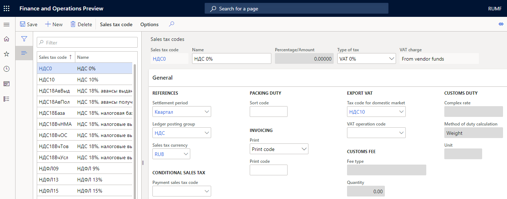

### Set up a document collection period and confirm the application of VAT at 0 percent

The date when the tax base on export is determined and the reflection of the export sale in the tax reporting depend on the period that is allowed for collecting the export confirmation documents.

The deadline for collecting the confirmation documents is calculated by using the following formula:

*Expiration date* = *Export date* + *Export confirmation period*

1. Go to **Accounts receivable \> Setup \> Period of documents collection**.
2. On the **Export confirmation period** page, on the Action Pane, select **New** to create a new period for confirming VAT at a rate of 0 percent.
3. In the **From date** field, specify the date when the export confirmation period begins.
4. In the **Export confirmation period** field, specify the period (in days) that is set for confirming VAT at a rate of 0 percent. The maximum length of the export confirmation period is 180 days.

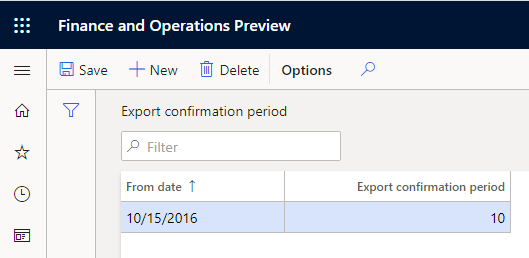

### Set up a default operation type

1. Go to **Accounts receivable \> Setup \> Accounts receivable parameters**.
2. On the **Ledger and sales tax** tab, on the **General** FastTab, in the **Debtor debts** section, in the **Operation type** field, select the default operation type for factures that haven't yet reached the time when an operation type is assigned to them.

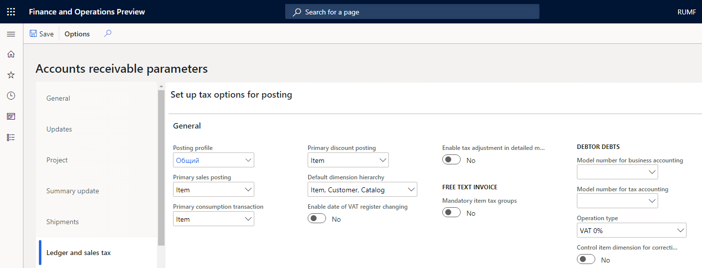

### Set up parameters for the VAT process

1. Go to **Accounts receivable \> Periodic tasks \> Sales book \> Parameters of VAT process**.

    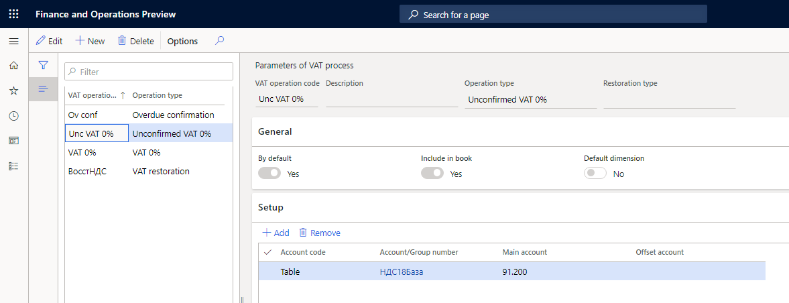

2. On the Action Pane, select **New** to create a new VAT operation code.
3. In the **VAT operation code** field, specify the operation code for outgoing VAT processing.
4. In the **Description** field, enter a description for the VAT operation code.
5. In the **Operation type** field, select the operation type for outgoing VAT processing.
6. On the **General** FastTab, set the **By default** option to **Yes** to specify that the operation code is the default operation code for the selected operation type.
7. Set the **Include in book** option to **Yes** if factures that have the VAT operation code should be included in the sales book when they are processed.
8. On the **Setup** FastTab, select **Add** to add a new line.
9. In the **Account code** field, select the account code.
10. In the **Account/Group number** field, select the sales tax code or sales tax group that VAT is processed for. This field is available only if you selected **Table** or **Group** in the **Account code** field.
11. In the **Main account** field, select the expenses ledger account for outgoing VAT processing transactions.
12. In the **Offset account** field, select the tax ledger account for outgoing VAT processing transactions. If you leave this field blank, the ledger account that is specified in the **Sales tax payable** field on the **Ledger posting groups** page (**Tax \> Set up \> Sales tax \> Ledger posting groups**) will be used.

### Set up a refinancing rate and factor for fine calculation

1. Go to **General ledger \> Ledger setup \> Refinancing rate**.
2. On the Action Pane, select **New** to create a new line.
3. In the **Start date** field, specify the date when the refinancing rate and factor become applicable.
4. In the **Percent** field, enter the refinancing rate as a percentage.
5. In the **Factor** field, enter the factor.

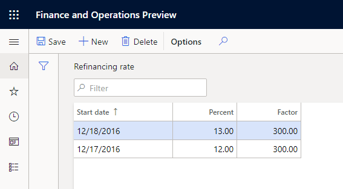

### Set up a main account for fine accounting

1. Go to **Tax \> Setup \> Profit tax \> Sales tax relations**.
2. On the Action Pane, select **New** to create a new line.
3. In the upper pane, in the **Module** field, select **Sales tax**.
4. In the **Type of tax** field, select **VAT 0%**.
5. In the **Code** field, select the sales tax code that you created earlier for export trade.
6. In the **Expense code** field, select the expense code for fines.
7. On the **Setup** FastTab, in the **Main account** field, select the main account for fine accounting in the event of overdue payment of tax for the tax code. This account will be debited in the transaction for fine accrual.
8. Go to **Tax \> Setup \> Sales tax \> Ledger posting groups**.
9. In the left pane, select a ledger posting group for the sales tax code that you selected in step 5.
10. On the **General** FastTab, in the **Export VAT fine** field, select a ledger account. This account will be in the credit of the voucher for fine accrual.

### Set up a reporting date for fine calculation

1. Go to **Tax \> Indirect taxes \> Sales tax \> Sales tax settlement periods**.
2. On the **Period intervals** FastTab, in the **Reporting date** field, specify the tax reporting date for the period. This date is used when fines are created for late payment of VAT.

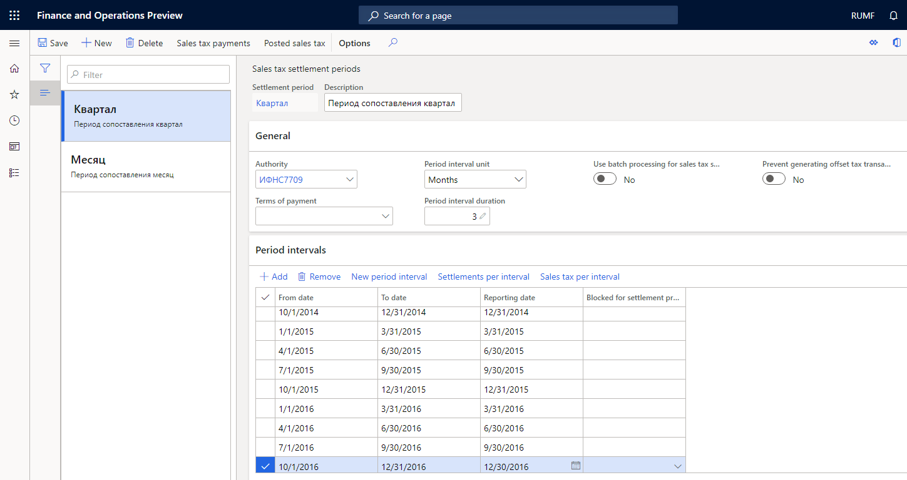

## Create a facture for export sales

1. Create a new sales order.
2. In the **Customer account** field, select the customer who is a foreign counteragent. For more information, see the [Set up a customer as a foreign counteragent](#foreigncounteragent) section.

    > [!NOTE]
    > The requested receipt date must be in the open sales book.

3. On the **Sales order** page, on the **Line details** FastTab, in the **Sales tax** section, set the **Sales tax group** and **Item sales tax group** fields. The sales tax group and item sales tax group that you select must contain the sales tax code that the tax code for the domestic market set up for.
4. On the Action Pane, on the **Sell** tab, in the **Generate** section, select **Confirm sales order**.
5. Create the invoice and facture.
6. On the **Sales order** page, on the Action Pane, on the **Invoice** tab, in the **Journals** section, select **Facture**.
7. On the **Facture journal** page, on the **Foreign trade** tab, in the **Export date** field, enter the date when export is allowed.
8. Optional: In the **Package date** field, select the date when confirmation documents are collected. In the **Confirmation date** field, select the date when the tax authority confirms the 0-percent VAT rate.
9. Optional: In the **Expiration date** field, view the deadline for collecting the confirmation documents. You can also view the settings of the **Operation type** fields and the **Into processing** check box.

## Preliminary processing of export factures

### Process export factures

1. Go to **Accounts receivable \> Periodic tasks \> Sales book \> Preliminary processing export factures**.
2. On the Action Pane, select **Select** to select factures for processing.
3. In the **Select factures for processing** dialog box, on the **Parameters** FastTab, in the **Start date** and **End date** fields, specify the processing period. By default, the processing period corresponds to the current open period of the sales book.
4. In the **Operation type** field, select the operation type for the processing. If you leave this field blank, factures for all operation types will be selected.
5. Set the **Show undefined type** option to **Yes** to select all factures for export, even if the system can't automatically determine the operation type.
6. On the **Records to include** FastTab, select **Filter** to specify selection criteria.

    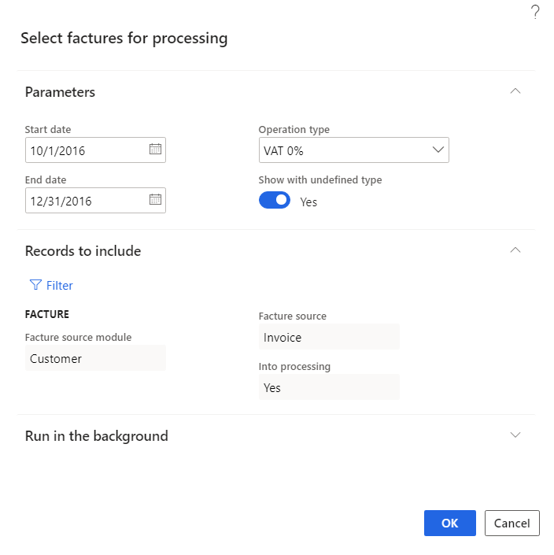

7. Select **OK**.
8. On the **Preliminary processing of export factures** page, notice the following details:

- The upper pane shows a list of selected factures:

    - In the **Current operation type** field, you can view the operation type that was assigned when the facture was processed. This field isn't editable.
    - The **Operation type** field is automatically set to the new operation type. You can change this value as required.
    - You can use the **Mark** check boxes, and the **Mark all** button on the Action Pane, to mark factures for processing.

- The lower pane shows the lines of the factures.

    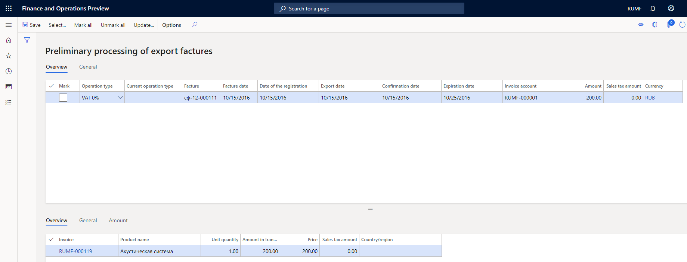

9. On the Action Pane, select **Update** to process the marked factures according to the assigned operation type.

### Cancel processing of export factures

1. Go to **Accounts receivable \> Periodic tasks \> Sales book \> Cancel preliminary processing of export factures**.
2. On the **Cancellation of preliminary processing** page, on the Action Pane, select **Select**.
3. In the **Select factures for cancellation of the preliminary processing** dialog box, on the **Records to include** FastTab, select **Filter** link to specify selection criteria.
4. Select **OK**.

The system will reset the current operation type to the previous operation type. For example, if the operation type of the facture was **VAT 0%** or **Unconfirmed VAT 0%**, it will become blank, and if it was **VAT 0% with the correction**, it will become **Unconfirmed VAT 0%**. The system will also delete factures that were created because of preliminary processing, if the facture isn't already included in the sales book.

## Outgoing VAT processing

### Process outgoing VAT

1. Go to **Accounts receivable \> Periodic tasks \> Sales book \> Outgoing VAT processing**.
2. On the Action Pane, select **Select** to select data for processing outgoing VAT transactions.
3. In the **Outgoing VAT processing – select data for period** dialog box, on the **Parameters** FastTab, in the **From date** and **To date** fields, specify the processing period. By default, the processing period corresponds to the current open period of the sales book.
4. Set the **Include unpaid export factures from previous periods** option to **Yes** to include unpaid export factures from previous periods in the processing.
5. On the **Records to include** FastTab, select **Filter** to specify selection criteria.
6. Select **OK**.

    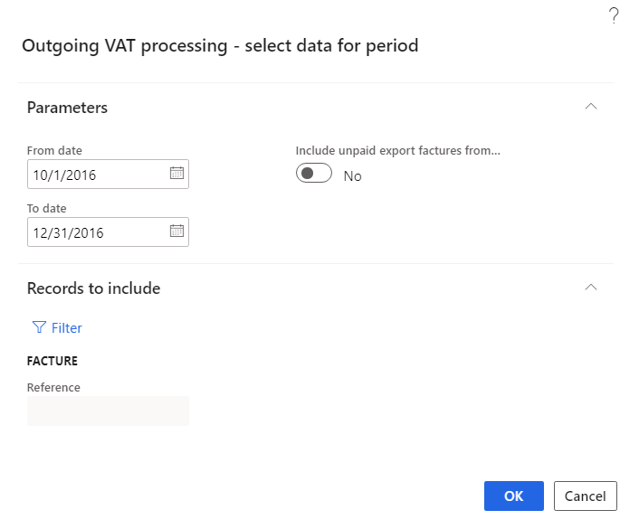

7. On the **Sales book (Outgoing VAT processing)** page, mark factures for posting, and then, on the Action Pane, select **Post**.

    .png)

8. In the **Outgoing VAT processing – ledger posting** dialog box, in the **Transaction date** field, select a transaction date, and then select **OK**.

    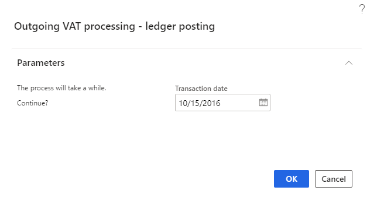

As a result of posting the marked factures, the following actions occur:

- Tax and ledger transactions are generated.
- Export sales factures are included in the sales book.

> [!NOTE]
> The sales book can't be closed until all VAT has been processed for the period.

### View processed factures

1. Go to **Accounts receivable \> Periodic tasks \> Sales book \> VAT processing log**.
2. On the **VAT processing log** page, you can view the transactions that were created and the factures that were processed.

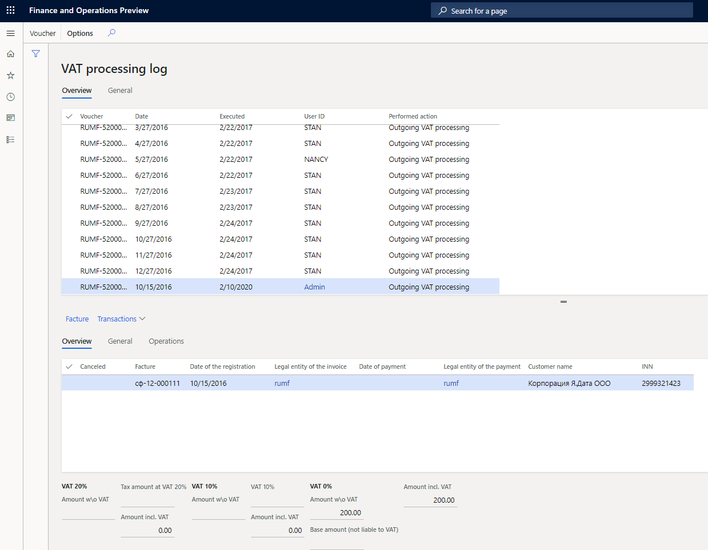

### Cancel processed VAT

1. Go to **Accounts receivable \> Periodic tasks \> Sales book \> Cancel processed VAT**.
2. On the Action Pane, select **Select** to select data for the cancellation of processing.
3. In the **VAT processing cancellation – select data for period** dialog box, on the **Parameters** FastTab, in the **From date** and **To date** fields, specify the period that you want to cancel processed VAT for.

    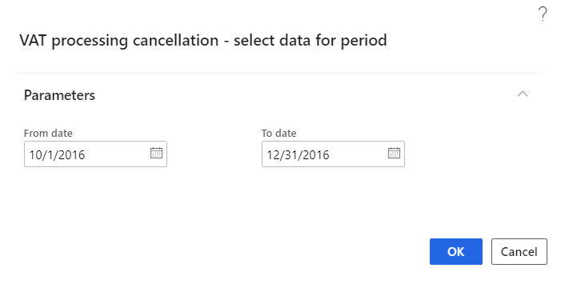

4. Select **OK**.

## Calculate the fine amount

1. Go to **Accounts receivable \> Periodic tasks \> Sales book \> Sales books journal**.
2. On the Action Pane, select **Functions \> Export fine calculation**.
3. On the **Fine calculation** page, on the Action Pane, select **Select** to open the **Fine calculation** dialog box.

    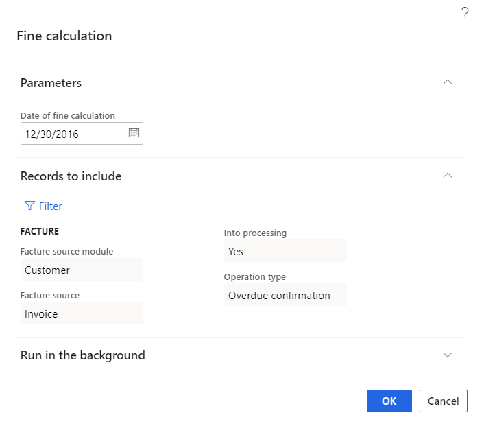

4. On the **Parameters** FastTab, in the **Date of fine calculation** field, specify the date when you want to calculate the fine amount.
5. On the **Records to include** FastTab, select **Filter** to specify selection criteria.
6. Select **OK** to calculate the fine.
7. On the **Fine calculation** page, in the lower pane, in the **Fine to post** field, you can view and edit the calculated fine amount.
8. In the upper pane, mark the factures for posting the fine amount, and then, on the Action Pane, select **Into journal**.
9. Select the journal where the lines for fine accrual should be created, and then select **OK**. The amounts for the marked factures will be transferred to the specified journal.
10. On the **Facture journal** page, on the **Foreign trade** tab, in the **Fine** section, in the **Date of fine calculation** field, you can view the date when the fine was calculated.

    > [!NOTE]
    > If the **Date of fine calculation** field was set before the calculation was done, the facture won't be included in the calculation.

11. In the **Fine amount** field, you can view the calculated fine amount.

[!INCLUDE[footer-include](../../includes/footer-banner.md)]